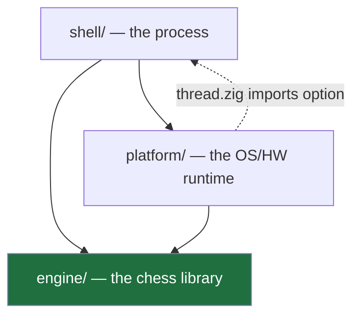
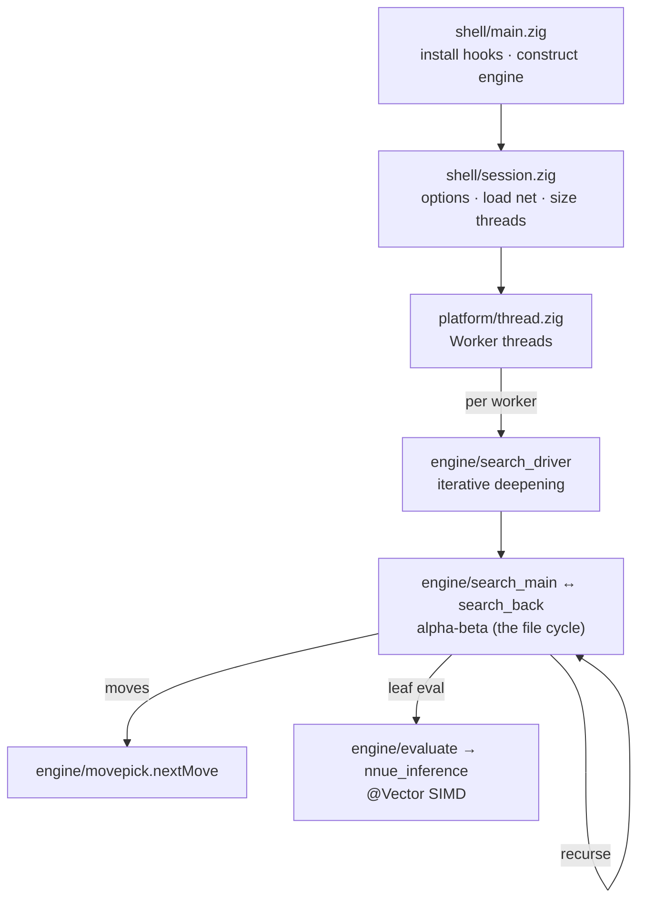

# Architecture

How the code is structured: the zones, how they depend on each other, and how one
search flows through them. For building, the bench gate, and the validation
commands, see [README](../README.md) and [CONTRIBUTING](../CONTRIBUTING.md); for the Zig
patterns behind the hot path, see [docs/idiomatic-zig.md](08-idiomatic-zig.md).
Per-module detail lives in each file's `//!` header.

This page states structure, not numbers. Where a count would date it (edges,
coupling), run `zig build arch-report` for the live value.

## The three zones

`src/` splits by responsibility, each a directory:

| Zone | Path | Owns | May import |
| --- | --- | --- | --- |
| **engine** | `src/engine/` | the chess library: board, movegen, search, NNUE eval, per-worker state | nothing outside `engine/` |
| **platform** | `src/platform/` | the OS/HW runtime: threads, memory, NUMA, Syzygy, the clock | `engine/` |
| **shell** | `src/shell/` | the process: UCI parsing, the option model, `main`, the engine object | `engine/`, `platform/` |

The stack is `shell → platform → engine`, engine at the bottom. `platform/` is not a
layer *beneath* the engine — it depends *on* engine, because `thread.zig` and
`search_thread.zig` manage `Worker` objects. It is the runtime that *hosts* the
engine library, not a base the engine sits on.


```mermaid
flowchart TD
    shell["shell/ — the process"]
    platform["platform/ — the OS/HW runtime"]
    engine["engine/ — the chess library"]

    shell --> engine
    shell --> platform
    platform --> engine
    platform -.->|thread.zig imports option| shell

    style engine fill:#1f6f3f,color:#fff
```

**`engine/` is a library.** The transitive closure of every engine module stays
inside `engine/`. It compiles and tests standalone — `zig build engine`, rooted at
`src/engine/headless.zig`, links no platform or shell. The one dashed edge above
(`platform/thread.zig` importing `shell/option`) is the only edge keeping the zone
graph from a strict DAG; the engine avoids the same import through a hook seam.

## What the library boundary buys

The zone rule is not tidiness — it is what lets the engine be *driven* with no process
around it. Upstream is a UCI binary and does not claim otherwise: `Search::Worker` holds
`const OptionsMap&` and `ThreadPool&` as members and `evaluate.cpp` includes `uci.h`, so
linking its search means linking the frontend and the thread pool. Here the same
dependencies are hook seams that **self-default headless**, and `zig build headless`
proves the boundary at the compiler and linker rather than by inspection.

**In use today:**

| Use | Owner | What the boundary supplies |
| --- | --- | --- |
| Compile and unit-test the whole engine with no runtime attached | `src/engine/headless.zig`, `zig build engine` | One root referencing every engine module; the `headless` gate ratchets engine → platform/shell up-edges toward zero |
| Coverage-guided fuzzing of the **real search** | `board/fuzz_targets.zig`'s `fuzzShallowSearch` → `search/headless_search.zig`, `zig build fuzz-board --fuzz` | A Worker, a one-thread pool, a TT and a `SharedHistories` stood up in-process. The fuzz root imports engine modules only, so a mutation drives move ordering, the TT, pruning, qsearch, the accumulator and the eval under ReleaseSafe — with no thread orchestrator to construct per iteration |
| Gates that test the **algorithm** rather than the protocol | `driver-golden`, `search-modes` | The search driver and its emit callback are callable directly. A gate that pipes `go` at the binary tests the command loop; one that drives `iterativeDeepening` tests the search |
| A reproducible search under a substituted platform | the seams' headless defaults | A depth-capped search needs no clock, no UCI option model and no pool: `headless_search` registers one deterministic option source (Skill off, MultiPV 1) and nothing else |
| Porting to a new OS | `src/platform/` | The engine issues no OS call, so a new target is a platform-zone change; the `@Vector` NNUE lowers to NEON with no source change |

**What the boundary makes possible and nobody has built.** These are capabilities the
invariant preserves, not features of this tree — describe them that way when quoting one:

- **Embedding the engine.** An analysis backend, an NNUE training-data generator, or a
  wasm build could link `engine/` with no threading runtime and no OS services. Nothing
  in this repo does.
- **In-process parameter search.** `headless_search`'s "search one position at depth N"
  entry is the shape an SPSA or sweep harness would drive, without a UCI round trip per
  evaluation.
- **A headless differential driver.** `tools/upstream_walk.py` already diffs both engines
  over a random walk, but it drives two *processes* over UCI pipes, because the oracle has
  no other interface. A Zig-side driver calling `headless_search` directly would lose the
  pipe and the `bestmove` handshake on our half — worth it only if the walk ever becomes a
  bottleneck, which at ~6 s for 40 positions it is not.

## What is actually in the binary

**There is no dependency scanner and no wildcard.** `build.zig` enumerates everything, and
a `.zig` file enters the build exactly three ways:

- as a **declared module** — a `module_specs` entry mapping a module name to a path, wired
  to its permitted peers by `module_edges`;
- as a **relative import** — `@import("sibling.zig")` from a file already in the build, the
  file-graph edges `arch-report` reports separately from the module graph;
- as a **compile root** — a `root_source_file`: the exe (`shell/main.zig`), the engine test
  root (`engine/headless.zig`), the fuzz and property-test roots, the `tools/` binaries.

A file in none of the three is compiled by nothing. It is not in the binary, not tested,
not reached by any gate — and it rots silently against the files that do move, which is the
worst version of the problem because it still *looks* maintained. Adding a file therefore
means adding it to `build.zig`, not just to the directory.

For the engine zone this is **gated**: `headless` asserts that `headless.zig` references
every engine module, so an engine module nobody added is a red build rather than a quiet
omission. `platform/` and `shell/` have no equivalent, so re-establish them with the check
rather than trusting this paragraph:

```sh
comm -23 <(find src -name '*.zig' | sort) <( \
  { grep -oE '"src/[A-Za-z0-9_/.-]+\.zig"' build.zig | tr -d '"'
    for f in $(find src -name '*.zig'); do d=$(dirname "$f")
      grep -ohE '@import\("[A-Za-z0-9_/.-]+\.zig"\)' "$f" \
        | sed 's/@import("\(.*\)")/\1/' \
        | while read -r r; do realpath -m --relative-to=. "$d/$r"; done
    done
  } | sort -u)
```

Empty output means every file under `src/` is compiled by something. It is empty today.

## How the zone rule is enforced

The zone rule is not a convention anyone remembers — five gates hold different halves of
it, and each fails on a different mistake. Run them together with `zig build parity`.

| Gate | Fails when |
| --- | --- |
| `headless` | an `engine/` file imports a `platform/` or `shell/` module. Resolves every `@import` through `build.zig`'s module table, so it sees the real edge, not a naming convention. Ratcheted — the count may only fall |
| `headless.zig` + `zig build engine` | the engine graph stops compiling and testing on its own. This is the compiler-and-linker half: the lint proves no *declared* up-edge, this proves the result actually links with nothing else attached |
| `arch-report` | the module graph gains a cycle, or the file graph gains one that is not the declared `search_main ↔ search_back`, or a `src/` file is reachable from no declared root |
| `hook-lint` | a cycle-break hook is added without declaring its failure mode, or the composition root forgets to register one. The second is the dangerous case: an unregistered hook does not crash, it *answers* |
| `src-free` | a C++ Stockfish or libc++ symbol reaches the shipped binary |

`arch-report`'s third tripwire is about a file being COMPILED at all. Its file graph is built
by walking `src/`, so a source nothing imports is a node with no in-edge — present in the count
and invisible in every other reading. That is not cosmetic: a file the build never names is not
compiled, not linked and not covered by any gate, while still looking maintained. Verified by
spike, and the spike is the way to re-verify it: a stray `src/` file whose only declaration is
`@compileError` passes the whole `parity` aggregate, because the error fires on *analysis* and
nothing analyses it. The roots are read from all three build files — `build/modules.zig`,
`build/tests.zig` and `build.zig` — and the first run proved why all three are needed by naming
`src/engine/headless.zig`, which is the `zig build engine` root and not an orphan at all. A root
reader that misses a root reports everything below it as dead, so the miss surfaces as a finding
rather than as silence.

The division matters. A lint over imports cannot prove the engine links standalone, and a
standalone link cannot prove no *unused* up-edge was declared — a dead declared edge is a
pre-granted permission that makes a stray `@import` compile silently. Neither alone is the
invariant; the pair is.

## The module graph

`build.zig` is not a script that discovers files. It is a **hand-declared module
graph** — a `module_edges` table of `.{ .from, .imp, .to }` triples wired by
`addImport`, and the authoritative statement of what may depend on what. A module
cannot reach a peer it was not handed.

**A declared edge is a permission, not a fact.** `addImport` grants the right to reach a
module; it does not oblige anyone to use it. So the table may be a superset of the real
dependencies, and `arch-report` reports the difference — for the composition root it prints
`main.zig: wired N, @imports M -> N-M DECLARED-BUT-UNUSED edges` and names each one. An
unused edge is **not an error**: the report prints the list, and nothing gates on its
length. Read the current count from the report, not from here.

They are also not free. A dead declared edge is a **pre-granted permission**: while it
stands, a stray `@import` of that module compiles silently; delete it and the same import
becomes a compile error. That is the only enforcement — the compiler will not otherwise stop
a module reaching a peer the design never intended it to touch. So prune an edge when its
last real use goes, and treat a growing unused list as permissions accumulating faster than
anyone is spending them.

Read the counts from `zig build arch-report`, never from prose: they move with every added or
deleted import, and any number written here is stale by the next commit.

The module graph is a **DAG**. The file graph (relative `@import` inside a module)
holds exactly one cycle, `search_main.zig ↔ search_back.zig` — the alpha-beta
recursion itself (`searchImpl ↔ runBack`), declared as one component in both file
headers. **Zig permits import cycles at both granularities**, so the DAG is a design
outcome, not a language guarantee. `zig build arch-report` prints both graphs and
trips on a broken module DAG or an undeclared file cycle.

### The composition root and the cycle-break hooks

The DAG rests on one pattern. `main.zig` is a **composition root**: it may import
everything and is imported by nothing. That asymmetry lets it hand implementations
*backwards* to leaf modules that could not import them.

Where a cycle *would* exist, a leaf declares a function-pointer **hook**, and the
composition root registers the real implementation at startup:

```zig
// Leaf (engine/search/time_source.zig): declare the seam.
pub var now: *const fn () i64 = &defaultNow;

// Composition root (shell/main.zig): inject the real clock at startup.
time_source.now = &clock.now;
```

This is dependency injection through function pointers — the reason the graph below
`main` is acyclic by construction, and how `engine/` reaches an OS clock while
importing no platform module. `main.zig` registers most hooks; `position.zig`
self-registers the two it owns. `zig build hook-lint` bounds them: it ratchets the
count and requires each to declare its failure mode when unregistered. See
`src/platform/runtime_hooks.zig` and the `//! hook-class:` headers.

### Does the DAG cost performance?

Not measurably, on the workload the gates cover — but read the limit at the end of this
section before quoting that. The DAG and its hooks are a *source-level* structure (for
cycle-freedom, the standalone `engine/` library, and testability), not compilation-unit
boundaries. Three **observations** against a full bench, none of them an A/B ablation:

- **Zig is whole-module.** Every `@import` lowers into one LLVM module, so the
  compiler inlines across module boundaries exactly as it would within a single file
  — a C codebase splits into translation units the linker must reconcile; zfish does
  not. Proven by building `-Dlto=false`: every hot cross-module call stays inlined, no
  small accessor (`sqBb`, `kingSquare`, `pawnAttacks`) shows up as its own symbol, and
  the profile's top functions are unchanged.
- **The hooks are wired at startup and stay off the hot path.** A function pointer is
  an optimizer barrier only *where it is called*. In the call graph over a full bench,
  every per-node symbol is a direct engine call; the one hook reached inside the
  search is the clock (`time_source.now`), which `checkTime`'s counter throttles to
  about one call per 512 nodes. Eval reads the network as startup-loaded data through
  a direct call, not a hook, and the per-node path allocates nothing.
- **Comptime replaces runtime indirection where it would be hot.** The search and the
  move scorer are specialized at `comptime` on node type and generator kind, so those
  dispatches resolve at compile time.

So on bench the architecture costs **startup wiring**, not nps. It would cost the search
if a hook sat on the per-node path un-throttled.

**The limit — one seam does sit there, and no gate can see it.** `search_main`'s Step 7
tablebase probe calls `tb_source.probeWdlPos` through a hook, guarded by
`worker.tb_config.cardinality != 0`. That is 0 without a `SyzygyPath`, so bench and every
golden run with the call short-circuited — the coverage is a property of the *workload*,
not of the seam. With tablebases loaded it becomes a live per-node indirect call where
upstream makes a direct one, and nothing here has measured it. The three observations
above bound the hooks bench reaches; they say nothing about this one. Treat "the DAG is
free" as unproven for a Syzygy-loaded search until an ablation says otherwise, and note
that the aggregate instruction ratio against the oracle bounds *all* structural overhead
together — it does not isolate the hooks from anything else.

**Is LTO required for this?** No. The whole-module inlining above is independent of
LTO — it is why the macOS and Windows builds ship with `-Dlto=false` permanently and
stay bit-exact. LTO (default on for Linux, matching upstream's `-flto=full`) buys a
separate ~4% by optimizing across the one boundary Zig does not compile itself: the
`compiler_rt` / libc runtime (`memcpy` / `memset` in the accumulator). The pure-Zig
affine kernel is bit-identical in instructions with LTO on or off; only the
libc-touching paths move. LTO is a codegen win to match upstream, not the thing that
makes the module graph free.

## How a search flows


```mermaid
flowchart TD
    M["shell/main.zig<br/>install hooks · construct engine"]
    S["shell/session.zig<br/>options · load net · size threads"]
    T["platform/thread.zig<br/>Worker threads"]
    ID["engine/search_driver<br/>iterative deepening"]
    AB["engine/search_main ↔ search_back<br/>alpha-beta (the file cycle)"]
    MP["engine/movepick.nextMove"]
    EV["engine/evaluate → nnue_inference<br/>@Vector SIMD"]

    M --> S --> T
    T -->|per worker| ID --> AB
    AB -->|moves| MP
    AB -->|leaf eval| EV
    AB -->|recurse| AB
```

`main` installs the hooks and constructs the engine; `session` registers UCI
options, loads the net, and sizes the pool; each `platform/` worker runs the
engine's iterative-deepening driver, which recurses through `searchImpl ↔ runBack`,
pulling moves from `movepick` and leaf evaluations from the `@Vector` NNUE. Nothing
on that path allocates.
