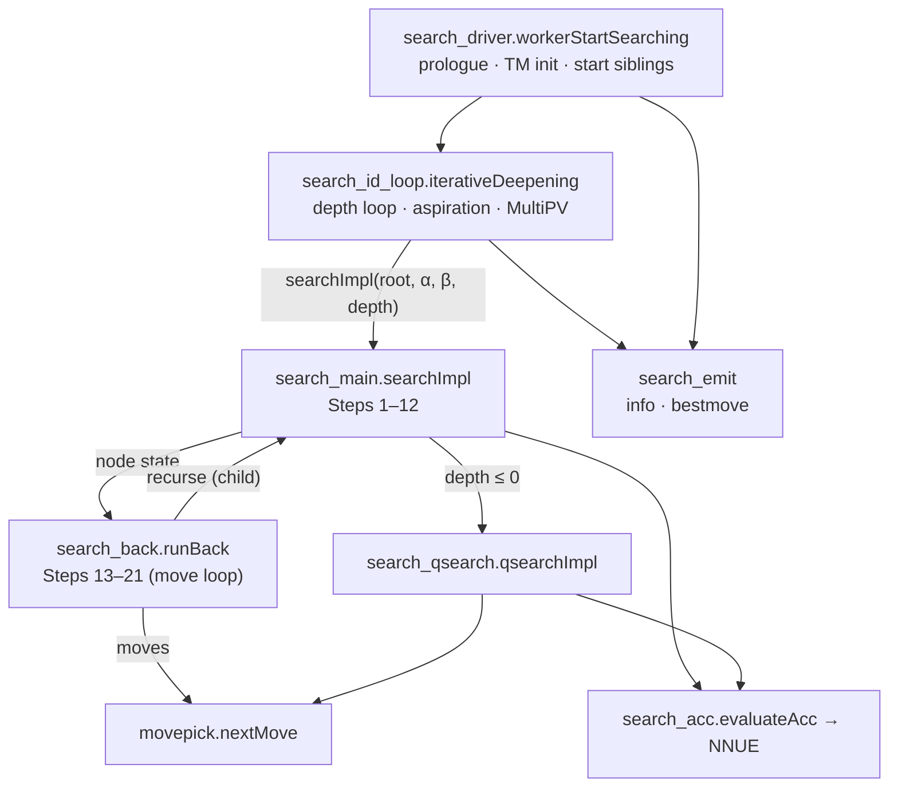
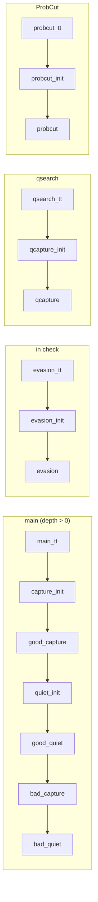

# Search

The search is the engine's decision procedure: given a root `Position` and a set of
limits, it returns a best move. It lives entirely in `src/engine/search/` — an
engine-zone subtree that imports no platform or shell module and reaches the clock,
the UCI options, the output stream, the tablebases, and the thread pool only through
function-pointer seams. For the zones and the module graph, see
[00-architecture.md](00-architecture.md); for the leaf evaluation, see
[03-engine-eval.md](03-engine-eval.md); for move generation and legality, see
[01-engine-board.md](01-engine-board.md).

## Modules

| File | Owns |
| --- | --- |
| **Driver / ID loop** | |
| `search_driver.zig` | `workerStartSearching` — the per-worker entry: prologue, main-thread time-management init, sibling start/wait, best-thread pick, final PV + bestmove emit. Re-exports the search surface |
| `search_id_loop.zig` | `iterativeDeepening` — the depth loop, aspiration windows, MultiPV walk, skill pick, per-iteration time decision |
| `search_id.zig` | The ID loop's primitives: `ssContext`/`searchIdState` snapshots, `ssTmInit`, thread start/wait/vote wrappers, root-move sort/move-to-front, `skillLevel`/`skillPickBest`, nodestime advance |
| `search_setup.zig` | `buildCtx` — fetches the stable per-search worker state once and assembles the `QCtx` threaded through the recursion |
| `search_emit.zig` | The UCI reporting side: `info` line building, the MultiPV walk (`searchPv`), `currmove`, `bestmove`, the no-moves line |
| `search_manager.zig` | `SearchManager` (main-thread bookkeeping, `is_main` branch, no vtable) and `UpdateContext` (the four output callbacks) |
| `root_move_build.zig` | Builds the `go`-path root-move list and ranks it by DTZ/WDL when tablebases are loaded; owns `TbConfig`, the scratch position and `rankMovesAt` — see [05-tablebases.md](05-tablebases.md) |
| `tb_extend.zig` | `syzygyExtendPv` — truncates a tablebase-scored PV to the part that holds the outcome, then walks it toward mate on minimal DTZ — see [05-tablebases.md](05-tablebases.md) |
| `tb_extend_source.zig` | The seam the reporter calls to reach `tb_extend`; defaults to returning the PV unchanged |
| `headless_search.zig` | An engine-zone-only "search this FEN at depth N" root: builds one worker, a one-thread pool, a small TT, and drives `iterativeDeepening` with no platform attached |
| **Alpha-beta** | |
| `search_main.zig` | `searchImpl` — a node's Steps 1–12: TT probe, the tablebase probe (Step 6, see [05-tablebases.md](05-tablebases.md)), static eval, razoring, futility, null move, IIR, ProbCut |
| `search_back.zig` | `runBack` — the move loop and node finalization, Steps 13–21: pruning, singular extensions, LMR, best-move update, TT store, correction-history update |
| `search_qsearch.zig` | `qsearchImpl` plus the primitives shared with the main search: `pvUpdate`, `qCorrectionValue`, `adjustKey50`, `ssAdd`/`ssSub`, `posCapture`, `isShuffling` |
| `search_control.zig` | `checkTime`, `rootUpdate`, `rootTtMove`, `rootInList`, `searchStopped`, `inLastIterPv` |
| `search_acc.zig` | The per-node accumulator/do-move/eval primitives: `doMoveAcc`, `undoMoveAcc`, `evaluateAcc`, `reductionAcc`, `updateSelDepth` |
| `search.zig` | The tuned formulas: margins, reductions, bonuses, aspiration deltas, `valueToTt`/`valueFromTt`, `correctionValue` |
| `search_common.zig` | Shared low-level helpers: `workerHistories`, `captureStage`, `moveIsOk`, the `statsUpdate` gravity update, capture-history indexing |
| **Move ordering** | |
| `movepick.zig` | The staged generator: `initMainStage`/`initProbcutStage`, `nextMove`, the stage selectors, `partialInsertionSort` |
| `movepick_score.zig` | `MovePickerState`/`MovePickerContext`/`SortEntry`, `scoreList`, `scoreValue` |
| `movepick_history.zig` | `HistorySnapshot` — typed views over the history tables — and the five score lookups |
| `movepick_snapshot.zig` | The read-only board queries and SEE shared by scoring and pruning |
| **Tables** | |
| `history.zig` | The history *writers*: `updateAllStats`, `updateQuietHistories*`, `updateContinuationHistories`, `updateCorrectionHistory`, `setContHist`, and the per-iteration decay/clear |
| `shared_history.zig` | The shared-history *storage*: large-page arena construct/free/clear/verify and the `sharedOf`/`pawnEntryRow`/`corrBundle` accessors |
| `shared_histories.zig` | The element-count math for the two shared arrays (pure `usize`, unit-tested standalone) |
| `shared_histories_map.zig` | The generic NUMA-index → entry map with construct/free hooks |
| `tt.zig` | The transposition table: `probeTable`, `entrySave`, `entryPenalize`, `hashfull`, resize/clear, generation |
| `timeman.zig` | `init` — the pure time-budget computation: optimum/maximum time from clock, increment, movestogo, ply |
| `uci_wdl.zig` | The win-rate polynomial, centipawn conversion, WDL, and the `info`/`bestmove` line formatters |
| **Types** | |
| `search_types.zig` | `SearchStack`; re-exports `PVMoves`, `RootMove`, `CorrectionBundle` |
| `search_ctx.zig` | `QCtx`, `SsCtx`, `SearchTimeState`, `ZfishIdState`, and the worker-graph accessors |
| `search_values.zig` | The value model: score sentinels, bound/depth enums, mate arithmetic, `isWin`/`isLoss`/`isDecisive` |
| **Seams** | |
| `option_source.zig` | UCI option reads (`intByName`, the Syzygy settings) |
| `output_sink.zig` | The UCI output sink (`printLine`, `isQuiet`, `setLastNodesSearched`) |
| `time_source.zig` | The monotonic clock (`now`) |
| `tb_source.zig` | The Syzygy probe (`probeWdlPos`, `probeFen`, `maxCardinality`) and `ProbeResult` |
| `thread_ops.zig` | The pool operations (`startSiblings`, `waitSiblings`, `waitThread`, `bestThreadWorker`) |

Supporting state lives in `src/engine/state/`: `worker_layout.zig` (the `WorkerLayout`
object graph, `ThreadPool`, `Thread`), `worker_histories.zig` (the per-worker tables),
`root_move.zig` (`RootMove`, `PVMoves`), `tt_types.zig` (`TtEntry`, `TtCluster`), and
`correction_bundle.zig` (`CorrectionBundle`).

## The pipeline

`workerStartSearching` runs on every worker. Helper threads go straight into
`iterativeDeepening` and return. The main thread additionally initializes time
management (`ssTmInit`, which also bumps the TT generation), starts the siblings,
runs its own `iterativeDeepening`, busy-waits while pondering or on `go infinite`,
sets the stop flag, waits for the siblings, picks the vote-winning thread (only when
no depth limit is set and skill is disabled — otherwise it keeps its own result), and
emits the final PV and `bestmove`.

`iterativeDeepening` allocates the `SearchStack` array on the Zig stack — sized
`max_ply + 10` with seven sentinel plies below the root, so `ss-1 .. ss-7` are always
readable — then loops on depth. Each depth runs the MultiPV lines; each line runs an
aspiration window around the root move's `average_score`, widening on every fail
high/low (`search.aspirationDeltaGrow`) until the score lands inside the window.

`searchImpl` handles one node's pre-loop work and then hands `runBack` the node
state as an `anytype` struct. `runBack` is an `inline fn`, so the pair compiles to
one function per node type — upstream's single `search<NodeType>` shape — instead
of re-loading the node-state struct across a real call. `runBack`'s move loop
recurses back into `searchImpl` for every child. The two files form a declared SCC — the cycle *is* the
alpha-beta recursion — and `zig build arch-report` lists it as known, so a *new* file
cycle shows up as undeclared instead of hiding behind this one. See
[00-architecture.md](00-architecture.md#the-module-graph).

`qsearchImpl` is a call-graph leaf: it self-recurses and never calls `searchImpl`.
`searchImpl` dives into it at `depth <= 0` and on razoring.

## The node

Three modules define what a node is.

`search_types.SearchStack` is the per-ply state, one array element per ply, addressed
relative to the current ply through `ssAdd`/`ssSub` (`search_qsearch.zig`):

| Field | Role |
| --- | --- |
| `pv` | This node's PV buffer (`?*PVMoves`); non-null only on a PV search |
| `continuation_history` | The `[16][64]` page for this move, set by `setContHist` |
| `continuation_correction_history` | The correction-history page, same indexing |
| `ply`, `current_move`, `excluded_move` | Position in the tree; the move made; the singular-extension exclusion |
| `static_eval`, `stat_score` | The corrected static eval; the move's history score |
| `move_count`, `cutoff_cnt`, `reduction` | Loop and reduction bookkeeping the parent reads back |
| `in_check`, `tt_pv`, `tt_hit`, `follow_pv` | Node predicates |

`search_ctx.QCtx` is the hot context threaded by pointer through the whole recursion.
It is built once per search by `search_setup.buildCtx`, which snapshots the worker's
live member pointers — the accumulator stack, the node counter, the refresh cache,
`optimism`, `nmp_min_ply`, `sel_depth`, `root_depth`, the reductions table,
`root_delta`, the last-iteration PV, the shared stop flag, the root-move array — plus
a `SearchTimeState`, whose main-thread-only fields are null on helper threads. Nothing
in the recursion re-walks the worker graph.

`search_values.zig` is the single source of truth for the value model: `value_mate`,
`value_inf`, `value_none`, `max_ply`, `value_tb`/`value_tb_win`, the `depth_qs` /
`depth_unsearched` / `depth_none` sentinels, the four `bound_*` flags, `mateIn` /
`matedIn`, and the `isValid`/`isWin`/`isLoss`/`isDecisive` predicates. Both search
bodies alias it.

Bounds are the usual fail-soft alpha-beta: `alpha`/`beta` narrow through the tree,
`best_value` may fall outside the window, and mate-distance pruning clamps them to
`matedIn(ply)` / `mateIn(ply+1)`. The node type is **comptime** — `searchImpl` takes
`comptime pv_node` and `comptime root_node`, mirroring upstream's
`template<NodeType>`; only `cut_node` is runtime, and `all_node` is derived. `runBack`
takes its node state as `anytype`, so it specializes per node type too.

The PV is a fixed `PVMoves` buffer per node. A child's PV is spliced into the parent's
by `pvUpdate` only when that move ran a real PV search; the child pointer is optional
and null means "the PV is just this move".

## Move ordering

`movepick.nextMove` is a staged generator: it never builds one big sorted list, and it
generates a category only when the stage that consumes it is reached. `state.stage`
starts at `initMainStage(has_checkers, has_tt_move, depth)` — which selects the main,
evasion, or qsearch entry stage and skips the TT stage when there is no TT move — or
at `initProbcutStage` for ProbCut.

The TT stage returns the TT move unchecked (the caller has already tested
`pseudoLegal`). `capture_init` generates captures, scores them, and fully sorts them;
`good_capture` re-tests each with `seeGe` against a threshold derived from its own
score and demotes the failures into the bad-capture region in place. `quiet_init`
generates quiets and *partially* sorts them — `partialInsertionSort` only inserts
entries at or above a depth-scaled limit, leaving the tail unordered — so
`good_quiet` walks the sorted head and `bad_quiet` sweeps the remainder after the bad
captures. `skip_quiets`, set by the caller's move-count pruning, short-circuits both
quiet stages.

`movepick_score.scoreList` scores a whole generated list in one pass, specialized at
comptime on the kind (`captures` / `quiets` / `evasions`):

| Kind | Score |
| --- | --- |
| captures | capture history + 7 × captured piece value |
| quiets | 2 × main history + 2 × pawn history + the continuation sum + a check bonus + a threat term + the low-ply bonus |
| evasions | capturing evasions by captured value above a large offset; others by main history + continuation history |

The quiet score reads the continuation history at slots 0, 1, 2, 3 and 5; the threat
term uses per-piece-type "attacked by a lesser piece" bitboards built once per list
from `attacksBy`; the check bonus requires both a check square and `seeGe`; the
low-ply bonus applies only below `low_ply_history_size` (`movepick.zig`).

The tables reached are packed into a `HistorySnapshot` (`movepick_history.zig`) from
the `MovePickerContext` the caller fills in — main, low-ply, capture, up to six
continuation pages, and the shared pawn history. The ProbCut context deliberately
passes only capture history; the rest are null.

## Heuristics and tables

**Per-worker** (`state/worker_histories.zig`, embedded in `WorkerLayout.histories`, a
contiguous `i16` prefix):

| Table | Shape | Indexed by |
| --- | --- | --- |
| `main_history` (butterfly) | `[2][65536]` | side to move, raw move |
| `low_ply_history` | `[5][65536]` | ply, raw move — refilled every search by `fillLowPlyHistory` |
| `capture_history` | `[16][64][8]` | moved piece, to-square, captured type |
| `continuation_history` | `[2][2]` of `[16][64] → [16][64]` | in-check, capture, then (piece, to) → (piece, to) |
| `continuation_correction_history` | `[16][64] → [16][64]` | (piece, to) → (piece, to) |
| `tt_move_history` | scalar | — |

**Shared per NUMA node** (`shared_history.zig`, `state/shared_history_types.zig`),
allocated from large pages and pointed to by `WorkerHistories.shared_history`:

| Table | Element | Indexed by |
| --- | --- | --- |
| `correctionHistory` | `[2]CorrectionBundle` (pawn / minor / non-pawn white / non-pawn black) | Zobrist key & mask, then colour |
| `pawnHistory` | a `[16][64]` `i16` page | pawn key & mask |

Both are power-of-two sized — `shared_histories.sharedHistoriesSizes` scales each base
size by `nextPowerOfTwo(threads on the node)` — so indexing is `key & mask`.
`shared_histories_map.zig` maps NUMA index → block with construct/free hooks, and
`clearSharedHistory` clears only this thread's partition of the arrays.

All history entries update by the same gravity rule, `search_common.statsUpdate`:
`v += clamped - v * |clamped| / D`, which pulls the entry toward `[-D, D]`.
`history.zig` owns every write. `updateAllStats` credits the best move and debits the
searched-but-rejected quiets and captures, with a running malus decay;
`updateContinuationHistories` walks the `ss-1 .. ss-6` pages with per-distance
weights, stopping after `ss-2` when in check.

**Correction history** adjusts the raw NNUE eval into `ss.static_eval`.
`qCorrectionValue` gathers the four shared correction values plus the `ss-2` and `ss-4`
continuation-correction entries and applies `search.correctionValue`;
`search.toCorrectedStaticEval` folds the result into the eval. After the move loop,
`updateCorrectionHistory` nudges all six back toward the observed search/static-eval
delta — only when the node is not in check and the best move is not a capture.

**The transposition table** (`tt.zig`, layout in `state/tt_types.zig`) is a flat array
of `TtCluster`, each holding `cluster_size` `TtEntry` records plus padding. An entry
packs a 16-bit key, depth, a generation/bound/is-PV byte, the move, the value, and the
static eval. `probeTable` returns the hit data *and* a writer pointer — the entry to
replace, chosen by depth and relative age — so a node probes once and stores through
the same slot. `adjustKey50` (`search_qsearch.zig`) perturbs the key near the 50-move
boundary so positions differing only in rule50 hash apart. `doMoveAcc` issues a
`tt.prefetch` for the child cluster before making the move — keyed by
`move_do.prefetchKey`, an approximate post-move key (from/to/captured psq toggles, side
flip, and the rule50 mix; castling/en-passant/promotion left wrong, so those rare moves
prefetch an unused line) reached through the same `firstEntryIndex` the probe uses — so
the miss latency hides behind the make and accumulator push. Values are mate-distance
corrected on the way in and out (`search.valueToTt` / `valueFromTt`). The generation
advances once per search in `ssTmInit`; `entryPenalize` decrements a stored depth when
a TT entry's window bound is the only reason a cutoff was refused. That decrement — and the
secondary aging in `entrySave` — **saturates at zero** (`depthSaturatingSub`), never wraps.
The table is shared across all workers and accessed without locks, so the subtraction is
racy by design: `depth8` is a `u8` and `depth8 != 0` is the occupancy test, so a wrapping
decrement would turn a penalised shallow entry into the deepest entry in the table and make
a cleared slot read as occupied. The clamp is what makes the lock-free write safe.

## Time management and stopping

`timeman.init` is pure: given the clock, increment, `movestogo`, ply, move overhead,
and the ponder flag, it returns `optimum_time` and `maximum_time`. `ssTmInit`
(`search_id.zig`) builds its input from the worker's limits and root position plus the
`nodestime`, `Move Overhead`, and `Ponder` options, and writes the outputs back into
the manager's `tm`.

Two mechanisms stop a search.

**The per-node check.** `search_control.checkTime` runs at the top of every
`searchImpl` node but is a no-op off the main thread (`calls_cnt` is null there). It
decrements a counter and only does real work when it hits zero, then re-arms it —
scaled down from 512 when a node limit is set, so a node-limited search overshoots by
a bounded amount. It raises the shared stop flag when `use_time_management` is on and
either the elapsed time exceeds `maximum_time` or `stop_on_ponderhit` is set, when a
`movetime` limit is reached, or when the node limit is hit. It never stops while
pondering.

**The per-iteration decision.** At the end of each depth the main thread computes
whether to start another iteration, from the falling-eval trend, the depth since the
best move last changed, the summed cross-thread `best_move_changes`, and the best
move's node effort share; over budget it either sets `stop` or, when pondering, arms
`stop_on_ponderhit`. Otherwise it sets `threads.increase_depth`, which the next
iteration reads to soften the aspiration depth reduction. The mate limit stops the
search once a mate within `limits.mate` is proven.

The stop flag itself is one byte in the `ThreadPool`, read and written with monotonic
atomics (`searchStopped`, `ssSetStop`). Every node checks it; `runBack` returns
`value_draw` immediately when it is set, and the ID loop discards the aborted line.

**nodestime** replaces the clock with the node counter. When `tm.use_nodes_time` is
set, both `checkTime` and `idElapsed` read the **pool's** node count
(`poolNodesSearched`, summed across the node's workers — upstream's
`threads.nodes_searched()`) instead of `time_source.now()`, `timeman.init` converts the
time budget into a node budget, and `ssNpmsecAdvance` debits that pool node count from
`tm.available_nodes` after the search. This makes a time-limited search reproducible.

All wall-clock reads go through `time_source.now`, so the engine never calls an OS
clock directly.

## Parallel search

Every worker searches the same root independently, sharing the transposition table
and the per-NUMA-node histories; the engine drives the pool only through the
`thread_ops` seam, and the reported move is chosen by thread voting. The pool, the
worker lifecycle, the shared-vs-per-worker split, NUMA replication, and what is
deterministic under threads are covered in
[04-multithreading.md](04-multithreading.md).

## The engine seams

`engine/` is a library: the transitive closure of every engine module stays inside
`engine/`, and `zig build engine` compiles and tests it with no platform or shell
linked. But a search must read UCI options, print `info` lines, probe tablebases, read
a clock, and start threads — all of which live *above* it. Importing them would invert
the zone stack and create a cycle.

Each is instead a **hook**: a `pub var` function pointer in an engine leaf, defaulted
to a headless-correct implementation, that the composition root overwrites at startup.
See [00-architecture.md](00-architecture.md#the-composition-root-and-the-cycle-break-hooks).

| Seam | Reached for | Default when unregistered |
| --- | --- | --- |
| `option_source.zig` | `MultiPV`, `Skill Level`, `UCI_Elo`, `UCI_LimitStrength`, `nodestime`, `Move Overhead`, `Ponder`, `UCI_ShowWDL`, the Syzygy settings | 0 / false — **search-affecting** |
| `output_sink.zig` | every `info` and `bestmove` line | drop the line — **degraded**: right move, no answer |
| `tb_source.zig` | Step 6's WDL probe, root ranking — see [05-tablebases.md](05-tablebases.md) | "no tablebases" — genuinely safe |
| `time_source.zig` | time management, elapsed, the skill RNG seed | a monotonic counter — safe, but in ticks |
| `thread_ops.zig` | start/wait siblings, best-thread vote | single-threaded — **search-affecting** |

The failure modes differ, and each hook declares its own in its `//!` header rather
than being blanket-panicked: `tb_source`'s and `time_source`'s defaults are the
*correct* answer with the subsystem absent, while `option_source`'s and
`thread_ops`'s are correct only because every root is accounted for — the shipped
`main.zig` registers them before the engine is reachable, and the headless roots are
genuinely single-threaded with no option model. `zig build hook-lint` bounds the set:
it ratchets the count and requires each hook to declare a failure mode. See
[CONTRIBUTING](../CONTRIBUTING.md) for the gates.

`headless_search.zig` is what the seams buy. It builds a worker, a one-thread pool, a
manager, a small TT, and a shared-history block, registers a deterministic option
source (skill off, MultiPV 1), and drives `iterativeDeepening` — a complete
depth-limited search rooted entirely in `engine/`, with no platform attached, usable
from unit tests and fuzzers.
