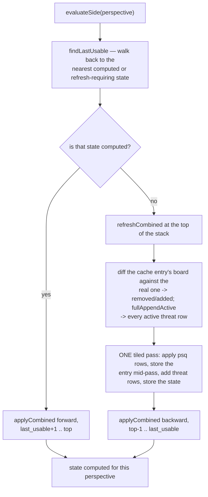

# Evaluation (NNUE)

How zfish turns a position into a score: an NNUE network whose input transformer is
updated incrementally as the search makes and unmakes moves, and a small stack of
integer affine layers over the transformed features. Everything here lives in
`src/engine/eval/` — inside the **engine** zone, importable by no zone above it
(see [00-architecture.md](00-architecture.md)). The eval is pure integer arithmetic,
so it is bit-exact and arch-invariant: every ISA tier must produce the same score
for the same position.

## Modules

| File | Owns |
| --- | --- |
| **network load / parse / storage** | |
| `network.zig` | the `Network` handle, the `load`/`save`/`verify` entry points, the file header, and the directory search; re-exports the inference surface |
| `nnue_parse.zig` | the `.nnue` byte format: signed LEB128 (`COMPRESSED_LEB128` sections), the feature-transformer blob layout/offsets, `weightIndexScrambled`, and the `write_parameters` serializer |
| `nnue_weight_storage.zig` | the weight arenas (`ftStorage`, `layerStorage`) and the loaded-net identity (`nnCurrent`, `nnDescription`) |
| `nnue_hash.zig` | the net-identity hashes: `hashBytes` (MurmurHash2-64A), the feature-transformer / architecture / network hash values, and the content hashes |
| **feature transformer** | |
| `nnue_feature.zig` | feature indexing for both feature sets: `halfMakeIndex`, `fullMakeIndex`, the changed/active index lists, and the refresh predicates |
| `nnue_feature_bb.zig` | the bitboard/attack math and comptime index tables `nnue_feature.zig` builds on |
| `nnue_ft.zig` | the `FeatureTransformer` weight-blob layout: byte offsets plus the four typed weight accessors |
| **accumulator** | |
| `nnue_acc_layout.zig` | the accumulator-stack byte layout: strides, diff records, the `AccumulatorStack` handle, and every state/diff accessor |
| `nnue_acc_update.zig` | the update algorithm: `evaluateSide`, the refresh path, and the fused incremental step |
| `nnue_acc_rowops.zig` | the `@Vector` weight-row add/sub kernels (`applyCombinedDelta`, `accRows`, the PSQT deltas) |
| `nnue_refresh_cache.zig` | the per-(king square, perspective) refresh cache ("finny tables") and `clearRefreshCache` |
| `nnue_accumulator.zig` | the stack facade (`stackPush`/`stackPop`/`stackReset`) and `transformBucket` — the clipped-ReLU transform plus the NNZ bitset |
| **inference** | |
| `nnue_inference.zig` | the forward pass: the affine layers, the activations, bucket selection, and the psqt/positional split |
| `evaluate.zig` | `computeValue` — blending the network output with optimism, material, and the 50-move counter into the final score — and `formatTrace`, the `eval` command's trace renderer (built by the file-local `formatTraceAlloc`) |
| `nnue_misc.zig` | the `eval` command's per-bucket contribution table |

## The network

A net file is a flat binary: a 12-byte header (`u32` version, `u32` structure hash,
`u32` description length) followed by the description, the feature-transformer blob,
and then one blob per layer stack. `network.zig` pins the version
(`network_version = 0x6A448AFA`) and rejects any file whose structure hash differs
from `nnue_hash.networkHashValue()` — the hash is derived from the architecture
constants, so a net built for a different architecture cannot load.

`network.load` resolves the `EvalFile` name (defaulting to
`default_eval_file_name`, the single source of truth for the net's name) against
three candidates in order:

| Candidate | Meaning |
| --- | --- |
| `"<internal>"` | the embedded net — only tried for the default name |
| `""` | the path as given, relative to the **current working directory** |
| `root_directory` | the binary's own directory |

Each candidate is skipped once a net of that name is already current. `loadUserNet`
maps the file read-only (POSIX `mmap`; Windows and an unmappable filesystem fall
back to a whole-file read into an arena) and hands the bytes to `loadNetworkBytes`,
which walks header → feature transformer → the eight layer stacks and requires the
consumed byte count to equal the file length exactly. The parse copies every weight
into the Zig-owned storage, so the mapping is released as soon as it returns.

**The net is an external runtime input, not a build artifact.** The "embedded" net is
an unconditional one-byte stub (`network.zig`) that always fails to parse, so the real
net must be found on disk. Because the whole search depends on it,
its absence is reported where it is required rather than left to surface as a
crash: `src/shell/engine/nnue.zig` (`requireNetworkLoaded`) checks
`network.ftPtr()` at startup, prints the file sought and every directory searched to
stderr — not through the UCI sink, which a quiet bench run suppresses — and exits
non-zero. For fetching the net and running the gates, see
[CONTRIBUTING](../CONTRIBUTING.md).

### Parsing and storage

`nnue_parse.zig` owns the format. The feature transformer is five arrays read in
stream order — biases (LEB `i16`), threat weights (raw `i8`), threat PSQT weights
(LEB `i32`), psq weights (LEB `i16`), psq PSQT weights (LEB `i32`) — each written
into its fixed, 64-byte-aligned offset in the destination blob. Affine layers are
`i32` little-endian biases followed by `i8` weights, permuted on the way in through
`weightIndexScrambled` (the SSSE3 layout the inference reads back). `serializeFeatureTransformer` /
`serializeLayer` invert this exactly, so an exported net round-trips byte-for-byte.

The parse is the *sole* source of weights: it writes straight into the arenas owned
by `nnue_weight_storage.zig`, and inference reads from that same memory. Those
arenas come from `page_alloc.alloc` (`src/engine/state/page_alloc.zig`) — the
injected large-block seam the platform backs with huge pages, and which falls back
to a page-backed allocator in a headless build; see [06-platform.md](06-platform.md). `nnue_weight_storage.zig` sits below
both `network.zig` and `nnue_inference.zig` so the I/O half and the compute half
share an owner without importing each other. There are exactly two arenas: the
feature-transformer blob, and ONE contiguous block holding all eight buckets'
fc_0/fc_1/fc_2 biases+weights at comptime offsets — mirroring upstream's in-line
`NetworkArchitecture network[LayerStacks]` member. Keep it one block: splitting the
layer stack into per-part huge-page allocations puts every part at the same address
bits modulo the huge-page alignment, aliasing the inference weights into a handful
of last-level cache sets (measured as ~5 extra LL misses per eval).

## Architecture of the net

The net has **two feature sets**. Their dimensions are pinned in
`nnue_acc_layout.zig` (and re-pinned file-locally by `nnue_ft.zig` and
`nnue_parse.zig`, which lay out the blob); `nnue_feature.zig` owns the indexing:

| Feature set | Dimensions | Index | Weights |
| --- | --- | --- | --- |
| PSQ (HalfKA v2, king-bucketed / horizontally mirrored) | `psq_feature_dimensions = 22528` | `halfMakeIndex` — oriented square + `piece_square_index` + `king_buckets` | `i16` |
| Threats (full threats: attacker × attacked × from × to) | `threat_dimensions = 60720` | `fullMakeIndex` — LUT over the oriented attacker/attacked pair and move | `i8` |

Together they are the net's 83248 input dimensions (`network.verify`). Both feed
one shared **feature transformer** whose layout `nnue_ft.zig` fixes: biases, psq
weights, threat weights, and two `i32` PSQT tables (`psqt_buckets = 8` per feature),
each region 64-byte aligned. It produces `half_dimensions = 1024` accumulated values
per perspective.

`nnue_accumulator.transformBucket` turns the two perspectives' accumulators into the
network input: per element, clamp to `[0,255]` and multiply the two halves with a
`>> 9` — the pairwise squared-clipped-ReLU — yielding 1024 `u8`. It records which
4-byte chunks are non-zero into an `NnzBitset` in the same pass, while the values are
still in registers, and returns the perspective-differenced PSQT value for the bucket.

Above the transformer sit **8 layer stacks** (`layer_stacks = 8`), selected by
material: `bucket = (piece_count - 1) / 4` (`nnue_inference.evaluate`). Each stack is

```
fc_0 (1024 -> 32) -> ac_sqr_0 | ac_0 -> fc_1 (64 -> 32) -> ac_sqr_1 | ac_1 -> fc_2 (128 -> 1)
```

Output scaling is integer throughout. The activation shifts are fixed per layer:
`fc_0`'s outputs go through `sqrClippedReLU(21)` and `clippedReLU(7)`, `fc_1`'s
through `sqrClippedReLU(19)` and `clippedReLU(6)`. The forward output is
`fc_2[0] + (fc_0[30] - fc_0[31])` scaled by `600*16 / (128*64*2)`, and `evaluate`
divides both the psqt and positional halves by `output_scale = 16` before returning.

## The accumulator

`AccumulatorStack` (`nnue_acc_layout.zig`) is a raw, 64-aligned byte arena embedded
in each `Worker` — one state per ply, `max_stack_size = 247`. A state holds both
perspectives' `i16` accumulation and `i32` PSQT values, a per-perspective `computed`
flag, and the ply's diff records. There is **one combined accumulator** (HalfKA +
Threats summed), living in the `psq_feature` storage slot.

The search drives it from `src/engine/search/search_acc.zig`: `doMoveAcc` calls
`stackPush` to claim the next slot and hands its `DirtyPiece` / `DirtyThreats`
records to `doMove`, which records the move's changed features while making it;
`undoMoveAcc` calls `stackPop`. Nothing is computed on the way down — states are
pushed uncomputed, and `evaluateAcc` triggers the work only when a node actually
needs a score. See [02-engine-search.md](02-engine-search.md) for the search side and
[01-engine-board.md](01-engine-board.md) for how the board fills the dirty records.

`evaluateSide` (`nnue_acc_update.zig`) runs once per perspective.
`findLastUsable` walks back from the top of the stack for the nearest state that is
either already computed or requires a refresh. It tests **only** the PSQ refresh
condition (the moved piece is that perspective's king), because a threat refresh —
the king crossing the board's centre file — is a strict subset of it, so the
combined accumulator always refreshes as a unit.



**Incremental step.** `applyCombined` builds this ply's PSQ and threat
changed-feature index lists from the stored diffs, splits them into removed/added
(inverted when stepping backward), and applies all four lists to the accumulator in
one pass: `nnue_acc_rowops.applyCombinedDelta` tiles the accumulator, holds each
tile in a register, and walks the weight rows *inside* the tile — so the accumulator
is loaded and stored once per tile rather than once per row. The PSQT delta
(`applyCombinedPsqtDelta`) holds the 8-bucket i32 row as one vector the same way.
Every weight pointer these kernels take carries `align(64)` and each row load asserts
its alignment at the load site (`loadVec`/`loadW`): a runtime-offset slice of a
many-pointer degrades to the element alignment, and non-VEX SSE folds a load into an
op's `m128` operand only when 16-byte alignment is provable — without the assert the
sse41 tier pays a separate `movdqu` per 16 weight bytes.

**Refresh.** A full refresh never rebuilds from an empty board. The refresh cache
(`nnue_refresh_cache.zig`) holds one entry per (king square, perspective) — the
accumulation, the PSQT values, and the board (plus its occupancy bitboard) that
produced them. `refreshCombined` diffs the entry's stored board against the current
one with two 32-byte vector compares into a changed-square bitboard, splits it into
removed/added HalfKA rows by the cached and current occupancy (upstream's
`get_changed_pieces` shape), collects every active threat row (`fullAppendActive`),
and applies everything
in one tiled pass (`nnue_acc_rowops.applyRefreshFusedI16`): the pass loads the entry
tile, applies the psq rows, stores the psq-only tile back to the entry (in place,
for next time), keeps adding the threat rows in the same registers, and stores the
combined `psq + threat` tile to the stack state — mirroring upstream's
`update_accumulator_refresh_cache`, with no second pass over the 2 KB row. It then
stores the new board back. `clearRefreshCache` seeds every entry with the
feature-transformer biases — the empty-board accumulator — and is called at worker
construction.

A refresh happens when `findLastUsable` reaches a state that is not computed: either
the bottom of the stack, or a ply whose diff says this perspective's king moved
(HalfKA is king-bucketed, so every index changes) — the same predicate as
`nnue_feature.halfRequiresRefresh`.

## Inference

`nnue_inference.zig` runs the forward pass for one bucket over the transformed
features. Each layer is `affineDpbusd`, which selects a kernel at comptime from the
target and shares one scalar-equivalent contract:

| Tier | Kernel | Why |
| --- | --- | --- |
| AVX-512 VNNI | `affineVnni` — `vpdpbusd` via the LLVM intrinsic, split into 3 dependency chains | LLVM will not lower the portable `@Vector` int8-dot pattern to `vpdpbusd`; the high-latency op needs independent accumulators merged at the end |
| AVX2 | `affineAvx2` — 256-bit `pmaddubsw` + `pmaddwd`, 8 outputs per step | the same maddubs dot as SSSE3 at twice the width; without it AVX2 fell to the portable path and the affine ran +64% instructions |
| SSSE3 | `affineSsse3` — 128-bit `pmaddubsw` + `pmaddwd`, 4 outputs per step | `pmaddubsw` multiplies `u8 × i8` directly: twice the lanes per register; also the AVX2 fallback for an `OUT` the 256-bit path cannot tile |
| `OUT == 1` (`fc_2`) on x86 | `affineOut1` — one contiguous int8 dot (`vpdpbusd`/`pmaddubsw`) plus a horizontal add | a single output makes the scrambled layout the identity, so `fc_2` is a plain 128-wide dot; the tiled kernels need `OUT % 4`, so it otherwise fell to the per-group portable path — measured the 2nd-largest affine cost |
| everything else | portable `@Vector` two-stage `pmaddwd` reduction | one source, lowered per target |

All of them are pure integer dots over the same scrambled layout, so they are
bit-identical; a unit test in the file pins every path against a scalar reference at
each `-Darch`.

The **sparse path** is the transformer's NNZ bitset, not a re-derived test.
`GroupIter(sparse)` yields only the input groups whose 4 bytes are non-zero,
iterating the bitset the transform already recorded. `fc_0` is sparse (its 1024 inputs
are mostly zero after the clipped ReLU); `fc_1` and `fc_2` are dense. Indices ascend
either way, so the accumulation order — and the result — is unchanged.

Activations are `sqrClippedReLU` (`min(127, (x*x) >> shift)`) and `clippedReLU`
(`clamp(x >> shift, 0, 127)`), written into a 128-byte `concat` that `fc_1` and
`fc_2` read. `evaluateBucketRaw` returns the two halves — `psqt` from the
transformer, `positional` from `propagateBucket` — and `evaluate` scales both by
`output_scale`.

`evaluate.zig` blends them into the final score. `computeValue` folds
`psqt + positional`, scales optimism by the psqt/positional disagreement
(complexity), damps the net output by the same, weights by material, applies the
50-move-rule decay, and clamps inside the TB bounds — all in `i64` with truncating
division. The search calls it through `search_acc.evaluateAcc`, which supplies
material and the side-to-move optimism.

## SIMD

The hot path — the row ops, the transform, the affine layers — is portable
`@Vector`: one kernel per operation, lowered by LLVM per target, with arch-specific
choices as `comptime` branches rather than forked source. Because the eval is
integer-exact it is also arch-invariant, so every ISA tier must agree on the
signature. See [08-idiomatic-zig.md](08-idiomatic-zig.md) for the pattern and the
gates that hold it.

Two vector widths are independent knobs and must not be folded into one:
`nnue_acc_layout.transform_vec_width` (the transform's clipped-ReLU pass) and
`row_tile_width` (the weight-row tile, file-local to `nnue_acc_rowops.zig`). They
touch different loops.

## Invariants

| Invariant | Held by |
| --- | --- |
| The evaluation is **integer-exact** — no floating point anywhere on the path from features to score. | `computeValue` in `i64`; every kernel integer |
| The evaluation is **arch-invariant**: every `-Darch` tier yields the same score. All three `affineDpbusd` paths are bit-identical dots. | the per-path scalar-reference test in `nnue_inference.zig`; the cross-tier bench signature |
| An **incremental update equals a full refresh**. Integer add/sub commute under two's-complement `i16` wrap, so applying rows in any order, tiled or not, forward or backward, yields the same accumulator. | `applyCombinedDelta`; the refresh/incremental split in `evaluateSide` |
| The combined accumulator always equals `psq + threat`, and both feature sets refresh together — a threat refresh is a subset of a PSQ refresh. | `findLastUsable` keyed on the PSQ condition only |
| The parse is the **sole source of weights**, and it must consume the file exactly. | the `offset != bytes.len` check in `loadNetworkBytes`; the structure-hash check |
| The accumulator-stack and refresh-cache footprints are **pinned**: `accumulator_stack_size` and `refresh_table_bytes` in `worker_layout.zig` must match what the layout constants here imply. Drift surfaces as a bench/parity failure, not a silent overrun. | `src/engine/state/worker_layout.zig` |
| The refresh cache is seeded from the FT biases before first use. | `clearRefreshCache`, called from `worker_construct.zig` |
