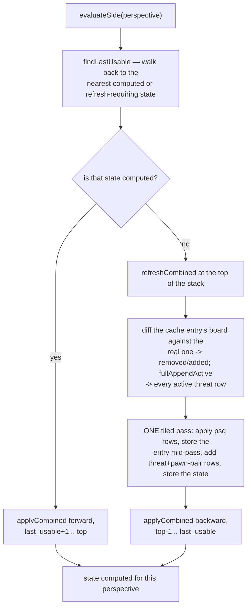

# Evaluation (NNUE)

How zfish turns a position into a score: an NNUE network whose input transformer is
updated incrementally as the search makes and unmakes moves, and a small stack of
integer affine layers over the transformed features. Everything here lives in
`src/engine/eval/` — inside the **engine** zone, importable by no zone above it
(see [00-architecture.md](00-architecture.md)). The eval is pure integer arithmetic,
so it is bit-exact and arch-invariant: every ISA tier must produce the same score
for the same position.

## Modules

| File | Owns |
| --- | --- |
| **network load / parse / storage** | |
| `network.zig` | the `Network` handle, the `load`/`save`/`verify` entry points, the file header, and the directory search; re-exports the inference surface |
| `nnue_parse.zig` | the `.nnue` byte format: signed LEB128 (`COMPRESSED_LEB128` sections), the section framing that writes each blob region at the offset `nnue_dimensions.zig` owns, `weightIndexScrambled`, and the `write_parameters` serializer |
| `nnue_leb.zig` | `decodeLeb` — the signed-LEB128 primitive alone, with its own reference encoder and bound tests; the one parse step that knows nothing of the section layout |
| `nnue_weight_storage.zig` | the weight arenas (`ftStorage`, `layerStorage`) and the loaded-net identity (`nnCurrent`, `nnDescription`) |
| `nnue_hash.zig` | the net-identity hashes: `hashBytes` (MurmurHash2-64A), the feature-transformer / architecture / network hash values, and the content hashes |
| **feature transformer** | |
| `nnue_feature.zig` | the FullThreats feature set and HalfKA indexing: `halfMakeIndex`, `fullMakeIndex`, the changed/active index lists (including the both-perspectives producer), and the refresh predicates; re-exports the PP_3Wide surface |
| `nnue_feature_pp.zig` | the PP_3Wide (pawn-pair) feature set: `ppMakeIndex`, its active/changed producers, and the both-perspectives topology walk |
| `nnue_feature_write_avx512.zig` | `writeIndices` — the AVX512VBMI+VBMI2 vector fast path for the refresh-time HalfKA removed/added index write |
| `nnue_feature_bb.zig` | the bitboard/attack math and comptime index tables `nnue_feature.zig` builds on |
| `nnue_feature_luts.zig` | the full-threat feature set's threat-index lookup tables — `index_lut1`/`index_lut2`, their offsets, the colocated `ThreatRouteBlock` planes, and the piece/square constants the index formulas share; all comptime-built |
| `nnue_ft.zig` | the four typed `FeatureTransformer` weight accessors, over the byte offsets `nnue_dimensions.zig` owns — it derives none of its own |
| **accumulator** | |
| `nnue_acc_layout.zig` | the accumulator-stack byte layout: strides, diff records, the `AccumulatorStack` handle, and every state/diff accessor |
| `nnue_acc_update.zig` | the update algorithm: `evaluateSide`, the refresh path, and the fused incremental step |
| `nnue_acc_entry.zig` | the two steps that start from a refresh-cache ENTRY: the entry diff both of them share, and `updateHybrid`, the same-half king move |
| `nnue_acc_both.zig` | `applyCombinedBoth` — one ply taken for BOTH perspectives, decoding each diff once |
| `nnue_acc_rowops.zig` | the `@Vector` weight-row add/sub kernels: `applyCombinedDelta`, `accRows`, the refresh-fused and hybrid passes, and the PSQT deltas |
| `nnue_transform_packus.zig` | the transform's packus clip-multiply-narrow kernels, one per x86 vector width (`packusTransform64`/`32`/`16`), and the scalar-reference tests that pin them |
| `nnue_refresh_cache.zig` | the per-(king square, perspective) refresh cache ("finny tables") and `clearRefreshCache` |
| `nnue_nnz.zig` | the transform's non-zero-chunk record: the two shapes (`NnzIndexList` on the AVX-512 VNNI tiers, `NnzBitset` elsewhere), the tier gate `use_nnz_index_list`, and `nnzRecord`/`nnzReset` |
| `nnue_accumulator.zig` | the stack facade (`stackPush`/`stackPop`/`stackReset`) and `transformBucket` — the clipped-ReLU transform, which writes the NNZ record as it packs |
| **inference** | |
| `nnue_inference.zig` | the forward pass: the affine layers, bucket selection, and the psqt/positional split — it drives the activations, it does not own them |
| `nnue_activations.zig` | the layer activations in every shape upstream emits: `sqrClippedReLU`, `clippedReLU`, and the fused `sqrClipPair`/`128`/`512` that produce both outputs in one pass, behind the `avx512_pair_activations` and `sse_pair_activations` tier gates. The forward driver picks a shape at comptime; the anchor is what pins that all of them agree |
| `nnue_affine.zig` | `affineDpbusd` and the non-VNNI affine kernels: the AVX2/SSSE3 maddubs dots, the `OUT == 1` contiguous dot, the portable reduction, and `GroupIter` |
| `nnue_affine_vnni.zig` | the AVX-512 VNNI kernel `affineVnni` — `vpdpbusd` plus the two sparse walks (index-list cursor under VBMI2, hoisted bitset otherwise) |
| `nnue_affine_load.zig` | `loadW`, the alignment-asserting weight-chunk load both affine files share |
| `evaluate.zig` | `computeValue` — blending the network output with optimism, material, and the 50-move counter into the final score — and `formatTrace`, the `eval` command's trace renderer (built by the file-local `formatTraceAlloc`) |
| `nnue_misc.zig` | the `eval` command's per-bucket contribution table |

## The network

A net file is a flat binary: a 12-byte header (`u32` version, `u32` structure hash,
`u32` description length) followed by the description, the feature-transformer blob,
and then one blob per layer stack. `network.zig` pins the version
(`network_version = 0x6A448AFA`) and rejects any file whose structure hash differs
from `nnue_hash.networkHashValue()` — the hash is derived from the architecture
constants, so a net built for a different architecture cannot load.

`network.load` resolves the `EvalFile` name (defaulting to
`default_eval_file_name`, the single source of truth for the net's name) against
three candidates in order:

| Candidate | Meaning |
| --- | --- |
| `"<internal>"` | the embedded net — only tried for the default name |
| `""` | the path as given, relative to the **current working directory** |
| `root_directory` | the binary's own directory |

Each candidate is skipped once a net of that name is already current. `loadUserNet`
maps the file read-only (POSIX `mmap`; Windows and an unmappable filesystem fall
back to a whole-file read into an arena) and hands the bytes to `loadNetworkBytes`,
which walks header → feature transformer → the eight layer stacks and requires the
consumed byte count to equal the file length exactly. The parse copies every weight
into the Zig-owned storage, so the mapping is released as soon as it returns.

**The net is an external runtime input, not a build artifact.** The "embedded" net is
an unconditional one-byte stub (`network.zig`) that always fails to parse, so the real
net must be found on disk. Because the whole search depends on it,
its absence is reported where it is required rather than left to surface as a
crash: `src/shell/engine/nnue.zig` (`requireNetworkLoaded`) checks
`network.ftPtr()` at startup, prints the file sought and every directory searched to
stderr — not through the UCI sink, which a quiet bench run suppresses — and exits
non-zero. For fetching the net and running the gates, see
[CONTRIBUTING](../CONTRIBUTING.md).

### Parsing and storage

`nnue_parse.zig` owns the format, over the `decodeLeb` primitive in `nnue_leb.zig`
(7 bits per byte, shift masked to 32, sign-extend when the final shift is under 32 and
bit `0x40` is set — upstream's `read_leb_128`). **`decodeLeb`'s bound is load-bearing,
not defensive tidiness**: a `.nnue` file states a section's byte length and its value
count independently, so a corrupt or hostile one can promise more values than it
carries, and ReleaseFast checks neither the slice nor the count. It returns `null`
rather than walking off the section, and every caller must treat that as a failed load.

**The section framing raises runtime safety; the LEB inner loop deliberately does not.**
The shipped binary is ReleaseFast, so no bound, cast or overflow is checked anywhere by
default — over a file the engine did not write, that is the wrong default. So
`readLebSection`, `parseFeatureTransformer`, `parseLayer` and `dstSlice` each open with
`@setRuntimeSafety(true)`: they do the offset arithmetic, they run once at startup, and
the checks are a backstop under the explicit `blob.len < …` rejections rather than a
replacement for them. `decodeLeb` is the exception, and the reason is measured rather
than assumed — it is the per-byte loop of the whole net load, and raising safety over it
cost **+22.8%** of the entire `bench 16 1 5` instruction count (`tools/perf_counters.zig`,
8 rounds, identical 45 597-node tree), where the framing alone costs +0.1%. Its every
access is already bounded by a test it states itself (`pos + 2 <= src.len`,
`pos >= src.len`, `out.len >= count`), so the check is redundancy over a proven bound —
paid for at the one place in the parse that cannot afford it.

The feature transformer is seven sections read in stream order — biases (LEB `i16`), threat weights (raw `i8`), threat PSQT weights
(LEB `i32`), pawn-pair weights (raw `i8`), pawn-pair PSQT weights (LEB `i32`), psq
weights (LEB `i16`), psq PSQT weights (LEB `i32`) — each written into its fixed,
64-byte-aligned offset in the destination blob. The threat and pawn-pair weight (and
PSQT) sections are framed separately in the stream but land in **one contiguous
region each** — pawn-pair rows right after the threat rows — so a single index
addresses either feature set's row (upstream's `threatAndPpWeights`). Affine layers are
`i32` little-endian biases followed by `i8` weights, permuted on the way in through
`weightIndexScrambled` (the SSSE3 layout the inference reads back; on the **AVX2**
pair-activation tier `fc_1`/`fc_2` additionally fold in the paired packs' lane
interleave — see the flag split below). `serializeFeatureTransformer` /
`serializeLayer` invert this exactly, so an exported net round-trips byte-for-byte.

The parse is the *sole* source of weights: it writes straight into the arenas owned
by `nnue_weight_storage.zig`, and inference reads from that same memory. Those
arenas come from `page_alloc.alloc` (`src/engine/state/page_alloc.zig`) — the
injected large-block seam the platform backs with huge pages, and which falls back
to a page-backed allocator in a headless build; see [06-platform.md](06-platform.md). `nnue_weight_storage.zig` sits below
both `network.zig` and `nnue_inference.zig` so the I/O half and the compute half
share an owner without importing each other. There are exactly two arenas: the
feature-transformer blob, and ONE contiguous block holding all eight buckets'
fc_0/fc_1/fc_2 biases+weights at comptime offsets — mirroring upstream's in-line
`NetworkArchitecture network[LayerStacks]` member. Keep it one block: splitting the
layer stack into per-part huge-page allocations puts every part at the same address
bits modulo the huge-page alignment, aliasing the inference weights into a handful
of last-level cache sets (measured as ~5 extra LL misses per eval).

## Architecture of the net

The net has **three feature sets**. Their dimensions are pinned in
`nnue_dimensions.zig`, which also derives the blob layout they determine;
`nnue_feature.zig` owns the indexing:

| Feature set | Dimensions | Index | Weights |
| --- | --- | --- | --- |
| PSQ (HalfKA v2, king-bucketed / horizontally mirrored) | `psq_feature_dimensions = 22528` | `halfMakeIndex` — oriented square + `piece_square_index` + `king_buckets` | `i16` |
| Threats (full threats: attacker × attacked × from × to) | `threat_dimensions = 59808` | `fullMakeIndex` — LUT over the oriented attacker/attacked pair and move | `i8` |
| Pawn pairs (PP_3Wide: pairs of pawns on the same or an adjacent file, ranks 2–7) | `pp_dimensions = 4560` | `ppMakeIndex` — triangular index of the two oriented pawn ids, base `pp_index_base = 59808` | `i8` |

Together they are the net's 86896 input dimensions (`network.verify`). The threat and
pawn-pair sets are **concatenated** — pawn-pair indices continue past the last threat
index (`pp_index_base == threat_dimensions`) — so they share one weight region and one
changed/active index list. `nnue_dimensions.zig` owns all three cardinalities and
*derives* `pp_index_base` from the threat count rather than restating it; four files
used to declare that count independently, each under its own name and integer width,
and a sync moving it in three of the four would have left the fourth addressing a real
row of the wrong feature set — an evaluation that is a plausible number rather than a
fault. The SFNNv16 change moved pawn-pawn interactions out of the
threat inputs (which lost the pawn-pusher input and pawns as threat targets) and into
this set. All three feed one shared **feature transformer** whose layout the same
module fixes: biases, psq weights, the combined threat+pawn-pair weights, and two
`i32` PSQT tables (`psqt_buckets = 8`; the threat+pawn-pair PSQT is likewise
combined), each region 64-byte aligned. It produces `half_dimensions = 1024`
accumulated values per perspective.

That layout is derived **once**, for the same reason `pp_index_base` is. It used to be
derived twice — `nnue_parse.zig` computed the offsets it *writes* each region at,
`nnue_ft.zig` computed the offsets its accessors *read* them back from, with two
round-up helpers and two independent spellings of 64 — and nothing related the two.
Editing one side alone left the parser writing every weight where the accessors do not
look: the net still loads, every gate still runs, and the evaluation is a plausible
wrong number. Measured, not argued: on the pre-change tree, moving
`psq_feature_dimensions` in `nnue_ft.zig` alone built clean and benched 4414749 nodes.

`nnue_accumulator.transformBucket` turns the two perspectives' accumulators into the
network input: per element, clamp to `[0,255]` and multiply the two halves with a
`>> 9` — the pairwise squared-clipped-ReLU — yielding 1024 `u8`. On every x86 tier
`packusTransform64` / `packusTransform32` / `packusTransform16`
(`nnue_transform_packus.zig`) compute the same values with upstream's packus body: the
second half skips its `max(0, ·)` because the signed `pmulhw` carries the sign into the
product and the saturating `packuswb` zeroes it on pack. The 256- and 512-bit packs
interleave their 128-bit lanes, so one shuffle restores natural byte order — the
permutation upstream instead folds into the weights at load time. It records which
4-byte chunks are non-zero into an `NnzBitset` in the same pass, while the values are
still in registers, and returns the perspective-differenced PSQT value for the bucket.

Above the transformer sit **8 layer stacks** (`layer_stacks = 8`), selected by
material: `bucket = (piece_count - 1) / 4` (`nnue_inference.evaluate`). Each stack is

```
fc_0 (1024 -> 32) -> ac_sqr_0 | ac_0 -> fc_1 (64 -> 32) -> ac_sqr_1 | ac_1 -> fc_2 (128 -> 1)
```

Output scaling is integer throughout. The activation shifts are fixed per layer:
`fc_0`'s outputs go through `sqrClippedReLU(21)` and `clippedReLU(7)`, `fc_1`'s
through `sqrClippedReLU(19)` and `clippedReLU(6)`. On the plain-AVX2 tier
(`nnue_parse.pair_activations` — AVX2 with neither VNNI nor AVX-512, upstream's
`USE_AVX2_PAIR_ACTIVATIONS`) `sqrClipPair` fuses each layer's two activations,
sharing the loads and the signed saturating packs; the packs' per-128-bit-lane
interleave is folded into the `fc_1`/`fc_2` weight parse instead of a restoring
permute, so the values — and every tier's eval — are unchanged. The 128-bit
SSSE3-class tier (`sse_pair_activations` — SSSE3 without AVX2) runs the same fused
shape as `sqrClipPair128`; its packs concatenate in order, so the bytes land in
natural order and the weight parse stays the identity. The forward output is
`fc_2[0] + (fc_0[30] - fc_0[31])` scaled by `600*16 / (128*64*2)`, and `evaluate`
divides both the psqt and positional halves by `output_scale = 16` before returning.

## The accumulator

`AccumulatorStack` (`nnue_acc_layout.zig`) is a raw, 64-aligned byte arena embedded
in each `Worker` — one state per ply, `max_stack_size = 247`. A state holds both
perspectives' `i16` accumulation and `i32` PSQT values, a per-perspective `computed`
flag, and the ply's diff records. There is **one combined accumulator** (HalfKA +
Threats + PawnPairs summed), living in the `psq_feature` storage slot.

The search drives it from `src/engine/search/search_acc.zig`: `doMoveAcc` calls
`stackPush` to claim the next slot and hands its `DirtyPiece` / `DirtyThreats`
records to `doMove`, which records the move's changed features while making it
(`DirtyThreats` also carries the before/after pawn bitboards the pawn-pair set diffs);
`undoMoveAcc` calls `stackPop`. Nothing is computed on the way down — states are
pushed uncomputed, and `evaluateAcc` triggers the work only when a node actually
needs a score. See [02-engine-search.md](02-engine-search.md) for the search side and
[01-engine-board.md](01-engine-board.md) for how the board fills the dirty records.

`evaluate` (`nnue_acc_update.zig`) brings both perspectives up to date, and how it does
that depends on whether either needs a refresh.

**Shared walk.** When NEITHER side does, the whole update is a forward walk, and above the
later of the two starting points both walks visit the same plies. So catch the lagging
side up alone, then take that common suffix once (`nnue_acc_both.zig`,
`applyCombinedBoth`). What is shared is what does not depend on the perspective: the
dirty-threat records with their add/remove routing, and the pawn-pair topology — which
squares changed, which partners each pairs with, in what order. What stays
per-perspective is the orientation every index is read under, the HalfKA indices, and the
accumulator arithmetic. Each list ends up holding exactly what its own separate walk
produced, in the same order.

Two details make that work. The threat routing bit is shared because bit 31 of a route
mask is set only for a *backward* walk and the shared walk is forward-only — so both
sides route identically off the raw record. But each index still gets its **own** bound
test: one perspective can drop a record the other keeps, and the two lists need not be the
same length.

Otherwise `evaluateSide` runs once per perspective.
`findLastUsable` walks back from the top of the stack for the nearest state that is
either already computed or requires a refresh. It tests **only** the PSQ refresh
condition (the moved piece is that perspective's king), because a threat refresh —
the king crossing the board's centre file — is a strict subset of it, so the
combined accumulator always refreshes as a unit.


```mermaid
flowchart TD
    A["evaluateSide(perspective)"] --> B["findLastUsable — walk back to the<br/>nearest computed or refresh-requiring state"]
    B --> C{"is that state computed?"}
    C -->|yes| D["applyCombined forward,<br/>last_usable+1 .. top"]
    C -->|no| E["refreshCombined at the top of the stack"]
    E --> E1["diff the cache entry's board against the<br/>real one -> removed/added; fullAppendActive<br/>-> every active threat row"]
    E1 --> E2["ONE tiled pass: apply psq rows, store the<br/>entry mid-pass, add threat+pawn-pair rows, store the state"]
    E2 --> F["applyCombined backward,<br/>top-1 .. last_usable"]
    D --> G["state computed for this perspective"]
    F --> G
```

**Hybrid.** A king move rebuckets every HalfKA index, so it would normally force a full
refresh — but the threat and pawn-pair orientation depends only on which **half** of the
board the king stands on. A king move that stays on its half therefore keeps that whole
accumulation, and only the HalfKA half has to change buckets. Both buckets are reachable
from the refresh cache, so the step is

```
target = computed − <old-bucket HalfKA> + <new-bucket HalfKA> + <this ply's threat/pp delta>
```

`nnue_acc_entry.zig` owns it (`updateHybrid`), together with the entry diff that the
refresh path shares. The old bucket's board is the position *before* the move, which
exists nowhere: the step reconstructs it by undoing the king move on a copy of the piece
array — the only board the accumulator builds rather than reads, and the reason the step
is bounded below by `MIN_PC_COUNT_HYBRID = 15` pieces. Below that, summing the threat and
pair features outright beats reconstructing the source bucket. Castling is excluded
because it relocates a rook as well.

`hybridApplicable`'s conditions are not all the same kind, and the bench separates them.
Dropping the same-half test **moves the node count**; so does allowing castling — both are
correctness conditions, and the step computes a different accumulator without them.
Dropping the piece-count bound leaves the count **unchanged**: that one is purely the cost
threshold it is described as. Re-derive this rather than trusting it — mutate the
predicate and run `zig build signature`.

**All five routes produce the same numbers, and that is what makes a dead one
invisible.** Which route runs changes only how much work the update costs, so a route
that stops running is answered correctly by the route that replaces it: the values never
move, the tree is identical, and the node count does not budge. bench, every UCI golden,
`arch-determinism` and the upstream node differential are all *value* gates — none of
them can see a whole branch go unreachable.

Only a counter can. `nnue_acc_update.PathCounts` counts the forward walk, the refresh, the
backward fill, the hybrid step and the shared walk, and `headless_search.zig`'s *"every
accumulator update route is exercised"* test drives a real depth-8 search and asserts every
one of them moved. The
counters compile in under `builtin.is_test` alone, so the shipped binary carries no
increment in the engine's hottest function — the branch folds away at comptime. Verified
by mutation: disabling the forward route fails that test and nothing else.

### And separately: do they pay?

"The route fires" and "the route is worth having" fail independently, and the counters
above answer only the first. A hot-path restructure can run, produce the right values,
and still cost time — an avx2 tile measured here once came in at −7.4% instructions and
**+1.9% cycles**.

Measured by ablation, which is clean precisely *because* every route agrees on every
value: disable the hybrid step and the shared walk together, and both binaries bench the
same node count (`zig build signature`), so it is one tree with two amounts of work, and
startup is identical on both sides and cancels.

| tier | instructions | per-node | cycles |
|---|---|---|---|
| avx2 | 0.995 | 6768 against 6800 | 0.935 |
| vnni512 | 0.983 | 5171 against 5259 | 0.979 |

So both ports pay as well as being faithful — ~1.7% of whole-process instructions at
vnni512, and more than that in the search alone, since startup dilutes a whole-process
figure. The sibling C port measured the same pair independently at 0.981, which is close
enough to be worth stating: two ports, two codebases, one conclusion.

**Read the cycles column as agreement in direction only.** This box was not idle when
these ran, and the documented serial-cycle floor here is ±1%; the instruction axis is
near-deterministic under load, which is why the claim rests on it.

### And the architecture above them: does the delta beat a rebuild?

Those two rows price the *routes*. The design underneath them — keep dirty records and
step incrementally, rather than rebuild the accumulator from the board every evaluation —
is priced by two comptime ablations, both bit-exact, so all three builds search the same
tree:

```sh
zig build -Darch=x86-64-sse41-popcnt                                        # A, shipped
zig build -Darch=x86-64-sse41-popcnt -Dacc-refresh-only                     # B
zig build -Darch=x86-64-sse41-popcnt -Dacc-refresh-only -Dno-threat-record  # C
cd resources && perf_counters --budget <bin> 5 bench 16 1 8
```

| build | instructions | vs shipped |
|---|---|---|
| A incremental + recording | 2,756,229,512 | 1.0000x |
| B rebuild every evaluation + recording | 3,785,329,102 | 1.3734x |
| C rebuild every evaluation, no recording | 3,731,454,159 | 1.3538x |

`B − C` is what `do_move`'s dirty-threat recording costs: **53.9M**, 1.44% of the rebuild
baseline. `C − A` is what the delta is worth: **975.2M**, so the incremental design is
**26.1% cheaper** than rebuilding.

**The recording is not the variable, and that is the transferable part.** The Rust sibling
port measured the same architecture and got the opposite verdict — its delta came in 7.1%
*dearer* than its rebuild, on a recording costing a comparable 4.14% of its baseline. The
difference is what the delta gets to SKIP. zfish applies dirty records straight into the
accumulator rows and materialises a feature set only on a refresh, so the delta skips the
whole active-set construction. A design whose live state IS a materialised set must derive
the child's set on the delta path too, to have it for later plies — so it pays the
rebuild's dominant cost either way and is left contesting the fold alone. Two ports, one
architecture, opposite signs, and the pivot is the data model rather than the language.

`-Dno-threat-record` refuses to compile without `-Dacc-refresh-only`, because the
incremental step reads the records it drops.

**Incremental step.** `applyCombined` builds this ply's PSQ and threat
changed-feature index lists from the stored diffs, splits them into removed/added
(inverted when stepping backward), and applies all four lists to the accumulator in
one pass. The threat list routing lives out of line in
`nnue_feature.fullAppendChanged` (upstream's `append_changed_indices` keeps the same
boundary): each packed record is oriented by one xor with a per-walk mask —
`threatRouteMask` folds the orientation, the color swap and the walk direction into
it, so the record's sign bit alone routes the index into removed or added.
`nnue_feature.ppAppendChanged` then appends the pawn-pair delta — the pairs touching a
changed pawn, computed from the ply's before/after pawn bitboards — onto the **same**
removed/added lists (their indices continue past the threats into the shared weight
region; the two out-lists swap for a backward walk, mirroring upstream's swapped
`append_changed_indices` arguments). The
apply itself: `nnue_acc_rowops.applyCombinedDelta` tiles the accumulator, holds each
tile in a register, and walks the weight rows *inside* the tile — so the accumulator
is loaded and stored once per tile rather than once per row. The PSQT delta
(`applyCombinedPsqtDelta`) holds the 8-bucket i32 row as one vector the same way.
Every weight pointer these kernels take carries `align(64)` and each row load asserts
its alignment at the load site (`loadVec`/`loadW`): a runtime-offset slice of a
many-pointer degrades to the element alignment, and non-VEX SSE folds a load into an
op's `m128` operand only when 16-byte alignment is provable — without the assert the
sse41 tier pays a separate `movdqu` per 16 weight bytes.

**Refresh.** A full refresh never rebuilds from an empty board. The refresh cache
(`nnue_refresh_cache.zig`) holds one entry per (king square, perspective) — the
accumulation, the PSQT values, and the board (plus its occupancy bitboard) that
produced them. `refreshCombined` diffs the entry's stored board against the current
one with two 32-byte vector compares into a changed-square bitboard, splits it into
removed/added HalfKA rows by the cached and current occupancy (upstream's
`get_changed_pieces` shape). At `nnue_feature.use_avx512_nnue_feature` (AVX512VBMI +
AVX512VBMI2 — `nnue_feature_write_avx512.zig`) both removed/added index lists are
written in one vector pass, as upstream's `HalfKAv2_hm::write_indices` does: since
`piece_square_index` and `king_buckets` are both multiples of 64 while `orient` and
the square only ever use the low 6 bits, no carry crosses bit 6, so
`(square ^ orient) + psi[pc] + bucket == square ^ (psi[pc] + bucket + orient)` —
`compress` packs the changed squares/pieces into 32-lane vectors, a 16-bit
`permutexvar` gathers each active feature's `psi[pc] + bucket + orient` from a
per-piece table built once per call, and one XOR against the compressed squares
produces every index at once. Below that tier, the scalar loop calls
`halfMakeIndex` per changed square, upstream's own non-vector path. `refreshCombined`
then collects every active threat row (`fullAppendActive`,
with each attacker's targets pre-restricted to the piece types its map row can
index — upstream's `pawnTargets`/`minorSliderTargets`/`queenTargets`) plus every
active pawn-pair row (`ppAppendActive`) onto the same list, and applies everything
in one tiled pass (`nnue_acc_rowops.applyRefreshFusedI16`): the pass loads the entry
tile, applies the psq rows, stores the psq-only tile back to the entry (in place,
for next time), keeps adding the threat and pawn-pair rows in the same registers, and
stores the combined `psq + threat + pawn-pair` tile to the stack state — mirroring upstream's
`update_accumulator_refresh_cache`, with no second pass over the 2 KB row. It then
stores the new board back. `clearRefreshCache` seeds every entry with the
feature-transformer biases — the empty-board accumulator — and is called at worker
construction.

A refresh happens when `findLastUsable` reaches a state that is not computed: either
the bottom of the stack, or a ply whose diff says this perspective's king moved
(HalfKA is king-bucketed, so every index changes) — the same predicate as
`nnue_feature.halfRequiresRefresh`.

## Inference

`nnue_inference.zig` runs the forward pass for one bucket over the transformed
features. Each layer is `affineDpbusd`, which selects a kernel at comptime from the
target and shares one scalar-equivalent contract:

| Tier | Kernel | Why |
| --- | --- | --- |
| AVX-512 VNNI | `affineVnni` — `vpdpbusd` via the LLVM intrinsic, split into 3 dependency chains | LLVM will not lower the portable `@Vector` int8-dot pattern to `vpdpbusd`; the high-latency op needs independent accumulators merged at the end |
| AVX2 | `affineAvx2` — 256-bit `pmaddubsw` + `pmaddwd`, 8 outputs per step | the same maddubs dot as SSSE3 at twice the width; without it AVX2 fell to the portable path and the affine ran +64% instructions |
| SSSE3 | `affineSsse3` — 128-bit `pmaddubsw` + `pmaddwd`, 4 outputs per step | `pmaddubsw` multiplies `u8 × i8` directly: twice the lanes per register; also the AVX2 fallback for an `OUT` the 256-bit path cannot tile |
| `OUT == 1` (`fc_2`) on x86 | `affineOut1` — one contiguous int8 dot (`vpdpbusd`/`pmaddubsw`) plus a horizontal add | a single output makes the scrambled layout the identity, so `fc_2` is a plain 128-wide dot; the tiled kernels need `OUT % 4`, so it otherwise fell to the per-group portable path — measured the 2nd-largest affine cost |
| everything else | portable `@Vector` two-stage `pmaddwd` reduction | one source, lowered per target |

All of them are pure integer dots over the same scrambled layout, so they are
bit-identical; a unit test in the file pins every path against a scalar reference at
each `-Darch`.

### Paired activations, and why pairing and scrambling are two flags

Between the affine layers sit the squared and linear clipped ReLUs. Three tiers compute
them **together** off shared input loads rather than in two passes — `sqrClipPair512`
(AVX-512), `sqrClipPair` (AVX2) and `sqrClipPair128` (SSSE3) — narrowing once to `i16`,
squaring via mulhi and clipping via max+shift at that width, then narrowing to bytes.

Whether a tier pairs and whether it must **scramble** are separate questions, and
`nnue_parse.zig` carries them as two flags because upstream does
(`USE_PAIR_ACTIVATIONS` vs `USE_SCRAMBLED_ACTIVATIONS`):

| Tier | `pair_activations` | `scrambled_activations` | Narrowing |
| --- | --- | --- | --- |
| AVX-512 | yes | **no** | `vpmovsdw` narrows the whole register **in order** |
| AVX2 (no VNNI, no AVX512) | yes | **yes** | `vpackssdw`/`vpacksswb` narrow per 128-bit **lane**, interleaving the bytes |
| SSSE3 | (own kernel) | no | the 128-bit packs concatenate in order — no cross-lane interleave exists at that width |

`scrambled_activations` alone drives `weightIndexScrambled`'s extra permutation of the
`fc_1`/`fc_2` weights. **Inverting the two silently corrupts those weights** — the values
stay plausible and only the node count moves — so the kernel keys off `pair_activations`,
the parse keys off `scrambled_activations`, and the bench signature is what pins that the
two agree on every tier.

The **sparse path** reads what the transformer recorded, never a re-derived test.
`fc_0` is sparse (its 1024 inputs are mostly zero after the clipped ReLU); `fc_1` and
`fc_2` are dense. Indices ascend either way, so the accumulation order — and the
result — is unchanged.

The record has two shapes, and which one the transform writes is decided by what the
tier's consumer can read (`nnue_nnz.use_nnz_index_list`, gated on `avx512vnni` so it
agrees with `nnue_affine_vnni`'s `has_vnni`, **and** on `avx512vbmi2`):

- **index list**, on `avx512icl` and better — upstream's `NNZInfo` at `USE_AVX512`
  (`nnz_helper.h`), which never builds a bitset. `nnzRecord` compresses each transform
  step's non-zero chunk indices with one `vpcompressw`, and `affineVnni` reads three per
  iteration off a straight-line cursor whose only branch is the loop back-edge.
- **bitset**, everywhere else — one bit per 4-byte chunk, walked with `@ctz`/`blsr`
  against a hoisted per-word base pointer.

The VBMI2 half of that gate is measured, not defensive. VBMI2 compresses 32 `u16` lanes
per instruction, which is exactly one transform step's mask; without it a step needs two
`vpcompressd` plus two narrowing stores, and that doubled producer cost flips the
instruction axis — `x86-64-vnni512` measured 1.003 against where `avx512icl` measured
0.998 for the identical patch, while both gained 0.934 on branch misses. Two tiers,
opposite verdicts on the axis that is deterministic, so only one takes the list.

The placement is upstream's and it is the one that does least: the compress runs in the
transform where the mask is already in a register, and the bitset store disappears
rather than being kept and expanded later. Building the same list at the *consumer*
measures the same two wins but retains that store on top of the expansion, so it is not
taken — `nnue_affine.zig` records both, and records which axes on this box are too noisy
to separate them (cycles, IPC and cache misses all fail an A/A calibration at this
magnitude; instructions and branch misses pass it).

Activations are `sqrClippedReLU` (`min(127, (x*x) >> shift)`) and `clippedReLU`
(`clamp(x >> shift, 0, 127)`), written into a 128-byte `concat` that `fc_1` and
`fc_2` read. `evaluateBucketRaw` returns the two halves — `psqt` from the
transformer, `positional` from `propagateBucket` — and `evaluate` scales both by
`output_scale`.

`evaluate.zig` blends them into the final score. `computeValue` folds
`psqt + positional`, scales optimism by the psqt/positional disagreement
(complexity), damps the net output by the same, weights by material, applies the
50-move-rule decay, and clamps inside the TB bounds — all in `i64` with truncating
division. The search calls it through `search_acc.evaluateAcc`, which supplies
material and the side-to-move optimism.

## SIMD

The hot path — the row ops, the transform, the affine layers — is portable
`@Vector`: one kernel per operation, lowered by LLVM per target, with arch-specific
choices as `comptime` branches rather than forked source. Because the eval is
integer-exact it is also arch-invariant, so every ISA tier must agree on the
signature. See [08-idiomatic-zig.md](08-idiomatic-zig.md) for the pattern and the
gates that hold it.

Two vector widths are independent knobs and must not be folded into one:
`nnue_acc_layout.transform_vec_width` (the transform's clipped-ReLU pass) and
`row_tile_width` (the weight-row tile, file-local to `nnue_acc_rowops.zig`). They
touch different loops.

## Invariants

| Invariant | Held by |
| --- | --- |
| The evaluation is **integer-exact** — no floating point anywhere on the path from features to score. | `computeValue` in `i64`; every kernel integer |
| The evaluation is **arch-invariant**: every `-Darch` tier yields the same score. All three `affineDpbusd` paths are bit-identical dots. | the per-path scalar-reference test in `nnue_inference.zig`; the cross-tier bench signature |
| An **incremental update equals a full refresh**. Integer add/sub commute under two's-complement `i16` wrap, so applying rows in any order, tiled or not, forward or backward, yields the same accumulator. | `applyCombinedDelta`; the refresh/incremental split in `evaluateSide` |
| The combined accumulator always equals `psq + threat + pawn-pair`, and all three feature sets refresh together — a threat/pawn-pair refresh is a subset of a PSQ refresh. | `findLastUsable` keyed on the PSQ condition only |
| The parse is the **sole source of weights**, and it must consume the file exactly. | the `offset != bytes.len` check in `loadNetworkBytes`; the structure-hash check |
| The accumulator-stack and refresh-cache footprints are **pinned**: `accumulator_stack_size` and `refresh_table_bytes` in `worker_layout.zig` must match what the layout constants here imply. Drift surfaces as a bench/parity failure, not a silent overrun. | `src/engine/state/worker_layout.zig` |
| The refresh cache is seeded from the FT biases before first use. | `clearRefreshCache`, called from `worker_construct.zig` |
