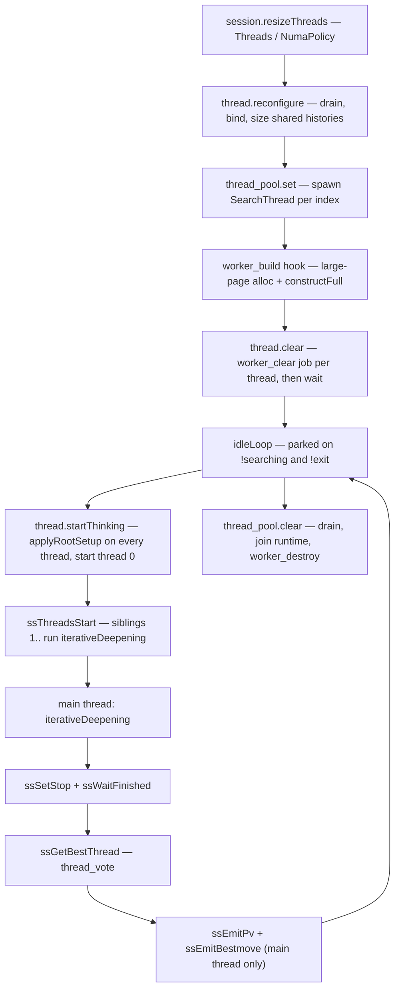

# Multithreaded search (Lazy-SMP)

zfish searches in parallel by running the *whole* search once per thread: every worker
runs its own `iterativeDeepening` loop over the same root position, and the threads
influence each other only through the shared transposition table, the shared
per-NUMA-node histories, and two atomic flags on the pool. When the search ends, one
thread's result is elected and reported.

The vertical spans all three zones:

* **shell** — sizes the pool from the `Threads` and `NumaPolicy` UCI options and drives
  the reconfigure chain (`src/shell/engine/session.zig`), and registers the lifecycle
  and pool-op hooks (`src/shell/main.zig`).
* **platform** — owns the OS threads, the idle-loop/job handshake, the pool footprint,
  the NUMA topology, and the vote (`src/platform/`).
* **engine** — owns the search each thread runs, and reaches the pool only through
  function-pointer seams (`src/engine/search/thread_ops.zig`).

For the search algorithm itself see [02-engine-search.md](02-engine-search.md); for the
memory, futex, and NUMA primitives see [06-platform.md](06-platform.md); for the zones and
the hook pattern see [00-architecture.md](00-architecture.md).

## Modules

| File | Owns |
| --- | --- |
| **platform — threads** | |
| `src/platform/thread_runtime.zig` | The job runner: `ThreadRuntime` — one `std.Thread` running `idleLoop`, plus `runCustomJob` / `waitForSearchFinished` / `deinit`, over the OS primitives [06-platform.md](06-platform.md) owns |
| `src/platform/search_thread.zig` | `SearchThread` — the vehicle: the `worker` handle, the heap `ThreadRuntime`, the thread index; `startSearching`, `clearWorker`, and the pool-level `startPoolSiblings` / `waitPoolSiblings` |
| `src/platform/thread_pool.zig` | The `worker_layout.ThreadPool` footprint writer: `set` (spawn + attach a Worker per index via an injected `ThreadBuilder`), `clear` (drain, join, free), `waitThread`, `boundNodesAssign` |
| `src/platform/thread.zig` | The pool policy layer: `reconfigure`, `startThinking`, `clear`, `startSearching`, `waitForSearchFinished`, `nodesSearched` / `tbHits`, `ensureNetworkReplicated`, `nextPowerOfTwo` |
| `src/platform/thread_vote.zig` | `ThreadSummary`, `bestThreadIndex`, `bestThreadWorker` — the Lazy-SMP vote |
| `src/platform/runtime_hooks.zig` | The lifecycle hook registry (`worker_build`, `worker_clear`, `worker_destroy`, the setup-state handoff, the shared-history insert/clear, `verify_thread_graph`) |
| `src/platform/numa.zig`, `numa/config.zig`, `numa/replication.zig` | The topology surface, the `NumaConfig` model + thread distribution, and the replica registry |
| **engine — the search side** | |
| `src/engine/search/thread_ops.zig` | The pool-op seam: `startSiblings`, `waitSiblings`, `waitThread`, `bestThreadWorker` |
| `src/engine/search/search_driver.zig` | `workerStartSearching` — the per-worker entry: main-thread branch, sibling start/wait, best-thread pick, final emit |
| `src/engine/search/search_id.zig` | The seam wrappers `ssThreadsStart` / `ssWaitFinished` / `ssGetBestThread`, `searchIdState`, `searchIdCollectBmc` |
| `src/engine/search/search_ctx.zig` | The per-iteration snapshots the ID loop reads through, including `ZfishIdState` (`stop`, `increase_depth`) |
| `src/engine/search/search_id_loop.zig` | The per-thread ID loop: the thread-indexed aspiration seed, the main thread's `increase_depth` / `stop` decisions |
| `src/engine/search/search_emit.zig` | The reporting side — only the main thread emits `info` and `bestmove` |
| `src/engine/search/tt.zig` | The shared transposition table; `waitThread` while a resize clears it |
| `src/engine/search/shared_history.zig` | One NUMA node's `SharedHistories` arena: construct / free / clear / verify, and the accessors |
| `src/engine/search/shared_histories.zig` | The element-count math for the two shared arrays |
| `src/engine/search/shared_histories_map.zig` | The generic NUMA-index → entry map (`tryEmplace`, `at`, `clear`) with construct/free hooks |
| `src/engine/search/history.zig` | The per-worker history writers and the per-iteration decay/clear |
| **engine — state** | |
| `src/engine/state/worker_layout.zig` | `WorkerLayout` (the Worker block), `ThreadPool`, `Thread`, `poolNodesSearched` / `poolTbHits`, `verifyLayouts` |
| `src/engine/state/worker_construct.zig` | `writeConstructorFields` / `constructFull` — bind a fresh Worker's SharedState references and NUMA identity scalars |
| `src/engine/state/worker_histories.zig` | `WorkerHistories` — the per-worker tables plus the shared-history reference |
| `src/engine/state/shared_state.zig` | `SharedStateOf` — the typed bundle (pool, TT, shared histories) handed to every Worker at construction |
| **shell** | |
| `src/shell/engine/session.zig` | `resizeThreads` / `resizeThreadsEngine` — the `Threads` / `NumaPolicy` reconfigure chain |
| `src/shell/main.zig` | The composition root: registers the lifecycle hooks and the four pool ops |

## The model

Each `SearchThread` runs `search_driver.workerStartSearching` with its own `Worker` as
the job context. `workerStartSearching` branches once on `ctx.is_mainthread`:

* **A sibling** runs `iterativeDeepening` and returns. It emits nothing, initializes no
  time management, and never inspects another worker.
* **The main thread** initializes time management, calls
  `ssThreadsStart` to launch the siblings, runs its own `iterativeDeepening`, busy-waits
  while pondering or `go infinite` has not yet been stopped, sets `stop`, calls
  `ssWaitFinished`, elects the best thread, and emits the PV and `bestmove`.

Nothing synchronizes inside the tree. Workers diverge because:

* they read and write the same TT concurrently and unsynchronized, so each sees a
  different history of stores;
* `search.aspirationInitialDelta` seeds the aspiration window from `thread_idx % 8`, so
  the threads start each iteration with different window widths;
* they share the correction, pawn, and continuation histories of their NUMA node, again unsynchronized.

The only cross-thread control signals are two `u8` atomics on `worker_layout.ThreadPool`,
both read by every worker's ID loop through `ZfishIdState`:

| Flag | Written by | Meaning |
| --- | --- | --- |
| `stop` | The main thread's time decision, the UCI `stop` path, `thread.startThinking` (clear at start) | Every worker aborts and unwinds |
| `increase_depth` | The main thread's per-iteration time decision | Cleared → each worker bumps its internal `search_again_counter` and re-searches shallower |

Aggregation is a read-only walk of the pool: `worker_layout.poolNodesSearched` and
`poolTbHits` sum each `Thread`'s Worker counters, and `searchIdCollectBmc` sums (and
resets) every worker's `best_move_changes` once per main-thread iteration, returning the
raw total. `search_id_loop.zig` divides that total by the thread count to scale the
time-management instability factor.

Data races on the TT and the shared histories are intentional and unfenced: entries are
plain values, a torn read is bounded by the search's own move-legality checks, and the
engine never relies on TT contents for correctness.

## The pool and worker lifecycle

`session.resizeThreads` is the single entry: it waits for any in-flight search, builds a
`SharedState` bundle (pool, TT, shared-histories map), and calls `thread.reconfigure`.

`reconfigure`:

1. drains and clears any existing pool (`waitMainThread` then `thread_pool.clear`);
2. reads `Threads`; returns immediately on zero;
3. resolves `NumaPolicy` into a `do_bind` decision (`none` → never, `auto` →
   `numa.suggestsBindingThreads`, anything else → always) and calls
   `thread_pool.boundNodesAssign` either way: with the per-thread node list when
   binding, with null to clear the `bound` slice when not;
4. clears the shared histories and re-inserts one `SharedHistories` per populated node,
   sized `nextPowerOfTwo(threads on that node)`;
5. calls `thread_pool.set`, which allocates the threads vector and, per index, creates a
   `SearchThread`, spawns its `ThreadRuntime`, and calls the `worker_build` hook to
   attach the Worker;
6. calls `thread.clear` (a `worker_clear` job on every thread, then a wait) and resets
   the main `SearchManager`;
7. calls `verify_thread_graph` to assert the resulting graph matches the model.

`resizeThreads` then sizes the TT and calls `ensureNetworkReplicated`. Allocation and
spawn failures propagate as `!void` to `resizeThreadsEngine`, the single handling
boundary.

The three lifecycle seams — `worker_build`, `worker_clear`, `worker_destroy` — are
`runtime_hooks` function pointers registered by `src/shell/main.zig`; see
[00-architecture.md](00-architecture.md#the-composition-root-and-the-cycle-break-hooks).
`worker_build` mints a `SearchManager` (main-thread flag for index 0), large-page-allocs
the Worker block, runs `worker_construct.constructFull`, and writes the Worker into the
thread's `worker` slot. `worker_clear` runs as a job *on* the thread, so each worker
zeroes its own tables. `worker_destroy` runs from `SearchThread.deinit`, after the
runtime is joined — no thread can touch the Worker once it is freed.

Job dispatch is `thread_runtime`. `idleLoop` sets `searching = false`, broadcasts, and
parks on `!searching and !exit`; `runCustomJob` stores a callback plus a context pointer,
sets `searching = true`, and broadcasts; `waitForSearchFinished` blocks until the job
returns. Three job kinds ride this one handshake: `applyRootSetup` (root position,
limits, root moves, TB config), `clearWorkerJob`, and `searchJob`. `searchJob` calls
through `search_thread.searchEntry`, a function pointer `thread.zig` installs at search
start so `search_thread` need not import `position`.

Teardown order is load-bearing. `thread_pool.clear` waits for every in-flight job
*before* tearing threads down: the teardown path runs with `stop` already set, so an
in-flight search bails immediately and emits its `bestmove` there. Skipping the drain
lets `deinit`'s `exit` flag race the idle loop and drop a just-queued search job — a lost
`bestmove`, deterministic for a back-to-back `go` / `quit`.

## Shared vs per-worker state

`worker_construct` binds each Worker's references from the `SharedState` bundle
(`src/engine/state/shared_state.zig`): the pool, the TT, and its node's
`SharedHistories`.

| State | Scope | Where |
| --- | --- | --- |
| History tables: main / low-ply / capture / continuation-correction / tt-move | Per-worker | `WorkerLayout.histories` (`worker_histories.WorkerHistories`) |
| Accumulator stack, refresh table | Per-worker | `WorkerLayout.accumulator_stack`, `.refresh_table` |
| Reductions table | Per-worker | `WorkerLayout.reductions` |
| Root position, root state, root moves, PV, `last_iteration_pv` | Per-worker | `WorkerLayout.root_pos` / `.root_state` / `.root_moves` / `.last_iteration_pv` |
| `nodes`, `tb_hits`, `best_move_changes`, `sel_depth`, `root_depth`, `root_delta`, `optimism`, `nmp_min_ply` | Per-worker (read across threads only for aggregation) | `WorkerLayout` |
| `limits`, `tb_config` | Per-worker copy, written identically by `applyRootSetup` | `WorkerLayout.limits`, `.tb_config` |
| `SearchManager` (time management, `ponder`, `stop_on_ponderhit`) | Per-worker, meaningful only on thread 0 | `WorkerLayout.manager` |
| `thread_idx`, `numa_thread_idx`, `numa_total`, `numa_access_token` | Per-worker identity | `WorkerLayout`, written by `worker_construct` |
| Transposition table | **Shared, unsynchronized** | `WorkerLayout.tt` → `SharedState.tt` |
| Correction + pawn + continuation histories | **Shared per NUMA node** | `WorkerHistories.shared_history` → `SharedState.shared_histories` (`shared_histories_map`, one `SharedHistories` per node; continuation entries relaxed-atomic) |
| `stop`, `increase_depth`, `setup_states`, the threads and bound slices | **Shared** | `worker_layout.ThreadPool` |
| NNUE network weights | **Shared, always resident** — not replicated per node | `engine/eval/` network storage |

`SharedHistories` is allocated from large pages and sized by
`shared_histories.sharedHistoriesSizes(thread_count)`: the correction and pawn arrays
scale with `nextPowerOfTwo(threads on the node)`, and their index masks are the counts
minus one. `clearSharedHistory` is partitioned by `thread_idx` / `numa_total`, so every
worker on a node clears a disjoint slice of the node's shared arrays in parallel.

## Thread voting

`search_driver.workerStartSearching` reports the main thread's move whenever the search
was depth-limited (`limits_depth != 0`) or skill-limited; otherwise it calls
`ssGetBestThread`, which reaches `thread_ops.bestThreadWorker`.

`thread_vote.zig` is a leaf over `worker_layout` — both `thread.zig` and the search
driver need the vote, and the driver cannot import `thread`, so the pure graph-read plus
integer arithmetic lives in its own module.

`bestThreadIndex` first fills one `ThreadSummary` per thread from its worker's first root
move: the PV's first move, whether the score is a bound, the score, and the PV length. Then:

1. `min_score` is the lowest score across all threads.
2. `threadVotingValue(summary) = score - min_score + 14` (no depth weighting).
3. `voteForMove(m)` sums that value — in `i64`, as upstream's vote map does — over every
   thread whose PV starts with `m`.
4. The winner is chosen by a linear scan against the current best:
   * if the current best is a **decisive** best (a non-bound TB-win/TB-loss score),
     only another decisive candidate with a larger absolute score displaces it;
   * otherwise a candidate wins if it is decisive, or if it is not a loss and either its
     move's vote exceeds the best's, or the votes tie and its own PV is longer than the
     best's.

The winner's Worker supplies the final PV and `bestmove`; the main thread still emits
them, and re-emits the PV when the winner is not itself.

## NUMA

Binding is decided in `thread.reconfigure` from the `NumaPolicy` option and, on `auto`,
from `numa.suggestsBindingThreads`. When bound, `numa.distributeThreadsAmongNodes` fills
a per-thread node index, `thread_pool.boundNodesAssign` writes it into the pool's `bound`
slice, and the per-node thread counts drive the shared-history sizing.

Two things are replicated per node:

| Object | Registry | Notes |
| --- | --- | --- |
| `SharedHistories` (correction + pawn) | `shared_histories_map` — a NUMA-index → entry map with construct/free hooks | Built by `reconfigure`, one entry per populated node, sized for that node's thread count |
| The NNUE network | `numa/replication.zig` — `NumaReplicationContext` tracks each `NumaReplicatedBase` hook and re-notifies on a config change | The context is live (it owns the `NumaConfig` the engine binds from), but **replication is not**: `thread.ensureNetworkReplicated` is still `_ = pool;`, the weights are always resident. Upstream shares one net across processes via `shm`; zfish allocates a private copy per process (measured: **+106 MiB per process**, PSS 286 vs 505 for two engines) |

The topology surface is live: `numa.configNodeCount` reports the config's real node count,
`distributeThreadsAmongNodes` calls `NumaConfig.distributeThreads`, and
`suggestsBindingThreads` evaluates upstream's rule. Every `NumaPolicy` value that can be
driven on a single-node host matches upstream, including a two-node string
(`0-7:8-15` → `2/8` on both) and the refusal of an unparseable one.

What remains single-node is **discovery**, not wiring: `NumaConfig.fromSystem` enumerates
every online CPU onto one node rather than reading `/sys/devices/system/node`, so `system`
and `hardware` cannot differ on **any** host — auto-detection collapses even a real
multi-socket machine to one node, and only an explicit `NumaPolicy` topology string reaches
the multi-node paths. The map, the `bound` slice, the per-node sizing math, and the replica
registry are real and unit-tested against multi-node inputs. The memory
and NUMA primitives are described in [06-platform.md](06-platform.md).

## The seams

`engine/` is a library: the transitive closure of every engine module stays inside
`engine/`, so it cannot import `platform/thread.zig` — and it must not, since the thread
stack imports the engine's `position` for its own pool ops. Importing back would invert
the zone stack and close a cycle.

So the four pool operations are `pub var` function pointers in
`src/engine/search/thread_ops.zig`, registered by the composition root:

| Seam | Registered to | Called from | Failure mode when unregistered |
| --- | --- | --- | --- |
| `startSiblings` | `search_thread.startPoolSiblings` | `ssThreadsStart`, before the main thread's own ID loop | silent — starts nothing |
| `waitSiblings` | `search_thread.waitPoolSiblings` | `ssWaitFinished`, after `stop` is set | silent — waits for nothing |
| `waitThread` | `thread.waitThread` | `tt.zig`, while a resize clears the table | silent — no wait |
| `bestThreadWorker` | `thread_vote.bestThreadWorker` | `ssGetBestThread` | silent — returns thread 0's worker |

These four are the unusual case: they are classed **service** hooks and declared
**search-affecting**, because unregistered they *answer* rather than abort. That is
deliberate. The defaults are exactly the correct single-threaded answers — there are no
siblings to start or wait for, no in-flight job to wait on, and the main worker *is* the
vote winner when it is the only searching thread — so a headless engine build with no
pool attached searches single-threaded and still reports a legal move. This is tolerable
only because both roots are accounted for: the shipped exe registers all four before the
engine is reachable, and the headless roots (including
`src/engine/search/headless_search.zig`) are genuinely single-threaded. `zig build
hook-lint` enforces that ratchet — every hook declares a failure mode and a class, and
the REGISTERED rule keeps the shipped-root claim true. See
[09-tooling-ci.md](09-tooling-ci.md).

The lifecycle hooks in `src/platform/runtime_hooks.zig` take the opposite line: each
defaults to a named `hookPanic`, so a root that skipped registration fails loudly and
names the missing hook.

## Determinism and testing

| Configuration | Deterministic? |
| --- | --- |
| `Threads 1`, depth- or node-limited | **Yes, bit-exact** — same score, same node count, same bestmove, across arch, OS, and build mode |
| `Threads 1`, time-limited | No — the time decision depends on wall-clock |
| `Threads > 1`, any limit | **No, by design** — TT and shared-history races make the tree, the node count, and the elected thread run-dependent |

`Threads 1` must reproduce the single-thread result bit-exactly; that is the floor
everything else is measured against. Multi-thread runs cannot be snapshot-compared at
all, so the gates assert a *band* and a set of well-formedness properties instead of
equality.

`tools/parity_harness.zig` drives both (see [09-tooling-ci.md](09-tooling-ci.md) for how
the gates are wired into `zig build`, and [CONTRIBUTING](../CONTRIBUTING.md) for what to
run before a commit):

**`mt-sanity`** (`zig build parity-mt`) is two layers over a fixed set of positions at a
fixed depth:

1. *The exact floor.* `Threads=1` at `go depth N` must reproduce the golden's score kind,
   score value, node count, and bestmove **exactly**. Depth-limited, so this is as
   bit-exact as `bench`. Without it, a single-thread regression that still landed inside
   the band below would slip past.
2. *The band.* For `Threads` in {2, 4}, the run must produce a well-formed `bestmove` and
   a score; the score kind must match the single-thread reference; a `mate` score must
   not flip sign; a `cp` score must land within a fixed centipawn band of the reference.
   This catches garbled result aggregation — a wrong vote, a dropped PV, a sign flip —
   that no snapshot can.

**`stress`** (`zig build parity-stress`) is a liveness gate, not a determinism gate.
Phase A hammers one process with go/stop cycles across `Threads` {1, 2, 4, 8}, a third of
them using the `go infinite` → `stop` handshake — the path that actually exercises the
wait/wake-on-address wakeup under contention. It waits for each cycle's own `bestmove`
marker, then requires the exact expected count and a clean exit. Phase B churns fresh
engine graphs: construct, search, destroy, per thread count, each yielding a bestmove and
a clean exit. A hang trips the CI job timeout.

The valgrind and teardown gates additionally sweep thread counts for leaks, invalid
accesses, and bad frees across the Worker build/clear/destroy lifecycle.
