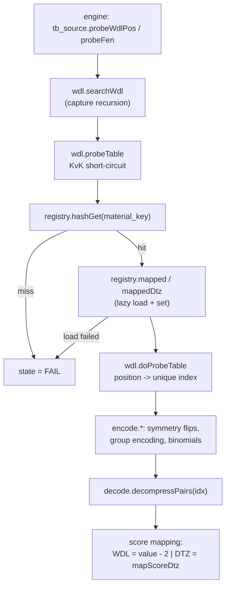

# Syzygy tablebases

zfish ports Stockfish's Syzygy prober bit-exactly — the same files, the same indexing,
the same probe results. For a position within the loaded tables' cardinality, a lookup
answers the game-theoretic result outright and the search returns it as a score.

The vertical spans three zones:

- **shell** — the `SyzygyPath` option and the load callback that (re)initialises the
  prober ([07-shell.md](07-shell.md)).
- **platform** — file discovery, the table registry, the file format decoder, and the
  probe algorithm ([06-platform.md](06-platform.md)).
- **engine** — the `tb_source` seam plus the two consumers: the in-search WDL probe and
  the root-move ranking ([02-engine-search.md](02-engine-search.md)).

The engine never imports the platform prober. It declares function pointers, the
composition root binds them, and a build with no prober attached simply never probes —
see [00-architecture.md](00-architecture.md#the-composition-root-and-the-cycle-break-hooks).

## Modules

| File | Owns |
| --- | --- |
| **platform: the facade** | |
| `src/platform/tablebase.zig` | the facade: re-exports `init` / `maxCardinality` / `discoveredMax` / `foundWdl` / `foundDtz` from `syzygy/tables.zig` and `probeFen` / `probeWdlPos` from `syzygy/wdl.zig`; re-exports `ProbeResult` from the engine's `tb_source` |
| **platform: syzygy** | |
| `src/platform/syzygy/tables.zig` | discovery: scan `SyzygyPath`, enumerate every material configuration up to 7 men, build the canonical stem, count files, set `maxCardinality` |
| `src/platform/syzygy/registry.zig` | the material-key → `TBTable` map, the lazy `.rtbw` / `.rtbz` load into a 64-byte-aligned buffer, and the `set` / `setDtzMap` parse of each `(side, file)` `PairsData` record |
| `src/platform/syzygy/probe.zig` | the data model (`LR`, `SparseEntry`, `PairsData`, `EntryInfo`) plus the pure helpers `setGroups` and `setSymLen` |
| `src/platform/syzygy/encode.zig` | the position→index geometry: `binomial`, `map_kk`, `map_a1d1d4`, `map_b1h1h7`, `map_pawns`, `lead_pawn_idx`, `lead_pawns_size` |
| `src/platform/syzygy/decode.zig` | the file header parse (`setSizes`) and the RE-PAIR / canonical-Huffman decoder (`decompressPairs`); the `TBFlag` bits |
| `src/platform/syzygy/wdl.zig` | the algorithm: `doProbeTable`, `probeTable`, `searchWdl`, `probeDtz`, `mapScoreDtz`, and the two probe surfaces `probeFen` / `probeWdlPos` |
| **engine** | |
| `src/engine/search/tb_source.zig` | the seam: `ProbeResult`, `maxCardinality`, `probeFen`, `probeWdlPos` |
| `src/engine/search/search_main.zig` | Step 6 — the in-search WDL probe and its score/bound handling |
| `src/engine/search/root_move_build.zig` | `TbConfig`, the root DTZ/WDL ranking, and the ranked `RootMoves` array |
| `src/engine/search/search_values.zig` | `value_tb`, `value_tb_win` — the TB score band |
| `src/engine/board/score.zig` | `classify` — the pure non-decisive / tablebase / mate score classifier |
| `src/engine/search/search_emit.zig` | the info-line emit: the `tbScore` override and the `tbhits` count |
| `src/engine/search/uci_wdl.zig` | `formatScore` — renders a TB-band score as `cp` |
| **shell** | |
| `src/shell/option_model.zig` | the four Syzygy option declarations |
| `src/shell/engine/session.zig` | the `SyzygyPath` callback — delegates to `control.tbInit` |
| `src/shell/engine/control.zig` | `tbInit` (init + load report, every caller) and `searchClear` — re-inits on `ucinewgame` / `Clear Hash` |
| `src/shell/engine/trace.zig` | the `d` command's `Tablebases WDL:` / `Tablebases DTZ:` lines |

`wdl.zig` imports `registry.zig` downward and never the reverse, so neither is a
god-file. Both cross the platform→engine down-edge: `wdl.zig` for a scratch `Position`,
its bitboards, and `movegen.generateLegal` (it generates all legal moves and filters the
captures itself), `registry.zig` for the material-key computation.

## What the files are

A Syzygy table set ships two file kinds per material configuration, and the code treats
them as two distinct tables on one `TBTable`:

| File | Answers | Read by |
| --- | --- | --- |
| `.rtbw` (WDL) | the game-theoretic result from the side-to-move's view: win / cursed win / draw / blessed loss / loss (`wdl_win` … `wdl_loss`, raw value − 2) | `registry.mapped`, `probeTable(dtz=false)` |
| `.rtbz` (DTZ) | the distance, in plies, to the next **zeroing** move (capture or pawn move) along an optimal line | `registry.mappedDtz`, `probeTable(dtz=true)` |

The two answer different questions, and the engine uses each where it needs that answer:

- **In-search (`search_main.zig`, Step 6)** probes **WDL only**. Inside the tree the
  search needs a value and a bound, not a move — WDL supplies both.
- **At the root (`root_move_build.zig`)** probes **DTZ first**. Ranking root moves
  requires *progress*, not just the result: every winning move is a win, so WDL cannot
  order them. DTZ can. The WDL ranking (`rankRootMovesWdl`) is the fallback used only
  when either probe fails (`probe.dtz_state == probe_fail`, or `probe.wdl_state ==
  probe_fail` on the zeroing-child branch), in which case all winning moves tie.

`registry.zig` declares and sets the `TBTable` fields that mark the two flavours —
`has_pawns`, `sides`, `dtz_ready`, `ready` — and `wdl.zig` only reads them. WDL tables
store both sides when `key != key2`; DTZ tables are always
one-sided, so when the stored side is not the side to move `doProbeTable` returns
`change_stm` and `probeDtz` resolves it with a 1-ply search minimising DTZ.

A `ProbeResult` (`tb_source.zig`) carries both: `available`, `wdl` + `wdl_state`, and
`dtz` + `dtz_state`. `available == 0` means "no WDL result"; a DTZ failure is reported
through `dtz_state` while WDL still reports.

## Loading

Loading is driven entirely by the `SyzygyPath` UCI option. `option_model.zig` declares it
as a string option with `callback_syzygy_path`; `session.zig` dispatches that callback to
`control.zig`'s `tbInit`, which runs `tablebase.init(value)` and, whenever the path is
non-empty, prints the load report:

```
info string Found N WDL and N DTZ tablebase files (up to M-man).
```

from `foundWdl()`, `foundDtz()`, and `discoveredMax()`. `searchClear` re-runs the SAME
`tbInit` with the stored path, so `ucinewgame` / `Clear Hash` rebuild the registry AND
print the report again — upstream emits it from inside `Tablebases::init`
(tbprobe.cpp), so every init with a usable path reports, whoever the caller is.

`tables.init` copies the path and calls `registry.reset`, then enumerates **every
King-vs-King material configuration up to 7 men** and calls `add` on each. The path is
split on the platform separator (`;` on Windows, `:` elsewhere) per lookup, in
`tbFileExists` and `registry.loadFile`. `add`:

1. builds the canonical **stem** with `buildName` — concatenate `PieceToChar` per piece
   type, then insert `v` before the second `K`: `{K,Q,K}` → `KQK` → **`KQvK`**;
   `{K,R,P,K,R}` → `KRPvKR`.
2. counts the DTZ file if `<stem>.rtbz` exists in any path directory;
3. requires `<stem>.rtbw` — a table is only "found" when its WDL file exists;
4. raises `max_card` to this configuration's piece count;
5. calls `registry.register(pieces)`.

Existence is tested with libc `access(path, F_OK)`. **Discovery counts files; it does not
open or validate them** — the magic header is checked later, at load time.

`registry.register` computes both material keys from per-color piece counts through the
engine's `computeMaterialKey`, so a registry key is bit-identical to a probed position's
`pos.st.material_key`. The table is inserted into a 4096-entry (`1 << 12`) open-addressed
hash indexed by the key's low bits, under `key` and — when they differ — `key2`.
`register` also derives `has_pawns`, `has_unique_pieces`, `sides` (2 when `key != key2`),
and the leading color (white unless black has pawns and either white has none or black
has fewer).

**`maxCardinality` is the largest piece count discovered on disk.** It is the search-facing
number: the largest position the prober can serve. With no `SyzygyPath` set it is **0**, so
a default build — and `bench`, which never sets a path — takes no tablebase path at all.

## Probing

`registry.mapped` / `mappedDtz` load lazily on first probe. `loadFile` reads
`<stem><ext>` from the first path directory that has it into a **64-byte-aligned** buffer
(the alignment makes `set`'s data-section rounding match an mmap base), rejects a file
whose size fails the `size % 64 == 16` corruption check, and verifies the magic header:

| File | Magic |
| --- | --- |
| `.rtbw` | `71 E8 23 5D` |
| `.rtbz` | `D7 66 0C A5` |

The load is **POSIX-only** (libc `open`/`read`); on Windows it yields null and the probe
reports unavailable.

`registry.set` then parses the file, generic over WDL/DTZ: per `(side, file)` it reads the
group `order` nibbles and the piece sequence, calls `probe.setGroups`, then
`decode.setSizes`, and finally walks the file assigning each `PairsData` its
`sparse_index`, `block_length`, and `data` pointers (each `data` section 64-byte aligned).
For DTZ, `setDtzMap` reads the four per-WDL-class value-remap tables between the size
headers and the sparse indices.

### The compressed format, as implemented

The decoder implements exactly what `decode.zig` and `probe.zig` contain:

| Layer | What the code does |
| --- | --- |
| **Symbols / btree** | `probe.LR` is a 3-byte entry packing two 12-bit symbols (left, right child). `right() == 0xFFF` marks a leaf, whose `left()` is the stored value. `probe.setSymLen` fills `d.symlen`, each entry holding the number of values its symbol represents **minus one** — a leaf is 0, and an internal symbol is `symlen[left] + symlen[right] + 1`. |
| **Canonical Huffman** | `decode.setSizes` builds `d.base64` from `d.lowest_sym` (`base64[i] >= base64[i+1]`, right-padded to 64 bits) and records `min_sym_len` / `max_sym_len`. |
| **Indices** | `probe.SparseEntry` is 6 bytes (`block[4]`, `offset[2]`, read LE at access). `sparse_index_size = ceil(tb_size / span)`; `block_length_size = blocks_num + padding`. |
| **Pairs data** | `decode.decompressPairs(d, idx)` locates the block via the sparse index, walks `block_length[]` to the exact block, reads that block's bitstream in big-endian 64-bit windows, decodes the symbol, then descends the btree to the leaf value. |
| **Single value** | When `flag_single_value` is set the table stores one value in `min_sym_len` and `decompressPairs` returns it for any index. |

Flags are `flag_stm`, `flag_mapped`, `flag_win_plies`, `flag_loss_plies`, `flag_wide`,
`flag_single_value` (`decode.zig`).

`encode.initGeometry` computes the position→index geometry once, with no I/O and no engine
types: `binomial[k][n] = C(n,k)`, the 462 legal king-pair encodings (`map_kk`), the
a1-d1-d4 triangle map (`map_a1d1d4`, 10 squares), the below-a1h8 map (`map_b1h1h7`, 28
squares), and the leading-pawn encoding (`map_pawns` over a2-h7 → 0..47, plus
`lead_pawn_idx` / `lead_pawns_size` for up to 5 leading pawns).

### The probe path



`doProbeTable` normalises the position (color/square flips when the black side is the
stronger one or the table is symmetric with black to move), gathers lead pawns then the
remaining pieces, reorders them to the file's canonical `d.pieces` sequence, maps the lead
square into the a1-d1-d4 triangle, computes the unique index through the group geometry,
and hands it to `decompressPairs`.

`searchWdl` is the capture recursion (Stockfish's `search<CheckZeroingMoves>`): a capture
zeroes the rule50 counter, so its result must be probed and compared against the
position's own stored value. It does/undoes moves on the live position and restores it
exactly. `probeDtz` folds in zeroing pawn moves via `searchWdl(check_zeroing=true)`, then
probes the DTZ table, resolving `change_stm` with the 1-ply minimising search.

Two surfaces are exported:

| Surface | Used by | Behaviour |
| --- | --- | --- |
| `probeFen(fen, len, chess960)` | root ranking, the `d` command | builds a scratch `Position` from the FEN, runs `searchWdl(pos, storage, false)` then `probeDtz`, returns both |
| `probeWdlPos(pos)` | in-search Step 6 | probes WDL on the **live** search `Position` — no FEN round-trip. `doMoveState` touches only the board + `StateInfo`, never the NNUE accumulator stack, so search/eval state is intact on return |

Both early-out to `available = 0` when `registry.ready()` is false (no path set).

## Search integration

### In-search: Step 6 (`search_main.zig`)

Attempted for non-root, non-excluded nodes, gated on the worker's `tb_config`:

| Condition | Source |
| --- | --- |
| `cardinality != 0` | `tb_config` (0 without a `SyzygyPath`, so a default build and `bench` never enter) |
| `pieces_count <= cardinality` | position popcount |
| `pieces_count < cardinality` **or** `depth >= probe_depth` | `SyzygyProbeDepth` |
| `pos.st.rule50 == 0` | TB values ignore the 50-move counter |
| `pos.st.castling_rights == 0` | TB positions have no castling rights |

On `available != 0` the worker's `tb_hits` increments and the WDL becomes a score:
`tb_value = value_tb - ss.ply`, then `-tb_value` / `+tb_value` / a draw score, where
`draw_score` is 1 when `Syzygy50MoveRule` is on (so a cursed win / blessed loss scores as a
draw) and 0 when it is off. The bound is `upper` for a loss, `lower` for a win, `exact` for
a draw. An exact bound, or a bound that already cuts against the window, saves a TT entry
at `min(max_ply - 1, depth + 6)` and returns. In a PV node a non-cutting lower bound
raises `best_value` / `alpha`; an upper bound caps `max_value`.

### Root probing (`root_move_build.zig`)

`loadTbConfig` builds `TbConfig` from the options, then clamps `cardinality` to
`tb_source.maxCardinality()` — and, when clamped, zeroes `probe_depth`. Cardinality is
**not** zeroed for a root larger than the tables: it stays so Step 6 still probes smaller
in-tree positions.

`buildRootMoves` ranks the root moves only when the root itself fits
(`cardinality >= pieces` and no castling rights):

1. `rankRootMovesDtz` — for each move, do it on a scratch position and derive a `dtz`
   (`dtzBeforeZeroing(-wdl)` after a zeroing move; 0 for a draw by rule50/repetition;
   `-probe.dtz` adjusted by one ply otherwise), correct a mating move to `dtz = 1`, then
   compute `tb_rank` and `tb_score`. `rank_dtz` comes from `dtzIsDtm` (pawnless and either
   3-man or 4-man minors-only) — when false, all winning moves tie at `max_dtz` and the
   movegen order breaks the tie.
2. On a probe failure it falls back to `rankRootMovesWdl`, which maps WDL through
   `wdl_to_rank` / `wdl_to_value`.
3. On success `root_in_tb = 1`, the moves are **stable-sorted by descending `tb_rank`**,
   and `cardinality` is zeroed (so the in-tree probe stops) when DTZ was available or the
   best move is not winning.

### TB score values

| Constant | File | Meaning |
| --- | --- | --- |
| `value_tb` | `search_values.zig` | `value_mate_in_max - 1` — the top of the TB band |
| `value_tb_win` | `search_values.zig` | `value_tb - max_ply` — the threshold above which a score is TB-decisive |
| `max_dtz` | `root_move_build.zig` | `1 << 18` — the root-ranking scale |
| `wdl_to_rank` / `wdl_to_value` | `root_move_build.zig` | the WDL-fallback rank and score tables |

`score.zig`'s `classify` is the pure classifier over that band: non-decisive → kind 0;
`|v|` between `value_tb_win` and `value_tb` → **kind 1 (tablebase)**, carrying the distance
to `value_tb` and a win flag; above → kind 2 (mate). `search_emit.zig` calls it with the
live thresholds.

### UCI reporting

`uci_wdl.formatScore` renders kind 1 as `cp ±20000 - value` (a TB win/loss shown as a
large but non-mate centipawn score). `search_emit.zig`:

- overrides the shown score with the root move's `tb_score` when `root_in_tb` and the score
  is not a genuine mate, and treats such a score as exact;
- reports `tbhits` as the pool's hits **plus** `rootMoves.size()` when `root_in_tb`, so the
  root-ranking probes are counted.

`trace.zig` adds the `d` command's `Tablebases WDL: N (state)` / `Tablebases DTZ: N (state)`
lines, probing through `probeFen` when the position has no castling rights and fits
`maxCardinality`.

### The options

| Option | Type | Default | Effect |
| --- | --- | --- | --- |
| `SyzygyPath` | string | *(empty)* | the search path; setting it runs `tablebase.init` and prints the load report. Empty ⇒ `maxCardinality() == 0` ⇒ never probe |
| `SyzygyProbeDepth` | spin 1..100 | 1 | minimum depth for the Step 6 probe when `pieces == cardinality`; forced to 0 when cardinality is clamped to `maxCardinality` |
| `SyzygyProbeLimit` | spin 0..7 | 7 | the requested cardinality, clamped down to what was discovered |
| `Syzygy50MoveRule` | check | true | when true, a cursed win / blessed loss scores as a draw (`draw_score = 1`) and the root ranking bounds shift accordingly |

Declared in `src/shell/option_model.zig` and `src/shell/engine/session.zig`; read by the
engine through `option_source.zig` (`syzygyProbeDepth`, `syzygyProbeLimit`,
`syzygy50MoveRule`), which the composition root binds to `src/shell/option.zig`.

### Extending the reported PV

A root move whose score came from the tablebase gets its PV rewritten before it is reported.
`tb_extend.zig`'s `syzygyExtendPv` — upstream `syzygy_extend_pv` — runs in two steps over a
scratch position walked forward from the root:

1. **Truncate.** Re-rank the legal moves at each ply and keep the PV only while its move still
   holds the best available rank. A repetition, or a drawing move while `Syzygy50MoveRule` is on,
   also ends it. What survives is the prefix whose game outcome is verified.
2. **Extend.** Keep playing the top-ranked move — minimal DTZ, with opponent mobility as the
   tie-break — until mate. The mate is optimal only for simple endgames such as KRvK; DTZ
   minimises the distance to the next zeroing move, not to mate.

The walk carries the state history, because both `isDraw` and `isRepetition` read it; a position
rebuilt from a FEN would answer them wrongly. When a clock is running the walk stops once it has
spent half the `Move Overhead`, reports what it verified, and prints
`info string Syzygy based PV extension requires more time, increase Move Overhead as needed.`
A walk that ends in a draw corrects the reported score to `VALUE_DRAW`, which is reachable when
the position was set up with a non-optimal 50-move counter.

`search_emit.zig` sits above `search_driver`, which `position` imports, so it cannot reach the
position machinery directly. It calls through `tb_extend_source.zig`, a seam the composition root
binds to `tb_extend.syzygyExtendPv`; unbound, the PV and score pass through unchanged.

## The tb_source seam

`src/engine/search/tb_source.zig` declares three function pointers and the result type:

| Symbol | Default | Meaning of the default |
| --- | --- | --- |
| `maxCardinality: *const fn () usize` | returns `0` | the tablebases cover nothing |
| `probeFen: *const fn ([*]const u8, usize, u8) ProbeResult` | `available = 0` | no result |
| `probeWdlPos: *const fn (*Position) ProbeResult` | `available = 0` | FAIL |

Probing is disk I/O — a platform service. The engine is the lower zone, so it cannot import
`src/platform/tablebase.zig`; instead it declares the seam and the composition root binds
the facade to it. The `ProbeResult` type stays here because it is a **search-facing value**;
the platform facade re-exports it, which is why the shell's inspection command still reaches
it as `tablebase.ProbeResult`.

The seam's `hook-class` is **service**: a leaf answering a query it must not import the
answer for. Its three hooks are **genuinely safe unregistered** — the default *is* the right
answer when the subsystem is absent. "No tablebases are loaded" is exactly true when no
prober is attached, and a search that does not probe is the correct search, not a degraded
one. A headless engine build therefore needs no registration for correctness, unlike the
`option_source` / `thread_ops` hooks whose defaults are correct only because every root is
accounted for.

See [00-architecture.md](00-architecture.md#the-composition-root-and-the-cycle-break-hooks)
for the pattern. `zig build hook-lint` bounds the seams: it ratchets the hook count and
requires every hook to declare a failure mode and a class, and to be registered.

## Testing

`zig build tb` runs `tools/fetch_tb.zig`, which downloads the **3-man set** — `KPvK`,
`KNvK`, `KBvK`, `KRvK`, `KQvK`, both `.rtbw` and `.rtbz` — into `resources/syzygy/` in pure Zig
(no `sh`/curl). It verifies each file's Syzygy magic header, so a mirror's error page
cannot masquerade as a table, and skips files already present. The tables are never
committed. Every `tb-*` gate depends on this step and runs with `cwd = resources/`, so
`setoption name SyzygyPath value syzygy` resolves to the fetched set.

The gates live in `tools/parity_harness.zig`, each diffed against a golden in `tools/`:

| Gate | Golden | Asserts |
| --- | --- | --- |
| `tb-init` | `tools/tb_init.golden` | the load report — the `Found N WDL and N DTZ tablebase files (up to M-man)` line == the upstream oracle. Pins discovery. |
| `tb-wdl` | `tools/tb_wdl.golden` | the `d`-command `Tablebases WDL: N (state)` line == oracle over a curated 3-man battery: all five piece types, win/loss/draw, white/black to move, the pawn and blackStronger (lead pawn is black) flip paths, and the `searchWdl` capture recursion (the lone king captures into a KvK draw). |
| `tb-dtz` | `tools/tb_dtz.golden` | the same battery, pinning the `Tablebases DTZ:` line — including the `change_stm` 1-ply path via KQvK with black to move. |
| `tb-root` | `tools/tb_root.golden` | root DTZ ranking: `go` on a TB win, pinning the emitted **score** and **tbhits** == oracle. Deliberately *not* pinned: the bestmove and node count — the oracle early-returns on a `root_in_tb` decisive win while zfish still searches, so among equally-optimal TB moves it may pick a different (also winning) one; gating that would be fake parity. |
| `tb-search` | `tools/tb_search.golden` | the in-search Step 6 probe: bench one 4-man position per file (each bigger than the 3-man tables, so the root searches normally and Step 6 fires at the 3-man nodes captures reach), pinning the node count **with** `SyzygyPath` and **without** — both == oracle. Bit-exact node-count parity for the in-tree probe. |
| `tb-cursed` | `tools/tb_cursed.golden` | **local-only**: cursed-win / blessed-loss WDL+DTZ on real DTZ>100 positions, exercising the cursed branches of `mapScoreDtz` and `probeDtz`. Needs ~40 MB of 5-man tables staged into `resources/syzygy5/`, which the 3-man CI set never contains, so it is not in the `parity` aggregate (see the `tb-cursed` step in `build.zig` for the fetch). |

`tb-init`, `tb-wdl`, `tb-dtz`, `tb-root`, and `tb-search` are all wired into the `parity`
aggregate. Each has a matching `-update` step that regenerates its golden from the current
binary. They are Linux-only, matching the POSIX-only file load.

Unit tests run under `zig build test` without any table file: `encode.zig` checks the
geometry against known mathematics (`Binomial[k][n] == C(n,k)`, 462 king-pair encodings,
the a1-d1-d4 and MapPawns coverage), `probe.zig` checks `LR` unpacking, `setGroups`, and
`setSymLen` on a synthetic btree, `decode.zig` checks the `flag_single_value` path, and
`tables.zig` checks the stem builder and the empty-path init.

See [09-tooling-ci.md](09-tooling-ci.md) for the gate battery and
[CONTRIBUTING](../CONTRIBUTING.md) for what to run before a commit.
