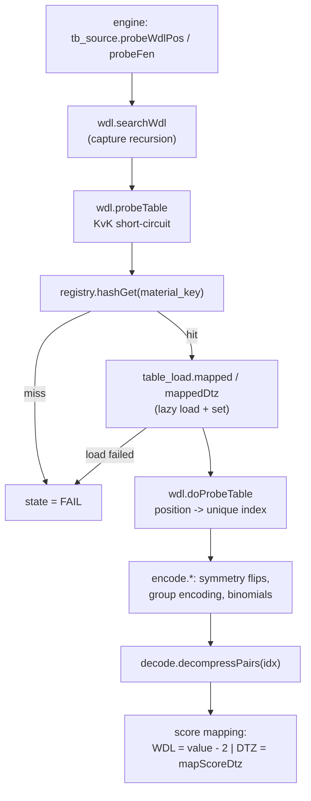

# Syzygy tablebases

zfish ports Stockfish's Syzygy prober bit-exactly — the same files, the same indexing,
the same probe results. For a position within the loaded tables' cardinality, a lookup
answers the game-theoretic result outright and the search returns it as a score.

The vertical spans three zones:

- **shell** — the `SyzygyPath` option and the load callback that (re)initialises the
  prober ([07-shell.md](07-shell.md)).
- **platform** — file discovery, the table registry, the file format decoder, and the
  probe algorithm ([06-platform.md](06-platform.md)).
- **engine** — the `tb_source` seam plus the two consumers: the in-search WDL probe and
  the root-move ranking ([02-engine-search.md](02-engine-search.md)).

The engine never imports the platform prober. It declares function pointers, the
composition root binds them, and a build with no prober attached simply never probes —
see [00-architecture.md](00-architecture.md#the-composition-root-and-the-cycle-break-hooks).

## Modules

| File | Owns |
| --- | --- |
| **platform: the facade** | |
| `src/platform/tablebase.zig` | the facade: re-exports `init` / `maxCardinality` / `discoveredMax` / `foundWdl` / `foundDtz` from `syzygy/tables.zig` and `probeFen` / `probeWdlPos` from `syzygy/wdl.zig`; re-exports `ProbeResult` from the engine's `tb_source` |
| **platform: syzygy** | |
| `src/platform/syzygy/tables.zig` | discovery: scan `SyzygyPath`, enumerate every material configuration up to 7 men, build the canonical stem, count files, set `maxCardinality` |
| `src/platform/syzygy/registry.zig` | the material-key → `TBTable` map and the arena behind it — everything derived from the material configuration, and nothing a file said |
| `src/platform/syzygy/table_load.zig` | the lazy `.rtbw` / `.rtbz` load into a 64-byte-aligned buffer, and the `set` / `setDtzMap` parse of each `(side, file)` `PairsData` record |
| `src/platform/syzygy/fuzz_targets.zig` | the unit fuzz targets: `setSizes` over arbitrary header bytes, `decompressPairs` over a fuzzer-built table |
| `src/platform/syzygy/fuzz_probe.zig` | the end-to-end fuzz target: parse an image into a registered `TBTable` and probe it, with no file and no fixture |
| `src/platform/syzygy/probe.zig` | the data model (`LR`, `SparseEntry`, `PairsData`, `EntryInfo`) plus the pure helpers `setGroups` and `setSymLen` |
| `src/platform/syzygy/encode.zig` | the position→index geometry: `binomial`, `map_kk`, `map_a1d1d4`, `map_b1h1h7`, `map_pawns`, `lead_pawn_idx`, `lead_pawns_size` |
| `src/platform/syzygy/decode.zig` | the PROBE-time half: the RE-PAIR / canonical-Huffman decoder (`decompressPairs`), the unaligned byte readers, the `TBFlag` bits |
| `src/platform/syzygy/decode_header.zig` | the LOAD-time half: the file header parse (`setSizes`) and the bounded region carve (`take`) |
| `src/platform/syzygy/probe_index.zig` | position -> unique table index (`doProbeTable`) and `mapScoreDtz`: pure geometry, and every bound the FILE cannot be checked against at load |
| `src/platform/syzygy/wdl.zig` | the algorithm: `probeTable`, `searchWdl`, `probeDtz`, and the two probe surfaces `probeFen` / `probeWdlPos` |
| **engine** | |
| `src/engine/search/tb_source.zig` | the seam: `ProbeResult`, `maxCardinality`, `probeFen`, `probeWdlPos` |
| `src/engine/search/search_main.zig` | Step 7 — the in-search WDL probe and its score/bound handling |
| `src/engine/state/tb_config.zig` | `TbConfig` — the std-only leaf both the Worker layout and the root-move builder name |
| `src/engine/search/root_move_build.zig` | `loadTbConfig`, the root DTZ/WDL ranking, and the ranked `RootMoves` array |
| `src/engine/search/search_values.zig` | `value_tb`, `value_tb_win` — the TB score band |
| `src/engine/board/score.zig` | `classify` — the pure non-decisive / tablebase / mate score classifier |
| `src/engine/search/search_emit.zig` | the info-line emit: the `tbScore` override and the `tbhits` count |
| `src/engine/search/uci_wdl.zig` | `formatScore` — renders a TB-band score as `cp` |
| **shell** | |
| `src/shell/option_model.zig` | the four Syzygy option declarations |
| `src/shell/engine/session.zig` | the `SyzygyPath` callback — delegates to `control.tbInit` |
| `src/shell/engine/control.zig` | `tbInit` (init + load report, every caller) and `searchClear` — re-inits on `ucinewgame` / `Clear Hash` |
| `src/shell/engine/trace.zig` | the `d` command's `Tablebases WDL:` / `Tablebases DTZ:` lines |

`wdl.zig` imports `table_load.zig`, which imports `registry.zig`, and never the reverse,
so no file here is a god-file. The split between the last two is the one the safety rules
already follow: `registry.zig` holds what the material configuration says, `table_load.zig`
holds what a FILE says, and the second validates itself against the first. Two of the three
cross the platform→engine down-edge: `wdl.zig` for a scratch `Position`, its bitboards, and
`movegen.generateLegal` (it generates all legal moves and filters the captures itself),
`registry.zig` for the material-key computation.

## What the files are

A Syzygy table set ships two file kinds per material configuration, and the code treats
them as two distinct tables on one `TBTable`:

| File | Answers | Read by |
| --- | --- | --- |
| `.rtbw` (WDL) | the game-theoretic result from the side-to-move's view: win / cursed win / draw / blessed loss / loss (`wdl_win` … `wdl_loss`, raw value − 2) | `table_load.mapped`, `probeTable(dtz=false)` |
| `.rtbz` (DTZ) | the distance, in plies, to the next **zeroing** move (capture or pawn move) along an optimal line | `table_load.mappedDtz`, `probeTable(dtz=true)` |

The two answer different questions, and the engine uses each where it needs that answer:

- **In-search (`search_main.zig`, Step 7)** probes **WDL only**. Inside the tree the
  search needs a value and a bound, not a move — WDL supplies both.
- **At the root (`root_move_build.zig`)** probes **DTZ first**. Ranking root moves
  requires *progress*, not just the result: every winning move is a win, so WDL cannot
  order them. DTZ can. The WDL ranking (`rankRootMovesWdl`) is the fallback used only
  when either probe fails (`probe.dtz_state == probe_fail`, or `probe.wdl_state ==
  probe_fail` on the zeroing-child branch), in which case all winning moves tie.

`registry.zig` declares and sets the `TBTable` fields that mark the two flavours —
`has_pawns`, `sides`, `dtz_ready`, `ready` — and `wdl.zig` only reads them. WDL tables
store both sides when `key != key2`; DTZ tables are always
one-sided, so when the stored side is not the side to move `doProbeTable` returns
`change_stm` and `probeDtz` resolves it with a 1-ply search minimising DTZ.

A `ProbeResult` (`tb_source.zig`) carries both: `available`, `wdl` + `wdl_state`, and
`dtz` + `dtz_state`. `available == 0` means "no WDL result"; a DTZ failure is reported
through `dtz_state` while WDL still reports.

## Loading

Loading is driven entirely by the `SyzygyPath` UCI option. `option_model.zig` declares it
as a string option with `callback_syzygy_path`; `session.zig` dispatches that callback to
`control.zig`'s `tbInit`, which runs `tablebase.init(value)` and, whenever the path is
non-empty, prints the load report:

```
info string Found N WDL and N DTZ tablebase files (up to M-man).
```

from `foundWdl()`, `foundDtz()`, and `discoveredMax()`. `searchClear` re-runs the SAME
`tbInit` with the stored path, so `ucinewgame` / `Clear Hash` rebuild the registry AND
print the report again — upstream emits it from inside `Tablebases::init`
(tbprobe.cpp), so every init with a usable path reports, whoever the caller is.

`tables.init` copies the path and calls `registry.reset`, then enumerates **every
King-vs-King material configuration up to 7 men** and calls `add` on each. The path is
split on the platform separator (`;` on Windows, `:` elsewhere) per lookup, in
`tbFileExists` and `table_load.loadFile`. `add`:

1. builds the canonical **stem** with `buildName` — concatenate `PieceToChar` per piece
   type, then insert `v` before the second `K`: `{K,Q,K}` → `KQK` → **`KQvK`**;
   `{K,R,P,K,R}` → `KRPvKR`.
2. counts the DTZ file if `<stem>.rtbz` exists in any path directory;
3. requires `<stem>.rtbw` — a table is only "found" when its WDL file exists;
4. raises `max_card` to this configuration's piece count;
5. calls `registry.register(pieces)`.

Existence is tested with libc `access(path, F_OK)`. **Discovery counts files; it does not
open or validate them** — the magic header is checked later, at load time.

`registry.register` computes both material keys from per-color piece counts through the
engine's `computeMaterialKey`, so a registry key is bit-identical to a probed position's
`pos.st.material_key`. The table is inserted into a 4096-entry (`1 << 12`) open-addressed
hash indexed by the key's low bits, under `key` and — when they differ — `key2`.
`register` also derives `has_pawns`, `has_unique_pieces`, `sides` (2 when `key != key2`),
and the leading color (white unless black has pawns and either white has none or black
has fewer).

**`maxCardinality` is the largest piece count discovered on disk.** It is the search-facing
number: the largest position the prober can serve. With no `SyzygyPath` set it is **0**, so
a default build — and `bench`, which never sets a path — takes no tablebase path at all.

## Probing

`table_load.mapped` / `mappedDtz` load lazily on first probe. `loadFile` reads
`<stem><ext>` from the first path directory that has it into a **64-byte-aligned** buffer
(the alignment makes `set`'s data-section rounding match an mmap base), rejects a file
whose size fails the `size % 64 == 16` corruption check, and verifies the magic header:

| File | Magic |
| --- | --- |
| `.rtbw` | `71 E8 23 5D` |
| `.rtbz` | `D7 66 0C A5` |

The load is **POSIX-only** (libc `open`/`read`); on Windows it yields null and the probe
reports unavailable.

`table_load.set` then parses the file, generic over WDL/DTZ: per `(side, file)` it reads the
group `order` nibbles and the piece sequence, calls `probe.setGroups`, then
`decode_header.setSizes`, and finally carves each `PairsData`'s `sparse_index`, `block_length`
and `data` region out of the file bytes (each `data` section 64-byte aligned). For DTZ,
`setDtzMap` reads the four per-WDL-class value-remap tables between the size headers and
the sparse indices.

**A table file is untrusted input, and the parse is bounded accordingly.** Every offset
`set` advances comes out of the file itself, so a truncated or hostile `.rtbw`/`.rtbz` can
drive the cursor past the end — which the shipped ReleaseFast build does not check. Five
things hold the line, and they are worth keeping distinct:

| Where | What it guarantees |
| --- | --- |
| `table_load.set` / `setDtzMap` / `decode_header.setSizes` return failure | Every region is carved with a `take` bound, so a file that cannot keep its own size promises is refused. `mapped`/`mappedDtz` then null the base and the probe reports the table **exactly as missing** — never half-parsed and reachable. |
| `PairsData`'s file-backed fields are **slices, not `[*]`** | A many-item pointer carries no length for anyone to check against; the slice records what the file actually provided, which is what makes the bound above expressible at all. |
| `decode_header.setSizes` validates the btree **before** `probe.setSymLen` walks it | Both child fields are 12 bits of the file, so a corrupt entry can name a symbol past the tree, and `setSymLen` writes `d.symlen[child]` — an out-of-bounds *write*. One O(n) pass at load makes the walk in-bounds by construction and leaves the probe path free of the check. |
| `table_load.set` checks the pawnful table's **leading piece** against the registry's lead colour | `doProbeTable` picks the leading pawns' colour off `get(0, 0).pieces[0]`, a raw file nibble. Name a piece that is not a pawn, or a pawn of the colour that has none, and the leading group is EMPTY: the probe then sorts `squares[1..0]` and indexes `lead_pawn_idx[0][squares[0]]` with a square it never wrote. One flipped nibble in a downloaded `.rtbw` reaches it. |
| `decode_header.setSizes` refuses a **cyclic** btree | `probe.setSymLen` marks a symbol before walking its subtree, so a two-state visited flag reads a cycle as "already computed": the walk terminates, but the sums it returns are built on `symlen[]` entries still holding zero and the table is accepted with garbage lengths. The third colour is what makes the cycle nameable — GREY means "on the current DFS path". |
| `decode_header.setSizes` refuses a **non-canonical** code | A canonical Huffman table satisfies `base64[i] * 2 >= base64[i + 1]` at every step. Upstream asserts it, which a release build compiles out; a table breaking it hands the decoder an alphabet its own length scan cannot describe. |
| `table_load.set` checks the header's **Split / HasPawns** bits against the registry | Both restate what the filename already told the registry, and every group width below is derived from the registry's answer — so a header that disagrees is not the table the probe is about to index. Another upstream assert. |
| `probe.setGroups` returns false on a **group longer than any geometry row** | The group lengths index `lead_pawns_size` and `binomial`, both sized for the longest group a legal material configuration makes. The lengths are runs over the same file nibbles, so a corrupt sequence makes a longer one and reads off the end of the array. |

Upstream refuses the same three and then **exits**: it prints `Corrupted table in file X`
and returns `EXIT_FAILURE`. zfish refuses the table and keeps playing without it, which is
the property `parity-malformed` gates — every mutated table answered with a clean exit and
a legal bestmove. That divergence is deliberate, and `tools/upstream/README.md` records it
so a later sync does not read it as drift.

**And `parity-malformed` is what keeps them.** Every row above was pinned by unit tests on
the *decoder* and by nothing at all on the shipped loader — and a unit test that calls
`setSizes` directly cannot see a loader that stopped calling it. `signature` stays green
with the whole refusal set reverted, because the bench reads no file the engine did not
ship with, and the fuzz targets above hunt input that is bad in a way nobody has described
yet, on a nightly budget rather than as a merge gate. So nothing asked whether yesterday's
refusal still holds today. The gate copies a real 3-man table, applies a committed
byte-edit list, and requires all three parts of a refusal on each fixture: exit 0, a legal
bestmove — a parser that takes the search down with it has not refused the file, it has
been defeated by it — and no hang, which is the class a crash-oriented fuzzer reports as a
timeout instead of a bug. The bar is **survival rather than a diagnostic**, and that is a
different bar rather than a weaker one: the format records nothing that says which value
was meant, so a reader cannot tell a mutated `lowestSym` from an intended one and must not
pretend to. See [10-tooling-ci.md](10-tooling-ci.md) for the gate and its negative control.

**Which sub-table a position uses is a type, not an integer.** A pawnful table folds
the mirrored file pairs — a/h, b/g, c/f, d/e — onto four per-file sub-tables, so
upstream's `edge_distance(f) = min(f, 7 - f)` converts a *board* file (one of eight)
into a *table* file (one of four). Those are two different spaces, and while both
were `usize` the conversion between them was an unannotated hop: a board file could
reach `TBTable.get`, and the side-to-move sat beside the file as a second bare
`usize` so the two could arrive transposed. `encode.TbFile` is an `enum(u2)` whose
tag width is exactly the bound of the `[4]PairsData` arrays it indexes;
`TbFile.fromBoardFile` is the only route between the spaces and `TbFile.all` the only
enumeration of them.

This one is worth a type more than anything else in the zone, and the reason is in
the failure mode rather than the frequency. Nothing here faults: the prober reads a
**real** sub-table of the wrong file and returns a confident wrong verdict. Every
`tb-*` golden compares verdicts this binary produced, so all of them agree while it
is wrong. See the cost rule in
[09-type-design.md](09-type-design.md#the-cost-rule) for when a type like this is
free — a cold path carrying a value, as here — and when it is not.

`decode_header.setSizes` additionally refuses `min_sym_len == 0` (it would make the `k == 0` right-pad
shift exactly 64, which does not fit the `u6` it is cast to) alongside the inverted and
oversized pairs it already rejected. Rejections release `base64`/`symlen`/`len_tab` through
`errdefer`: the shipped caller passes the registry arena and would not care, but the unit
tests and fuzz target pass a checking allocator, and that is what surfaced the leak. Those
three are what `probe.freeOwned` releases; it skips a `len_tab` still pointing at the shared
walk-from-zero default, which is static storage rather than an allocation.

What the header cannot pin is block **content**. `block` is decoded from the compressed
bitstream, so `decompressPairs` checks it itself and returns 0 rather than reading off the
table. `sym` is decoded from the bitstream too, but its bound is a property of the TABLE
rather than of the payload: `buildDecodeTables` derives, for every length the scan can
reach, the largest symbol that length can name, and refuses a table naming one outside
`symlen[]`. That is the same guarantee the probe-time test gave, established once per table
opened instead of once per symbol decoded. Its 64- and 32-bit windows read *ahead* of the symbol being
decoded, which on a final block reaches past the stored data — upstream lands in the
mmap's page padding, and zfish used to land in `loadFile`'s 63-byte alignment slack.
`windowBe` zero-fills that tail instead, so the bits are defined rather than whatever the
arena held. Refusing the read is **not** an equivalent choice: the bits are never
load-bearing for a valid table, but bailing out on them changes decoded values.

A decoded value's **domain** is the same kind of claim one level up, and it is not academic.
`doProbeTable<WDL>` returns `value - 2`, and its callers do not merely report that score — they
**index** with it: `mapScoreDtz` reads `wdl_map[wdl + 2]`, five entries wide. Nothing before that
return bounds the value. It comes out of the payload, and the `flag_single_value` branch returns
`min_sym_len` — a raw header byte — verbatim, so a byte of 255 left the probe as a WDL score of
253 and indexed that five-entry map with 255. `fuzz_probe.zig` found it on the nightly lane, on a
header the unit targets accept and `table_load.set` has no reason to refuse. `doProbeTable` now
refuses a WDL value outside `0..4`, the five outcomes a WDL file can hold; no well-formed table
produces another, so the refusal is unreachable on real tables and the `tb-*` goldens are
unmoved. Bound the value where it is born, not at each place that indexes with it — the score
reaches `mapScoreDtz`, `dtzBeforeZeroing` and the in-search probe, and only the first of those
happened to trap.

### The compressed format, as implemented

The decoder implements exactly what `decode.zig`, `decode_header.zig` and `probe.zig` contain:

| Layer | What the code does |
| --- | --- |
| **Symbols / btree** | `probe.LR` is a 3-byte entry packing two 12-bit symbols (left, right child). `right() == 0xFFF` marks a leaf, whose `left()` is the stored value. `probe.setSymLen` fills `d.symlen`, each entry holding the number of values its symbol represents **minus one** — a leaf is 0, and an internal symbol is `symlen[left] + symlen[right] + 1`. |
| **Canonical Huffman** | `decode_header.setSizes` builds `d.base64` from `d.lowest_sym` (`base64[i] >= base64[i+1]`, right-padded to 64 bits) and records `min_sym_len` / `max_sym_len`. `buildDecodeTables` then derives what the decode loop would otherwise recompute per symbol: `shift_tab` / `off_tab` / `real_len_tab` hold the three values that depend only on a symbol's length, and `len_tab` maps the word's top bits to a lower bound on that length so the scan resumes there instead of at zero. |
| **Indices** | `probe.SparseEntry` is 6 bytes (`block[4]`, `offset[2]`, read LE at access). `sparse_index_size = ceil(tb_size / span)`; `block_length_size = blocks_num + padding`. |
| **Pairs data** | `decode.decompressPairs(d, idx)` locates the block via the sparse index, walks `block_length[]` to the exact block, reads that block's bitstream in big-endian 64-bit windows, decodes the symbol, then descends the btree to the leaf value. |
| **Single value** | When `flag_single_value` is set the table stores one value in `min_sym_len` and `decompressPairs` returns it for any index. |

Flags are `flag_stm`, `flag_mapped`, `flag_win_plies`, `flag_loss_plies`, `flag_wide`,
`flag_single_value` (`decode.zig`).

`encode.initGeometry` computes the position→index geometry once, with no I/O and no engine
types: `binomial[k][n] = C(n,k)`, the 462 legal king-pair encodings (`map_kk`), the
a1-d1-d4 triangle map (`map_a1d1d4`, 10 squares), the below-a1h8 map (`map_b1h1h7`, 28
squares), and the leading-pawn encoding (`map_pawns` over a2-h7 → 0..47, plus
`lead_pawn_idx` / `lead_pawns_size` for up to 5 leading pawns).

### The probe path


```mermaid
flowchart TD
  A["engine: tb_source.probeWdlPos / probeFen"] --> B["wdl.searchWdl<br/>(capture recursion)"]
  B --> C["wdl.probeTable<br/>KvK short-circuit"]
  C --> D["registry.hashGet(material_key)"]
  D -->|miss| F["state = FAIL"]
  D -->|hit| E["table_load.mapped / mappedDtz<br/>(lazy load + set)"]
  E -->|load failed| F
  E --> G["wdl.doProbeTable<br/>position -> unique index"]
  G --> H["encode.*: symmetry flips,<br/>group encoding, binomials"]
  H --> I["decode.decompressPairs(idx)"]
  I --> J["score mapping:<br/>WDL = value - 2 | DTZ = mapScoreDtz"]
```

`doProbeTable` normalises the position (color/square flips when the black side is the
stronger one or the table is symmetric with black to move), gathers lead pawns then the
remaining pieces, reorders them to the file's canonical `d.pieces` sequence, maps the lead
square into the a1-d1-d4 triangle, computes the unique index through the group geometry,
and hands it to `decompressPairs`.

`searchWdl` is the capture recursion (Stockfish's `search<CheckZeroingMoves>`): a capture
zeroes the rule50 counter, so its result must be probed and compared against the
position's own stored value. It does/undoes moves on the live position and restores it
exactly. `probeDtz` folds in zeroing pawn moves via `searchWdl(check_zeroing=true)`, then
probes the DTZ table, resolving `change_stm` with the 1-ply minimising search.

Two surfaces are exported:

| Surface | Used by | Behaviour |
| --- | --- | --- |
| `probeFen(fen, len, chess960)` | root ranking, the `d` command | builds a scratch `Position` from the FEN, runs `searchWdl(pos, storage, false)` then `probeDtz`, returns both |
| `probeWdlPos(pos)` | in-search Step 7 | probes WDL on the **live** search `Position` — no FEN round-trip. `doMoveState` touches only the board + `StateInfo`, never the NNUE accumulator stack, so search/eval state is intact on return |

Both early-out to `available = 0` when `registry.ready()` is false (no path set).

## Search integration

### In-search: Step 7 (`search_main.zig`)

Attempted for non-root, non-excluded nodes, gated on the worker's `tb_config`:

| Condition | Source |
| --- | --- |
| `cardinality != 0` | `tb_config` (0 without a `SyzygyPath`, so a default build and `bench` never enter) |
| `pieces_count <= cardinality` | position popcount |
| `pieces_count < cardinality` **or** `depth >= probe_depth` | `SyzygyProbeDepth` |
| `pos.st.rule50 == 0` | TB values ignore the 50-move counter |
| `pos.st.castling_rights == 0` | TB positions have no castling rights |

On `available != 0` the worker's `tb_hits` increments and the WDL becomes a score:
`tb_value = value_tb - ss.ply`, then `-tb_value` / `+tb_value` / a draw score, where
`draw_score` is 1 when `Syzygy50MoveRule` is on (so a cursed win / blessed loss scores as a
draw) and 0 when it is off. The bound is `upper` for a loss, `lower` for a win, `exact` for
a draw. An exact bound, or a bound that already cuts against the window, saves a TT entry
at `min(max_ply - 1, depth + 6)` and returns. In a PV node a non-cutting lower bound
raises `best_value` / `alpha`; an upper bound caps `max_value`.

### Root probing (`root_move_build.zig`)

`loadTbConfig` builds `TbConfig` from the options, then clamps `cardinality` to
`tb_source.maxCardinality()` — and, when clamped, zeroes `probe_depth`. Cardinality is
**not** zeroed for a root larger than the tables: it stays so Step 7 still probes smaller
in-tree positions.

`buildRootMoves` ranks the root moves only when the root itself fits
(`cardinality >= pieces` and no castling rights):

1. `rankRootMovesDtz` — for each move, do it on a scratch position and derive a `dtz`
   (`dtzBeforeZeroing(-wdl)` after a zeroing move; 0 for a draw by rule50/repetition;
   `-probe.dtz` adjusted by one ply otherwise), correct a mating move to `dtz = 1`, then
   compute `tb_rank` and `tb_score`. `rank_dtz` comes from `dtzIsDtm` (pawnless and either
   3-man or 4-man minors-only) — when false, all winning moves tie at `max_dtz` and the
   movegen order breaks the tie.
2. On a probe failure it falls back to `rankRootMovesWdl`, which maps WDL through
   `wdl_to_rank` / `wdl_to_value`.
3. On success `root_in_tb = 1`, the moves are **stable-sorted by descending `tb_rank`**,
   and `cardinality` is zeroed (so the in-tree probe stops) when DTZ was available or the
   best move is not winning.

### TB score values

| Constant | File | Meaning |
| --- | --- | --- |
| `value_tb` | `search_values.zig` | `value_mate_in_max - 1` — the top of the TB band |
| `value_tb_win` | `search_values.zig` | `value_tb - max_ply` — the threshold above which a score is TB-decisive |
| `max_dtz` | `root_move_build.zig` | `1 << 18` — the root-ranking scale |
| `wdl_to_rank` / `wdl_to_value` | `root_move_build.zig` | the WDL-fallback rank and score tables |

`score.zig`'s `classify` is the pure classifier over that band: non-decisive → kind 0;
`|v|` between `value_tb_win` and `value_tb` → **kind 1 (tablebase)**, carrying the distance
to `value_tb` and a win flag; above → kind 2 (mate). `search_emit.zig` calls it with the
live thresholds.

### UCI reporting

`uci_wdl.formatScore` renders kind 1 as `cp ±20000 - value` (a TB win/loss shown as a
large but non-mate centipawn score). `search_emit.zig`:

- overrides the shown score with the root move's `tb_score` when `root_in_tb` and the score
  is not a genuine mate, and treats such a score as exact;
- reports `tbhits` as the pool's hits **plus** `rootMoves.size()` when `root_in_tb`, so the
  root-ranking probes are counted.

`trace.zig` adds the `d` command's `Tablebases WDL: N (state)` / `Tablebases DTZ: N (state)`
lines, probing through `probeFen` when the position has no castling rights and fits
`maxCardinality`.

### The options

| Option | Type | Default | Effect |
| --- | --- | --- | --- |
| `SyzygyPath` | string | *(empty)* | the search path; setting it runs `tablebase.init` and prints the load report. Empty ⇒ `maxCardinality() == 0` ⇒ never probe |
| `SyzygyProbeDepth` | spin 1..100 | 1 | minimum depth for the Step 7 probe when `pieces == cardinality`; forced to 0 when cardinality is clamped to `maxCardinality` |
| `SyzygyProbeLimit` | spin 0..7 | 7 | the requested cardinality, clamped down to what was discovered |
| `Syzygy50MoveRule` | check | true | when true, a cursed win / blessed loss scores as a draw (`draw_score = 1`) and the root ranking bounds shift accordingly |

Declared in `src/shell/option_model.zig` and `src/shell/engine/session.zig`; read by the
engine through `option_source.zig` (`syzygyProbeDepth`, `syzygyProbeLimit`,
`syzygy50MoveRule`), which the composition root binds to `src/shell/option.zig`.

### Extending the reported PV

A root move whose score came from the tablebase gets its PV rewritten before it is reported.
`tb_extend.zig`'s `syzygyExtendPv` — upstream `syzygy_extend_pv` — runs in two steps over a
scratch position walked forward from the root:

1. **Truncate.** Re-rank the legal moves at each ply and keep the PV only while its move still
   holds the best available rank. A repetition, or a drawing move while `Syzygy50MoveRule` is on,
   also ends it. What survives is the prefix whose game outcome is verified.
2. **Extend.** Keep playing the top-ranked move — minimal DTZ, with opponent mobility as the
   tie-break — until mate. The mate is optimal only for simple endgames such as KRvK; DTZ
   minimises the distance to the next zeroing move, not to mate.

Step 2 is bounded by its own terminations — mate, a draw, or the clock — and by **nothing
else**, which is why a root move's PV is the growable `RootPVMoves` and the
`tb_extend_source` seam takes the list rather than a slice and a length: a bound is exactly
what it must not have, since a fixed one truncates the mate line instead of limiting it.
That it terminates rests on the caller: `searchPv` extends only a decisive score, so the
walk is minimal-DTZ play in a won position, which converges to mate.

The walk carries the state history, because both `isDraw` and `isRepetition` read it; a position
rebuilt from a FEN would answer them wrongly. When a clock is running the walk stops once it has
spent half the `Move Overhead`, reports what it verified, and prints
`info string Syzygy based PV extension requires more time, increase Move Overhead as needed.`
A walk that ends in a draw corrects the reported score to `VALUE_DRAW`, which is reachable when
the position was set up with a non-optimal 50-move counter.

`search_emit.zig` sits above `search_driver`, which `position` imports, so it cannot reach the
position machinery directly. It calls through `tb_extend_source.zig`, a seam the composition root
binds to `tb_extend.syzygyExtendPv`; unbound, the PV and score pass through unchanged.

## The tb_source seam

`src/engine/search/tb_source.zig` declares three function pointers and the result type:

| Symbol | Default | Meaning of the default |
| --- | --- | --- |
| `maxCardinality: *const fn () usize` | returns `0` | the tablebases cover nothing |
| `probeFen: *const fn ([*]const u8, usize, u8) ProbeResult` | `available = 0` | no result |
| `probeWdlPos: *const fn (*Position) ProbeResult` | `available = 0` | FAIL |

Probing is disk I/O — a platform service. The engine is the lower zone, so it cannot import
`src/platform/tablebase.zig`; instead it declares the seam and the composition root binds
the facade to it. The `ProbeResult` type stays here because it is a **search-facing value**;
the platform facade re-exports it, which is why the shell's inspection command still reaches
it as `tablebase.ProbeResult`.

The seam's `hook-class` is **service**: a leaf answering a query it must not import the
answer for. Its three hooks are **genuinely safe unregistered** — the default *is* the right
answer when the subsystem is absent. "No tablebases are loaded" is exactly true when no
prober is attached, and a search that does not probe is the correct search, not a degraded
one. A headless engine build therefore needs no registration for correctness, unlike the
`option_source` / `thread_ops` hooks whose defaults are correct only because every root is
accounted for.

See [00-architecture.md](00-architecture.md#the-composition-root-and-the-cycle-break-hooks)
for the pattern. `zig build hook-lint` bounds the seams: it ratchets the hook count and
requires every hook to declare a failure mode and a class, and to be registered.

## Testing

`zig build tb` runs `tools/fetch_tb.zig`, which downloads the **3-man set** — `KPvK`,
`KNvK`, `KBvK`, `KRvK`, `KQvK`, both `.rtbw` and `.rtbz` — into `resources/syzygy/` in pure Zig
(no `sh`/curl). It verifies each file's Syzygy magic header, so a mirror's error page
cannot masquerade as a table, and skips files already present. The tables are never
committed. Every `tb-*` gate depends on this step and runs with `cwd = resources/`, so
`setoption name SyzygyPath value syzygy` resolves to the fetched set.

The gates live in `tools/parity/golden_tb.zig`, each diffed against a golden in `tools/`:

| Gate | Golden | Asserts |
| --- | --- | --- |
| `tb-init` | `tools/tb_init.golden` | the load report — the `Found N WDL and N DTZ tablebase files (up to M-man)` line == the upstream oracle. Pins discovery. |
| `tb-wdl` | `tools/tb_wdl.golden` | the `d`-command `Tablebases WDL: N (state)` line == oracle over a curated 3-man battery: all five piece types, win/loss/draw, white/black to move, the pawn and blackStronger (lead pawn is black) flip paths, and the `searchWdl` capture recursion (the lone king captures into a KvK draw). |
| `tb-dtz` | `tools/tb_dtz.golden` | the same battery, pinning the `Tablebases DTZ:` line — including the `change_stm` 1-ply path via KQvK with black to move. |
| `tb-root` | `tools/tb_root.golden` | root DTZ ranking: `go` on a TB win, pinning the emitted **score** and **tbhits** == oracle. Deliberately *not* pinned: the bestmove and node count — the oracle early-returns on a `root_in_tb` decisive win while zfish still searches, so among equally-optimal TB moves it may pick a different (also winning) one; gating that would be fake parity. |
| `tb-search` | `tools/tb_search.golden` | the in-search Step 7 probe: bench one 4-man position per file (each bigger than the 3-man tables, so the root searches normally and Step 7 fires at the 3-man nodes captures reach), pinning the node count **with** `SyzygyPath` and **without** — both == oracle. Bit-exact node-count parity for the in-tree probe. |
| `tb-cursed` | `tools/tb_cursed.golden` | **local-only**: cursed-win / blessed-loss WDL+DTZ on real DTZ>100 positions, exercising the cursed branches of `mapScoreDtz` and `probeDtz`. Needs ~40 MB of 5-man tables staged into `resources/syzygy5/`, which the 3-man CI set never contains, so it is not in the `parity` aggregate (see the `tb-cursed` step in `build.zig` for the fetch). |

`tb-init`, `tb-wdl`, `tb-dtz`, `tb-root`, and `tb-search` are all wired into the `parity`
aggregate. Each has a matching `-update` step that regenerates its golden from the current
binary. They are Linux-only, matching the POSIX-only file load.

### The bucket width is a knee, and three ways to improve it are already refused

`len_tab` is a direct-mapped table from the stream's top `min(max_sym_len, 12)` bits, indexed at
random by compressed data. The 12 is a measured knee rather than a round number. Measured here,
over the 60 `PairsData` the 3-man and 5-man corpora build between them (largest `max_sym_len`
20), as the share of buckets left holding the escape index:

| index width | buckets | escape share |
| --- | --- | --- |
| 8 | 13,760 | 38.78% |
| 10 | 46,528 | 21.81% |
| **12** | **155,072** | **9.91%** |
| 16 | 1,547,712 | 0.09% |

Below 12 the escape share climbs fast, and an escape is the data-dependent scan the table exists
to remove. Above it the table grows 10x for the last ten points, against a 32 KB L1d it already
shares with `symlen[]` and `btree[]` — both also randomly indexed.

Three restructurings of this loop were measured on the sibling C tree (`../Stockfish`, branch
`refish`, under gcc) and all three cost more than they bought. They are
recorded because two of them read as obvious improvements:

| | change | result |
| --- | --- | --- |
| A | index width 12 → 8 | **+11.71%** search Ir — the escape rate is the whole trade |
| B | 4-bit entries, two buckets per byte, bucket count unchanged | **+27.14%** — coverage preserved exactly, but the extract is ~4 instructions in a ~20-instruction body |
| C | the three per-length arrays packed into one 4-byte entry | **+2.03%** — one more live 32-bit value in a loop already at the register file's limit, and gcc spills |

**C is why `shift_tab`, `off_tab` and `real_len_tab` are three separate arrays here and must stay
that way.** Packed into one record they read as tidier and cost a register in the hottest loop in
the reader. Those are that tree's numbers under gcc, so they are hypotheses about this one — but
they are hypotheses with a mechanism, and the mechanism is the same register pressure `decode.zig`
already lives under. Re-measure before re-trying, do not re-derive.

Reopen the width on a 6-man corpus and not before: that is where the working set genuinely exceeds
L1 and the balance could invert. Neither corpus here reaches it.

**None of those five carries the decoder.** Measured by mutation: a `buildDecodeTables`
defect that moves 130 of 1422 probe values leaves `tb-wdl`, `tb-dtz`, `tb-root` and
`tb-search` all green, and only `tb-cursed` goes red. The 3-man set the aggregate fetches
cannot close that gap either — its codes fit the bucket index, so the escape path the
mutation broke never fires on it, and the same mutation is invisible across all 1422
positions when only `resources/syzygy` is loaded. `tb-cursed` is the sole carrier for
`decompressPairs`, it is local-only, and it has already sat red for a week unnoticed once.
Run it by hand after ANY edit to `decode.zig` or `decode_header.zig`.

Unit tests run under `zig build test` without any table file: `encode.zig` checks the
geometry against known mathematics (`Binomial[k][n] == C(n,k)`, 462 king-pair encodings,
the a1-d1-d4 and MapPawns coverage), `probe.zig` checks `LR` unpacking, `setGroups`, and
`setSymLen` on a synthetic btree, `decode.zig` checks the `flag_single_value` path, and
`tables.zig` checks the stem builder and the empty-path init.

See [10-tooling-ci.md](10-tooling-ci.md) for the gate battery and
[CONTRIBUTING](../CONTRIBUTING.md) for what to run before a commit.
