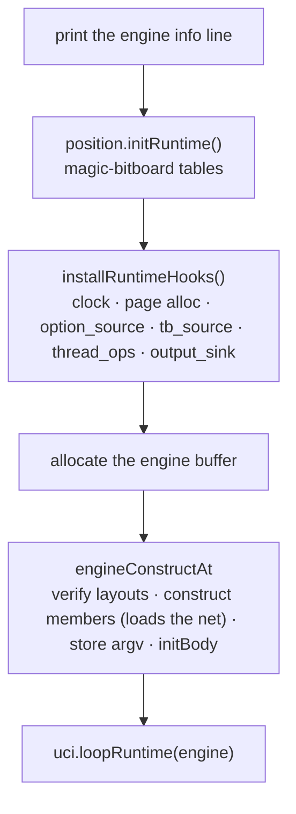

# Shell

`src/shell/` is the process surface: the UCI protocol, the option model, `main`, and
the engine object that owns the run. It is the top zone — it may import `engine/` and
`platform/`, and nothing imports it. For the zones and the module graph see
[00-architecture.md](00-architecture.md); for what the shell drives, see
[02-engine-search.md](02-engine-search.md), [03-engine-eval.md](03-engine-eval.md), and
[06-platform.md](06-platform.md).

## Modules

| File | Owns |
| --- | --- |
| **Composition root** | |
| `main.zig` | startup: runtime init, hook registration, engine construction, the UCI loop; the hook implementations that need modules their callers cannot import |
| `thread_construct.zig` | the `verify_thread_graph` hook — asserts a freshly built `ThreadPool`/`Thread` graph against the pinned model |
| **UCI** | |
| `uci.zig` | the command loop and dispatch: read a line, classify the token, call the engine |
| `uci_input.zig` | the persistent stdin reader: one command line per call, stitched across buffer refills so a long `position ... moves` line is not truncated |
| `uci_parse.zig` | the `go` / `position` / `setoption` token parsers and their `Parsed*` results |
| `uci_format.zig` | the live output strings: `info string`, help, unknown-command, critical-error |
| `uci_strings.zig` | the shared C-string alloc / format / trim primitives |
| `uci_output.zig` | the output sink: one mutex-guarded `printLine` funnel, the log-file tee, quiet mode, the last-nodes-searched cell |
| **Options** | |
| `option.zig` | the facade over the process-global option store; the readers the engine reaches through the `option_source` seam |
| `option_model.zig` | the data model: `OptionKind`, `OptionEntry`, the `OptionsModel` store, the name→callback-kind map, the standard-option fixture |
| `option_parse.zig` | option string parsing: case-insensitive name compare, `setoption`/validate/tune parsers |
| **Engine object and session** | |
| `engine.zig` | the *face*: one flat `engine.` namespace re-exporting the `engine/` leaves and the session driver |
| `engine/session.zig` | the *driver*: `initBody`, on-change dispatch, position setup, the `go` entry, the reconfigure chain, the live `SharedState` |
| `engine/object.zig` | the buffer-resident `EngineObject`: the owned members, `constructMembers`/`destructMembers`, the side position/TT storage |
| `engine/graph.zig` | `EngineGraph`, the typed assembly node — force-compiled so its layout asserts are build-verified |
| `engine/control.zig` | TT resize/clear, ponderhit, search-clear, hashfull, stop, wait-for-search |
| `engine/options.zig` | the `add{String,Check,Spin,Button}Option` registration helpers |
| `engine/nnue.zig` | the net lifecycle: `requireNetworkLoaded`, `verifyNetwork`, load, save |
| `engine/pending.zig` | the pending-state registry handed from the UCI thread to the search pool |
| `engine/perft.zig` | the `go perft` root divide |
| `engine/info.zig` | the NUMA / thread-binding / thread-allocation info gatherers |
| `engine/infofmt.zig` | the pure formatters those gatherers render through |
| `engine/shared_histories.zig` | the side shared-histories map and its teardown |
| `engine/trace.zig` | the read-only inspection commands: `eval` trace, `d` visualize, FEN, position snapshots |
| `engine/util.zig` | `ByteView`, `CountPair`, and the engine-side string helpers |
| **Bench** | |
| `benchmark.zig` | bench/benchmark setup: parse the args, emit the command script |
| `bench_positions.zig` | the fixed position tables — pure data |
| `uci_bench.zig` | the `bench` / `speedtest` runners, driving commands through an injected dispatch |
| **Support** | |
| `misc.zig` | engine/compiler info text, binary directory, hardware concurrency, hashing |
| `debug_counters.zig` | the lock-free `dbg_*` instrumentation counters and their dump |

## main.zig — the composition root

`main` runs a fixed startup order:

`main.zig` may import everything and is imported by nothing. That asymmetry is what
lets it hand implementations *backwards* to leaf modules that could not import them —
the pattern, and the lint that bounds it, are described in
[00-architecture.md](00-architecture.md#the-composition-root-and-the-cycle-break-hooks).
The hook bodies live here because they need `position`/`engine`/`network`/`search`
modules that already import their callers: worker build/destroy/clear, the setup-state
adopt/handoff, the shared-history ops, and the thread-graph verify.

Teardown is the mirror image, by LIFO `defer`: destruct the engine object, free the
side shared-histories map, free the side TT, free the buffer.

## The UCI surface

`uci.loopRuntime` takes the engine as `*anyopaque` and casts it once — every command
below runs on the typed handle. With arguments, it joins argv into one command,
dispatches it, and returns; otherwise it reads stdin line by line through a persistent
`std.Io` reader and dispatches each line until `quit`. A closed stdin, an over-long
line, or a read failure is end-of-input and dispatches `quit`.

`dispatchCommand` trims the line, skips blanks and `#` comments, classifies the first
token into a `CommandKind`, and hands the rest to the engine face:

| Command | Effect |
| --- | --- |
| `uci` | print the id line, the rendered option listing, `uciok` |
| `isready` | print `readyok` |
| `setoption` | parse, apply to the model, fire the on-change callback |
| `position` | parse the FEN and move list, set the position |
| `go` | emit the NUMA/thread info lines, then perft or `startThinking` |
| `stop` / `ponderhit` | `stop` stops the engine and **sets** the main manager's ponder flag (`setPonderhitEngine(engine, 1)`); `ponderhit` **clears** it (`setPonderhitEngine(engine, 0)`) — `setPonderhit(x)` calls `setPonder(x != 0)` |
| `ucinewgame` | clear the search state |
| `quit` | stop the pool and leave the loop |
| `flip` | read the live FEN, flip it, re-set the position |
| `bench` / `speedtest` | run the bench / benchmark command scripts |
| `d` | print the board visualization |
| `eval` | print the eval trace |
| `compiler` | print the compiler info |
| `export_net` | save the network, optionally to a named file |
| `help` / `--help` / `license` / `--license` | print the help text |

Anything else prints an unknown-command line. `go` builds a `LimitsType` and stamps
`start_time` at the earliest point, so the info-line elapsed and nps are honest;
`searchmoves` records are owned in Zig and freed once `startThinking` has read them.

The search and UCI lines — `info`, `bestmove`, the option listing's neighbours, the
`info string` reports — go through `uci_output.printLine`: one `std.Io` handle, one
mutex, so the line and its newline are one indivisible pair and a search info line can
never tear against the UCI listener. The engine writes through this same funnel without
importing the shell: `main` registers it on the `output_sink` seam.

Not everything the process emits takes that route. `uci_bench.zig`, `benchmark.zig`,
`thread_construct.zig`, `engine/nnue.zig`, and `debug_counters.zig` still print with
`std.debug.print` — stderr, unmutexed — bypassing the sink's mutex, its log tee, and quiet
mode. For `engine/nnue.zig` that is deliberate: a fatal net-missing diagnostic must not be
swallowed by a quiet bench run.

`uci.zig` does not. The `uci` handshake and the `eval` trace are protocol, so each builds its
block once and emits it through `uci_output.printLine` — stdout, mutexed, tee'd to
`Debug Log File` — matching upstream's single `sync_cout << … << sync_endl`. A GUI reads
stdout, so the stream is part of the contract, and the gates pin it: `build.zig` asserts the
handshake on stdout, and `buildUciOptions` **fails** if any handshake line appears on
stderr.

## The option model

`option_model.zig` holds the data — each entry carries name, kind (`string`, `check`,
`spin`, `button`), default, current value, spin bounds, and a callback kind — and the
`OptionsModel` store that adds, validates, normalizes, reads, and renders in
registration order. `option.zig` wraps a process-global model and serves both name- and
index-keyed reads. `option_parse.zig` is the std-only parsing leaf underneath both, so
the model and the facade import it acyclically.

Options are declared from `session.initBody` through the `engine/options.zig` helpers.
Registration does not carry the callback kind: `option.addOption` derives it from the
canonical name, so an option registered at runtime still fires its engine callback.

On `setoption`, `applySetOptionEngine` waits for the search to finish, sets the value
into the model, and — if the value was accepted and the option has a callback — relays
the normalized value to `session.optionOnChange`, which dispatches:

| Option | On change |
| --- | --- |
| `Debug Log File` | open/close the log tee |
| `NumaPolicy` | set the NUMA config, resize the threads, report |
| `Threads` | resize the threads, report the allocation |
| `Hash` | resize the transposition table |
| `Clear Hash` | clear the search state |
| `SyzygyPath` | re-init the tablebases and report what was found ([05-tablebases.md](05-tablebases.md)) |
| `EvalFile` | load the network |

The engine never imports `option.zig`. `main` injects the readers onto the
`option_source` seam at startup, so the search reads `MultiPV`, the Syzygy settings,
and the rest through function pointers. The same inversion carries the clock, the
page allocator, the tablebase prober, the thread-pool ops, and the output sink.

## The engine object and the session

`engine/object.zig` defines `EngineObject`, a plain Zig struct that `main` allocates a
buffer for and reinterprets. It is an **ownership container**: every heap member is
explicitly freed, and the rest are inline slots — each reached through a typed accessor,
never a byte offset.

| Member | Note |
| --- | --- |
| `numa_context` | a `*NumaReplicationContext` (config + replica registry), built over `NumaConfig.fromSystem` and freed in the teardown |
| `states` | the fallback root `StateList` |
| `threads` | the `ThreadPool` |
| `binary_directory` | owned string; the net load resolves against it |
| `cli_argc` / `cli_argv` | the CLI |
| `update_context` | inline byte-array slot the search binds for the main thread's manager |
| `on_verify_network` | inline byte-array slot holding the network-verify callback |

Position, TT, and the shared-histories map are file-scope side storage whose accessors
ignore the engine pointer — the object does not own them. `constructMembers` builds the
members in dependency order and triggers the net load; `destructMembers` frees them in
reverse, with `states` owned by exactly one of the slot or the pool's setup-states.

`engine.zig` is a pure **face**: `pub const` re-exports that present the `engine/`
leaves and the driver as one flat namespace. The command-handler call graph lives in
`engine/session.zig`, the **driver**. The edge is one-way — no leaf imports the face —
which is why the driver can instantiate the one live `SharedState` (it must see every
referent type, and a graph root cannot be in a cycle).

`session.initBody` is the whole post-member startup, in order:

1. register the standard options;
2. `requireNetworkLoaded` — the net is checked here, between the load and the first
   code that needs it;
3. set the start position;
4. `resizeThreadsEngine` — size the pool.

`goEngine` asserts the limits carry no perft, verifies the network, and calls
`startThinking`; root-setup OOM fails loudly at this single boundary rather than in
each leaf. The reconfigure chain — `resizeThreadsEngine` → `resizeThreads` — waits for
the search, rebuilds the live `SharedState` from the threads/TT/shared-histories
handles, reconfigures the pool, sizes the TT from the `Hash` option, and replicates the
network. It is the one place a thread-pool OOM or spawn failure is handled; the pool it
drives is described in [04-multithreading.md](04-multithreading.md).

`engine/graph.zig` states the same object graph as a fully typed `EngineGraph` —
concrete members, vtable-free and callback-free, with its own `sharedState` and
`makeManager`. `engine.zig` force-compiles it so its layout asserts are build-verified
rather than dead source; the live path builds its `SharedState` in the driver.

## Bench

`bench_positions.zig` holds two pure-data tables: `Defaults`, the fixed FEN set behind
`bench`, and `BenchmarkPositions`, the richer set behind `speedtest`. `benchmark.zig`
turns the command arguments and the current FEN into a command script.
`uci_bench.zig` runs that script — each line goes back through an *injected* dispatch
function pointer rather than an import of the command loop, so the leaf carries no
cycle back into `uci.zig`.

`bench` walks the script, prints each position, sums the nodes the search reported
through `uci_output`, and prints the total time, the **node signature**, and the nps.
That node count is the project's gate: see [CONTRIBUTING](../CONTRIBUTING.md) for the
golden rule and the commands that check it. The position tables are therefore their own
regression gate — editing a FEN moves the signature.

`speedtest` runs quiet (the search info emitters no-op), sets Threads and Hash from the
setup, warms up, clears the search, then measures.

## Invariants

**The net loads before the threads are built.** Worker construction reads the
feature-transformer biases, so a missing net would first surface as a null unwrap on a
worker thread in an unrelated subsystem. `initBody` checks `ftPtr()` at the site that
requires it — between the load and the first code that needs it — and reports the file
sought, every directory searched, and where to get it, then exits non-zero. The
diagnostic goes to stderr, not through `uci_output`: it must not be swallowed by quiet
mode nor depend on the `output_sink` hook being registered.

**The composition root registers the hooks before the engine is reachable.**
`installRuntimeHooks` runs before the engine buffer is allocated, so no seam is ever
read while unregistered. Construction then verifies the layouts before touching the
buffer, and the thread-graph verify hook asserts the freshly built pool against the
pinned model.

**One search at a time.** The live `SharedState` is a single static rebuilt per search
and never aliased; workers only read it while a search runs. `setoption` and the
reconfigure chain wait for the search to finish first.
