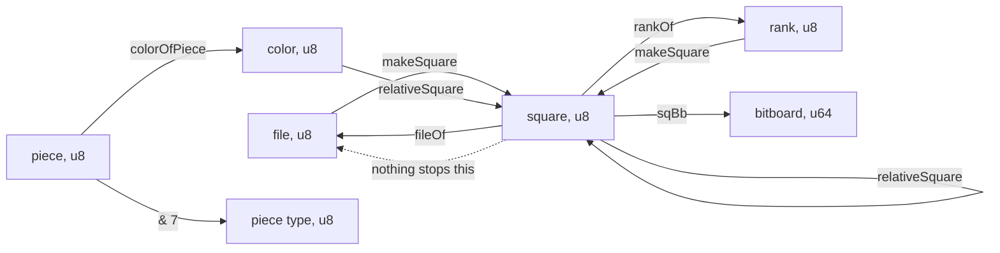
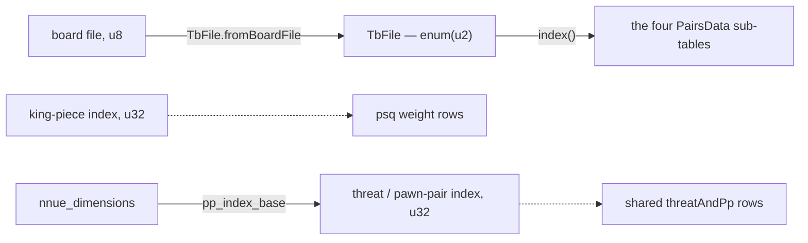
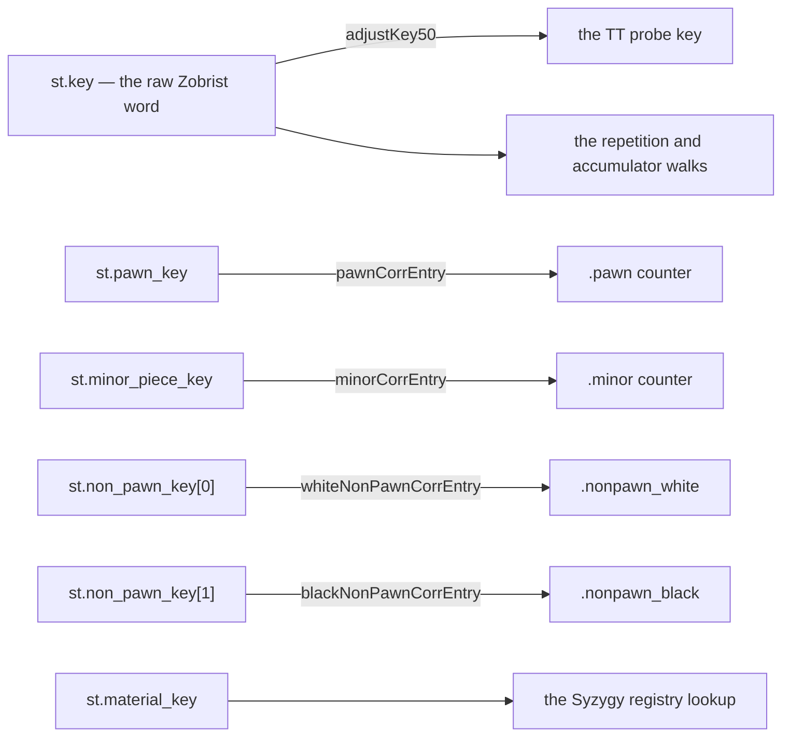
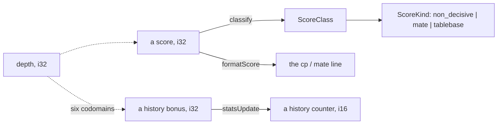
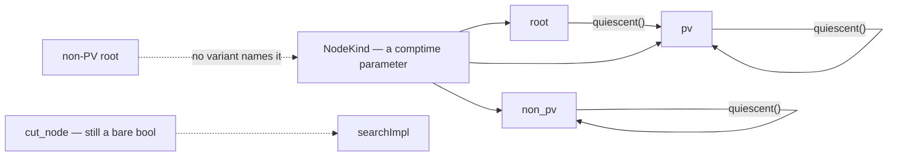
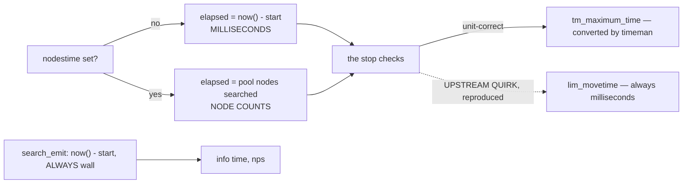

# The value domain

What zfish's quantities *mean*, which of them the compiler can tell apart, and — stated
as plainly as the rest — which of them it cannot.

[08-idiomatic-zig.md](08-idiomatic-zig.md) is the neighbouring page: it records how a C++
construct becomes a Zig one and what each translation measured. This one records what the
resulting values denote. The theory each family rests on is collected in
[11-references.md](11-references.md) under "Type theory and type design", with what each
citation is for.

## The premise, and why it reads differently here than elsewhere

The usual argument for a domain type is that it removes a runtime check. **That argument
does not apply to zfish at all.** The shipped binary is ReleaseFast: no bound, no cast, no
overflow and no alignment is checked anywhere ([08-idiomatic-zig.md](08-idiomatic-zig.md)).
There is no check for a type to fold away, and no `unsafe` boundary for it to guard.

So a type here buys exactly one thing, and it is worth more than the check would have been:

> **A swap between two same-typed quantities does not fault. It answers wrong.**

That is this port's characteristic failure. The engine keeps running, the evaluation or the
verdict is a plausible number, and every value gate in the tree compares output *this binary
produced* — so they all agree, unanimously, and they are all wrong together. The only gate
that notices is the bench signature, and it says *that* something moved, never *where*.

A type removes the shape rather than the instance. That is the whole case, and the rest of
this page is where it has been made, where it has not, and what it costs.

## What it has bought, concretely

Each of these compiled before its type or its accessor existed:

| the swap | what it did instead of failing |
| --- | --- |
| a board file where a Syzygy sub-table index belongs | a **confident wrong** tablebase verdict — a real sub-table of the wrong file |
| the side-to-move and the table file, transposed | the same, by a different route |
| a correction counter read from a row the wrong key chose | a real counter of the wrong kind, so a plausible wrong correction |
| a non-PV root, in the hottest function's signature | nothing yet — an illegal state nobody had written, waiting |
| a feature count drifting between its four declarations | a real row of the wrong feature set folded into the accumulator |

None is hypothetical, and none was argued: each was applied to the tree, built, and the
compile errors recorded. A type that has not been seen to reject something is a claim.

**And it has cost.** The direction is not predictable from the source — see
[the cost rule](#the-cost-rule), which is the part of this page most likely to save a
wasted session.

## The maps

Six, because the families answer different questions and one diagram hides all six. A
solid arrow is a **named function** — a value crosses a boundary by calling something, and
the call is where a reader looks. A dashed arrow is a crossing the compiler still permits.

### Board primitives: one width, many meanings



**The dashed arrow is the honest part of this diagram.** Square, file, rank, piece, piece
type and colour are all `u8`, so every conversion above is a *convention* named by a
function rather than a boundary the compiler holds. `makeSquare(f, r)` and
`relativeSquare(c, s)` both take two `u8`s and neither rejects them transposed.

This is deliberate and it is not comfortable. The board primitives are the most
diff-sensitive code in the port — they are read directly against upstream's own
`Square`/`File`/`Rank` spellings — and they sit inside the search body, which is exactly the
shape [the cost rule](#the-cost-rule) says a wrapper perturbs. `sq_none = 64` stays an
in-band sentinel for the same reason plus one more: Zig does not niche-pack optional enums,
so `?Square` would be *wider*, not narrower.

### Index spaces: one type per table, where the producer allows it



`TbFile` is the one index space in the tree with its own type, and it is the one where a
wrong answer is worst: a Syzygy verdict is reported as fact, not as an estimate.
`enum(u2)`, so the tag width **is** the bound of the arrays it indexes, and
`fromBoardFile` is the only route from the eight-file space to the four-file one.

The two NNUE feature index spaces are dashed because they are still `u32`. They are
*concatenated* into one weight array, so the pair block begins exactly where the threat
block ends — a property `nnue_dimensions` now **derives** rather than restating in four
files. That closes the drift; it does not close the confusion, and
[the boundary](#what-a-compile-error-does-not-stop) says why the type is blocked.

### The key family: seven spaces, one `u64`



Seven key spaces share one word, and two of the crossings have already cost this port real
time — both recorded in the code rather than inferred:

- **`adjustKey50` is the only route from the raw word to the TT key**, and it mixes the
  halfmove clock only at and above 14. Below the threshold the two keys are *identical*,
  which is why every golden and every bench position agreed while the `d` command was
  printing the raw key for positions past the threshold.
- The same function has two upstream instantiations differing by one in the threshold, and
  the citation in this tree once claimed one while implementing the other.

The four correction arrows are the second lesson. Those counters live in **one bundle**,
are selected by **four different keys**, and were read through four fields picked after the
row lookup — so `corrRow(shared, st.pawn_key)[c].minor` compiled and returned a real
counter of the wrong kind. Each pair now has one accessor that reads its own key *and* its
own field, so the pairing is the signature. **No key newtype**: a Zobrist word is XORed on
every `do_move`, which makes it *computed with*, and Zig has no operator overloading.

### The score domain, and where it stops being a number



The score stays `i32` throughout the search — see [why there is no Depth](#why-there-is-no-depth),
which is the same argument. What *is* typed is the **boundary**: `classify` turns a raw
score into a `ScoreClass` whose `ScoreKind` is a three-variant enum, so a consumer switches
exhaustively on *mate / tablebase / ordinary* rather than on magic magnitudes with an
`else`. A decisive score is a fact rather than an estimate, and the three variants make
that visible where it is reported.

`statsUpdate` is the other boundary, and it is the one place this page was wrong about
its own guarantee. Its clamp is a `comptime` parameter, and that was recorded here as
enough — "the limit is not a runtime value, so the transposition is not even
expressible". It was expressible. Wherever the bonus is *itself* a literal, both
arguments are compile-time known and the swap type-checks:
`statsUpdate(captEntry(...), 892, 10692)` transposed to `(..., 10692, 892)` built with
zero errors and benched off the anchor — the gravity curve reshaped, the move ordering
changed, nothing refused it.

`comptime` restricts WHEN a value is known, never WHAT it means, and the swap this needed
guarding against is between two values that are both `i32` and both constant. So the
clamp carries a type of its own: `HistLimit`, a one-field struct with one constant per
table (`main_history_limit`, `capture_history_limit`, …, mirroring upstream's
`Stats<i16, D, ...>` instantiations). Both directions are now refused — a transposition
as `expected type 'i32', found 'search_common.HistLimit'`, and a bare `10692` as
`expected type 'search_common.HistLimit', found 'comptime_int'`. It costs nothing: the
parameter stays `comptime`, so the `.text` section is byte-identical across the change.

Those two sentences are quotations from a gate, not recollections. `zig build type-refusal`
writes each mistake into a snippet beside the module and requires the compiler to reject it
**with that message**, and requires the legal form to still compile — so a decl that was
renamed away cannot score a pass by failing for a different reason. It exists because the
paragraph above is where this page was wrong: the claim that a `comptime` parameter made the
transposition inexpressible was written down, believed, and false. A refusal nobody has
watched happen is an assumption.

An enum would not do here. Two pairs of tables share a value today
(ButterflyHistory/LowPlyHistory at 7183, PawnHistory/TTMoveHistory at 8192), and Zig
refuses duplicate enum values — while collapsing each pair to one name would make a sync
that moves either tunable move both. A struct holds four distinct constants over two
distinct values without saying they are the same fact.

### Node kinds: three states, and the fourth that used to be writeable



The search used to spell a node's kind as two independent `comptime` booleans. Four
combinations, three meanings: a root is always searched on a full window, so a non-PV
root names nothing, and no call site ever produced one. One `comptime NodeKind`
parameter makes it unwriteable — there is no fourth variant, and `type-refusal` holds a row
that tries to name one (`has no member named 'non_pv_root'`). Restoring the variant is also
the gate's negative-control mutation: an unused enum variant moves no value, so the anchor
and every golden stay green while the domain quietly widens.

`quiescent()` carries a fact the code held only in a comment: dropping into quiescence
loses rootness and keeps PV-ness, so the root's own quiescence node is an ordinary PV
node rather than a second root. That is what lets `qsearchImpl` refuse `.root` outright.

**Zig takes an enum as a `comptime` parameter directly**, which is why this needs no
marker types or generic machinery. A sibling port in a language without that had to
encode the same three kinds as a sealed trait over three zero-sized types.

The dashed `cut_node` arrow is the honest part again: it is still a bare `bool`, passed
positionally. That is a *provenance* problem rather than an illegal-state one — both of
its values are real — and it is left alone deliberately; see
[the boundary](#what-a-compile-error-does-not-stop).

### The clock: two quantities, one `i64`, and a flag that decides which



`nodestime` converts the whole clock model into node counts, so `elapsed`,
`optimum_time` and `maximum_time` change *physical unit* under a flag stored beside them.
All four are `i64` and nothing in the type system relates them.

Two of the three crossings are right, and they are right **structurally rather than by
type**:

- `tm_maximum_time` is converted into the budget's unit by `timeman`, so the stop check
  compares like with like.
- Reporting has its own producer. `search_emit` computes `info time` and nps from
  `now() - start_time` unconditionally, so a GUI is never told a search took N
  milliseconds when the engine was counting nodes. That is a separate function rather
  than a separate type, and it holds for the same reason: there is no path from the
  budget's clock into the report.

The dashed arrow is an **inherited quirk, not a defect**. Under `nodestime`, `elapsed` is
a node count and `lim_movetime` is the UCI figure in milliseconds, and upstream compares
them anyway — so `go movetime N` under `nodestime` stops after N *nodes*. The port
reproduces it because the bench and every golden agree with upstream only while it does.
It is marked at the comparison with upstream's own line quoted beside it.

**Why this is documented rather than typed**, which is the honest half: making the bounds
unreachable without their unit means putting them behind accessors, and they live in flat
POD structs the search driver threads through — including one whose byte layout is
comptime-asserted against the Worker arena. That restructuring is a larger change than
the defect justifies, and *naming the flag alone would be a rename dressed as a
guarantee*. See [Adding a type](#adding-a-type), step 3.

## Denotation: a type is a set of values

The frame is the ordinary denotational one — `TbFile` denotes the four sub-tables,
`ScoreKind` the three outcomes a score can name. Membership is construction, so a value of
the type *is* a proof that it belongs to the set, which is why the constructors matter more
than the methods.

Two rules govern them here:

- **One named route between two spaces.** `TbFile.fromBoardFile` is the only conversion
  from board files to table files; `adjustKey50` the only one from a raw key to a TT key;
  `pp_index_base` the only thing that lifts a pair index into the shared array. When there
  is exactly one, it is the line a reviewer reads.
- **Never mask.** A mask under a name that reads lossless turns a corrupt byte from a
  Syzygy file or a transposition entry into a plausible piece — a wrong answer where a
  detected fault was available. Where the input is untrusted, the parse is bounded and
  refuses instead ([05-tablebases.md](05-tablebases.md)).

## Why there is no `Depth`

Deliberate, for upstream's own reason, and worth writing down because it is the type a
reader will propose first. A depth-scaled product feeds at least six different codomains: a
history bonus, two score margins, a move count, a history magnitude, and a reduction
denominator.

A type carries its unit through arithmetic only if the operation has one result type. Any
single choice leaves the other five needing an escape, and the choice that serves all six —
depth times an integer yields an integer — turns any depth into any number, which is
exactly the property the type was for. **A type that needs six output types needs none.**
Upstream spells it `using Depth = int` for the same reason.

Units-of-measure systems solve this with unit polymorphism, where a function is generic in
the unit it returns ([11-references.md](11-references.md)). Zig cannot express that either,
and with no operator overloading the wrapper would additionally turn every one of those
expressions into a method call. The honest answer is to leave depth a scalar and say why.

## The cost rule

Measured across a sibling port's twenty type-shaped changes at two ISA tiers, and it
contradicts the usual claim that a newtype is free:

> A newtype over a scalar is free while the value is **carried** — produced, stored,
> passed, indexed with. It can cost when many instances are **live at once inside one
> large function**, because that is a register-allocation problem and the wrapper perturbs
> it. The cost appears as extra `mov`, has no attributable symbol, and no attribute
> addresses it.

Free: index spaces carried in a slice and consumed one at a time, coordinates passed to a
table lookup, every layout-preserving rename. Costly: a scalar threaded through the control
flow of a function large enough to dominate the profile.

**The rule is about what a function HOLDS, not what it is parameterised by.** A `comptime`
parameter occupies no register, so replacing two `comptime` booleans with a `comptime` enum
is free even on the hottest function in the engine — the monomorphisation is unchanged and
nothing new is live. Wrapping a `comptime` scalar in a one-field struct is free for the
same reason, and this one was checked rather than argued: `HistLimit` on `statsUpdate`,
which every history update on the hot path calls, left the release binary's `.text`
section byte-identical. Replacing a *runtime* boolean with a two-variant enum is a different
change and is what the rule actually governs: measured elsewhere at +0.0025% on both tiers,
which is small, real, and the reason `cut_node` here is still a `bool`.

**Diagnose it with the static instruction mix of the enclosing function, not a callgrind
symbol diff.** A symbol diff reports "diffuse" and stops; the opcode histogram of the one
function names the mechanism.

**The rule is predictive, not exact.** It has already mispredicted — a typed ply pushed
into an NNUE transform was predicted free by it and cost nearly a percent. So a type on a
hot path is an experiment, measured at both tiers whatever the prediction says, and a
sibling's measurement is a hypothesis about *this* compiler rather than a result
([08-idiomatic-zig.md](08-idiomatic-zig.md)).

## What a compile error stops

Each has been made to fail on purpose, and the errors counted:

- A board file reaching the Syzygy sub-table lookup.
- The side-to-move and the table file, transposed.
- A correction counter read through a field the row's key did not select.
- A feature-set count declared twice and drifting.
- A non-exhaustive switch over `ScoreKind`.
- A non-PV root, which has no variant to name it.
- Entering quiescence at the root — `qsearchImpl` refuses `.root` by name.
- The continuation-history plane selectors `in_check` and `capture`, transposed — `InCheck` and `WasCapture`. A swap picked a different plane of the table: a valid entry of the wrong thing, visible only as a moved bench signature.
- A history bonus and its clamp transposed, or the clamp given as a bare integer —
  `HistLimit`. This row spent time in the wrong section: `comptime` alone was recorded as
  stronger than a type here, and it was not.

### An enum literal infers its way around the distinction

Two two-variant enums are not two types at a call site that writes `.yes` / `.no`. An enum
literal takes its type from the parameter it lands in, so

```zig
setContHist(w, ss, if (in_check) .yes else .no, if (capture) .yes else .no, pc, to);
```

still compiles after the two arguments are transposed — each literal simply adapts to its new
position. That was built and confirmed, not reasoned about; the first version of `InCheck` and
`WasCapture` stopped a bare `u1` and nothing else, which is the shape of a type-safety change
that reviews as done and gates nothing.

Name the type at the call site to fix it — a constructor (`InCheck.of(in_check)`) rather than a
literal, so the transposition reads `expected type 'history.InCheck', found
'history.WasCapture'`. **The general rule: when two adjacent parameters are the reason a type
exists, the call site has to spell the type. A newtype whose values are only ever written as
inferred literals is a comment.**

It is also free here, which sharpens [the cost rule](#the-cost-rule) rather than contradicting
it. These are *runtime* values on the `do_move` path, where replacing a bool is the change that
was measured at +0.0025% elsewhere — and the release binary's `.text` section is byte-identical
across this one. The difference is what the function does with the value: `cut_node` is held
live across the whole search body, while these two are consumed immediately into an index. The
rule is about what is HELD, and runtime-ness alone does not predict a cost.

## What a compile error does NOT stop

A page that omits its own boundary invites over-trust, and this one is short enough to
invite it.

**Every board primitive.** Square, file, rank, piece, piece type and colour are all `u8`
and interchangeable everywhere. This is the largest untyped surface in the tree, it is
deliberate (diff fidelity plus the cost rule), and it means the first map's dashed arrow is
the normal case rather than an exception.

**A wrong index that is in range.** `TbFile` narrows *which space* an index lives in, never
*which entry*. The Syzygy prober is the sharpest case: an index computed one off there
still returns a confident wrong verdict.

**The NNUE feature index spaces.** Still `u32`, and blocked rather than overlooked. The
producers are vectorized writers that store `@Vector(N, u32)` into these buffers, and there
is no `@Vector` of enums; typing only the consumer would reintroduce an unchecked cast at
exactly the boundary the type exists to guard. Typing at the boundary or not at all is a
rule on the neighbouring page, and this is the case that earned it.

**Two accessors with the same signature.** The four correction accessors are mutually
swappable — the welding stops a key/field mismatch, not one accessor for another. Only the
bench signature catches that, and it did — the mutation moved the node count off the
anchor by roughly fifteen per cent.

**A physical unit.** `elapsed`, `optimum_time`, `maximum_time` and `lim_movetime` are all
`i64`, and the first three change unit under `nodestime`. Nothing rejects a comparison
between two of them in different units — upstream in fact requires one such comparison, which
is reproduced and marked. What holds here is a separate *producer* for the wall clock, not a
separate type.

**Boolean provenance at a call site.** `cut_node` is still a bare `bool` passed
positionally to `searchImpl`, and `setContHist(worker, ss, in_check, capture, pc, to)` takes
four adjacent `u8`s of which two are booleans — any pair of the four can be transposed and
three of the six transpositions still select a real plane of the continuation table. Both
values are legal in every combination, so this is provenance rather than an illegal state,
and both sit on per-node paths where the cost rule predicts a real if small cost. Recorded
as known, not fixed.

**The four bug classes that have cost this port the most**, none of which is a typing
problem: integer semantics under conversion, two generators emitting the same set in a
different *order*, a key identity that omits the halfmove clock, and a state update that
"obviously" belongs and does not.

**Cost.** A type is not free here and the direction is not predictable from the source.

## Adding a type

1. Say which set it denotes, and give it a constructor that is the only way into that set.
2. Check the value is **carried**, not computed with. If it participates in arithmetic on a
   hot path, expect a cost and read [the cost rule](#the-cost-rule) before starting.
3. Type at the boundary, or not at all. If the producer cannot be typed, a cast at the
   consumer is a rename, not a guarantee — say so instead of shipping it.
4. **Make the mutation fail.** Break the code on purpose in the way the type is meant to
   stop, build it, and record the compile errors. Arguing that it would fail is not
   watching it fail.
5. Gate it: `zig build parity` for anything, plus `zig build tsan-race -Dtsan -Dlto=false`
   if it touches shared state, plus the zone's local-only gates
   ([10-tooling-ci.md](10-tooling-ci.md)). Check the exit code, never a piped fragment.
6. Add a row here — to a map, to the boundary, or to both. A type added without one makes
   this page quietly wrong.
