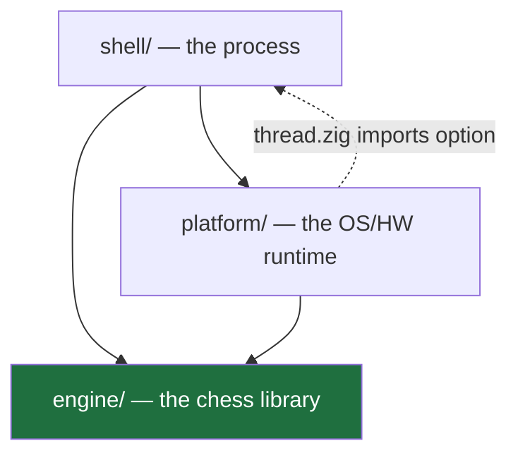
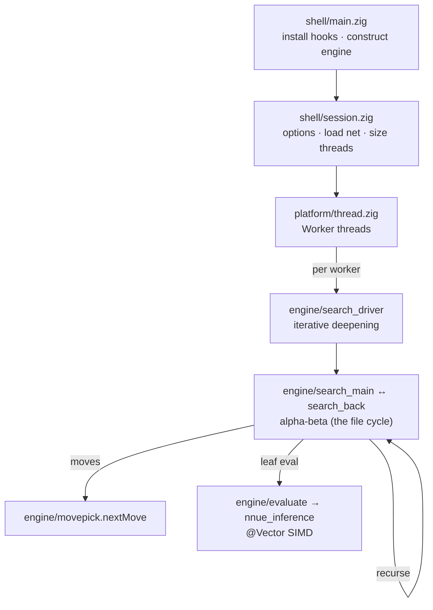

# Architecture

How the code is structured: the zones, how they depend on each other, and how one
search flows through them. For building, the bench gate, and the validation
commands, see [README](../README.md) and [CONTRIBUTING](../CONTRIBUTING.md); for the Zig
patterns behind the hot path, see [docs/idiomatic-zig.md](9-idiomatic-zig.md).
Per-module detail lives in each file's `//!` header.

This page states structure, not numbers. Where a count would date it (edges,
coupling), run `zig build arch-report` for the live value.

## The three zones

`src/` splits by responsibility, each a directory:

| Zone | Path | Owns | May import |
| --- | --- | --- | --- |
| **engine** | `src/engine/` | the chess library: board, movegen, search, NNUE eval, per-worker state | nothing outside `engine/` |
| **platform** | `src/platform/` | the OS/HW runtime: threads, memory, NUMA, Syzygy, the clock | `engine/` |
| **shell** | `src/shell/` | the process: UCI parsing, the option model, `main`, the engine object | `engine/`, `platform/` |

The stack is `shell → platform → engine`, engine at the bottom. `platform/` is not a
layer *beneath* the engine — it depends *on* engine, because `thread.zig` and
`search_thread.zig` manage `Worker` objects. It is the runtime that *hosts* the
engine library, not a base the engine sits on.



**`engine/` is a library.** The transitive closure of every engine module stays
inside `engine/`. It compiles and tests standalone — `zig build engine`, rooted at
`src/engine/headless.zig`, links no platform or shell. The one dashed edge above
(`platform/thread.zig` importing `shell/option`) is the only edge keeping the zone
graph from a strict DAG; the engine avoids the same import through a hook seam.

## The module graph

`build.zig` is not a script that discovers files. It is a **hand-declared module
graph** — a `module_edges` table of `.{ .from, .imp, .to }` triples wired by
`addImport`, and the authoritative statement of what may depend on what. A module
cannot reach a peer it was not handed.

The module graph is a **DAG**. The file graph (relative `@import` inside a module)
holds exactly one cycle, `search_main.zig ↔ search_back.zig` — the alpha-beta
recursion itself (`searchImpl ↔ runBack`), declared as one component in both file
headers. **Zig permits import cycles at both granularities**, so the DAG is a design
outcome, not a language guarantee. `zig build arch-report` prints both graphs and
trips on a broken module DAG or an undeclared file cycle.

### The composition root and the cycle-break hooks

The DAG rests on one pattern. `main.zig` is a **composition root**: it may import
everything and is imported by nothing. That asymmetry lets it hand implementations
*backwards* to leaf modules that could not import them.

Where a cycle *would* exist, a leaf declares a function-pointer **hook**, and the
composition root registers the real implementation at startup:

```zig
// Leaf (engine/search/time_source.zig): declare the seam.
pub var now: *const fn () i64 = &defaultNow;

// Composition root (shell/main.zig): inject the real clock at startup.
time_source.now = &clock.now;
```

This is dependency injection through function pointers — the reason the graph below
`main` is acyclic by construction, and how `engine/` reaches an OS clock while
importing no platform module. `main.zig` registers most hooks; `position.zig`
self-registers the two it owns. `zig build hook-lint` bounds them: it ratchets the
count and requires each to declare its failure mode when unregistered. See
`src/platform/runtime_hooks.zig` and the `//! hook-class:` headers.

## How a search flows



`main` installs the hooks and constructs the engine; `session` registers UCI
options, loads the net, and sizes the pool; each `platform/` worker runs the
engine's iterative-deepening driver, which recurses through `searchImpl ↔ runBack`,
pulling moves from `movepick` and leaf evaluations from the `@Vector` NNUE. Nothing
on that path allocates.
