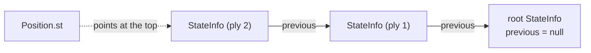

# Board

The board subsystem owns the chess representation and everything that can be
decided from it alone: the `Position` object, bitboard attack tables, legal move
generation, Zobrist hashing, draw detection, and FEN. It lives in
`src/engine/board/` at the bottom of the engine zone — it imports nothing outside
`engine/`, and nothing in it reaches for the NNUE or the OS. The one edge upward
is `position.zig`'s `@import("search")`, declared at the top of the file and
unused in its body. See
[1-architecture.md](1-architecture.md) for the zones and the module graph; the Zig
patterns behind the hot path are in [9-idiomatic-zig.md](9-idiomatic-zig.md);
build and gate commands are in [CONTRIBUTING](../CONTRIBUTING.md).

## Modules

`position.zig` is a **facade**: it re-exports the public surface and owns
`initRuntime()`, but the code lives in leaves below it. Every leaf depends only on
other leaves, so the board graph is a DAG with `position` at its root.

| File | Owns |
| --- | --- |
| **Types and primitives** | |
| `position_types.zig` | `Position`, `StateInfo`, `DirtyPiece`, `DirtyThreats`; the size/alignment asserts |
| `board_core.zig` | piece/color/file/move-type constants, move-word decoders, square helpers, the pawn-attack table |
| `score.zig` | `classify()` — score → non-decisive / tablebase / mate, in plies |
| **Bitboards** | |
| `bitboard_geom.zig` | pure square/file/rank math and the from-scratch attack generators used to build the tables |
| `bitboard.zig` | the runtime magic-bitboard slider tables, leaper and pseudo-attack tables, `between` / `line` / `rayPass` |
| **Position** | |
| `position.zig` | the facade: re-exports, `initRuntime()`, self-registration of the two snapshot hooks |
| `position_query.zig` | read-only accessors (`sideToMove`, `gamePly`, `hasCheckers`, `wdlMaterial`) and the snapshot fills |
| `position_lifecycle.zig` | `create` / `destroy` / `setPositionState` / `doMoveState` — the graph-sized wrappers |
| `position_snapshot.zig` | `PositionSnapshot` plus the `fill_fn` / `move_is_legal_fn` hook seam |
| `state_setup.zig` | derived-state (re)computation: `setState`, `setCheckInfo`, `updateSliderBlockers`, `setCastlingRight` |
| `state_list.zig` | `StateList` / `PendingStateStorage` — the pointer-stable `StateInfo` chain the engine holds |
| **Moves** | |
| `move_do.zig` | `doMove` / `undoMove` / `doNullMove` / `undoNullMove`, `putPiece`, the board mutators |
| `move_do_threats.zig` | `updatePieceThreats` — the dirty-threat deltas the NNUE threat features consume |
| `movegen.zig` | the staged pseudo-legal generators plus `generateLegal` |
| `legality.zig` | `legal`, `pseudoLegal`, `givesCheck`, `seeGe`, `attackersTo`, `attackersToExist` |
| **Hashing and draws** | |
| `zobrist.zig` | the process-global `zob_*` tables and the cuckoo tables, built by `init()` |
| `repetition.zig` | `isDraw`, `isRepetition`, `hasRepeated`, `upcomingRepetition` |
| **Text** | |
| `fen_parse.zig` | `setPosition` — FEN → live `Position` |
| `fen.zig` | `formatFen`, `flipFen`, `buildEndgameFen` — the encode side (pure, no `Position`) |
| `uci_move.zig` | UCI move text ↔ raw move word, including the Chess960 castling encoding |
| **Tests** | |
| `board_props.zig` | the property tests (perft, round-trips, cross-checks) |
| `fuzz_targets.zig` | the coverage-guided `std.testing.fuzz` targets |

## Position and state

`Position` is the whole board object: the 64-square piece `board`, the
`by_type_bb` / `by_color_bb` bitboards, `piece_count`, the castling tables, a
pointer `st` to the current `StateInfo`, `game_ply`, `side_to_move`, `chess960`,
and the trailing NNUE scratch (`scratch_dp`, `scratch_dts`). Field order is Zig's
to choose; only the footprint is contractual.

`StateInfo` carries the per-ply state: the Zobrist keys (`key`, `pawn_key`,
`material_key`, `minor_piece_key`, `non_pawn_key`), `non_pawn_material`,
`castling_rights`, `rule50`, `plies_from_null`, `ep_square`, `checkers_bb`,
`blockers_for_king`, `pinners`, `check_squares`, `captured_piece`, `repetition`,
and `previous`.

### The pinned footprints

`position_types.zig` asserts `@sizeOf(Position) == 1032`, `@alignOf(Position) == 8`,
`@sizeOf(StateInfo) == 192`, `@alignOf(StateInfo) == 8`. These are not cosmetic:
`src/engine/state/worker_layout.zig` pins the same values as `position_size` /
`state_info_size` and embeds `root_pos` / `root_state` as typed fields in the
`Worker` block, and `src/engine/state/position_storage.zig` owns the engine's
`pos` member as one aligned, zeroed block of exactly `position_size` bytes.
`position.zig` re-asserts `@sizeOf(Position) <= worker_layout.position_size`;
`legality.zig` and `state_setup.zig` each re-assert the `StateInfo` width so a
layout change is caught where the type is read and written, not only where it is
defined.

### The state list

`state_list.zig` holds the engine's `states` member. Its contract:

- the list starts non-empty, with one zeroed root `StateInfo`;
- `reset()` drops to a single fresh root, `push()` appends one, `back()` returns
  the latest;
- **pointer stability is mandatory** — `doMove` writes into the newest record
  while earlier ones stay referenced through the `previous` chain, so every
  `StateInfo` is its own heap allocation and no address ever moves.

`PendingStateStorage` wraps a `StateList` with move semantics: the engine builds
the chain during position setup, then `moveOut()` hands ownership to the thread
pool and nulls the wrapper, so a later `destroy()` frees nothing.

### do_move / undo_move

`doMove(pos, m, new_st, gives_check, dp, dts)` copies the carried prefix of the
current `StateInfo` into `new_st` field by field (not as a byte prefix), links
`new_st.previous = pos.st`, and re-points `pos.st` at it. It then incrementally
updates the keys and material, mutates the bitboards and board through the
threat-recording mutators, sets `ep_square` only when a double push is actually
capturable, recomputes `checkers_bb` and the check info, flips `side_to_move`,
and walks the `previous` chain to fill `st.repetition`. The trailing block
(`checkers_bb`, `blockers_for_king`, `pinners`, `check_squares`, `repetition`) is
recomputed, never copied.

`undoMove(pos, m)` reverses the board mutation and then simply pops
`pos.st = pos.st.previous`. The popped record is still owned by the state list, so
the chain remains walkable.



`doNullMove` follows the same shape but copies the whole record, clears
`ep_square`, resets `plies_from_null`, clears `captured_piece` (a null move
captures nothing, so a copied stale value would corrupt prior-capture detection),
and flips the side.

`position_lifecycle.doMoveState` is the setup/perft entry point: it supplies fresh
`DirtyPiece` / `DirtyThreats` scratch and computes `gives_check` itself, for
callers that thread no accumulator delta.

## Bitboards

A bitboard is a `u64`, one bit per square, index 0 = a1. `by_type_bb[0]` is total
occupancy; `by_type_bb[pt]` and `by_color_bb[c]` are intersected to select pieces.

`initRuntime()` in `position.zig` builds every table, in order, before any
position setup or search runs:

1. `board_core.initPawnAttacks()` — the `[2][64]` pawn attack table.
2. `bitboard.initSliderMagics()` — the magics, leaper tables, then derived tables.
3. `zobrist.init()` — the Zobrist and cuckoo tables (the cuckoo build calls
   `bitboard.attacks()`, so it must come last).

Everything built here is read-only afterwards; the single-threaded startup init is
the only writer.

### Magic bitboards

`initMagics` searches, per square and per slider type, a magic multiplier such
that `((occupied & mask) * magic) >> shift` indexes a collision-free slot in a
shared attack table (`rook_magic_attacks`, `bishop_magic_attacks`). Each entry is
filled from the `slidingAttack` ray-cast reference, so the table holds the same
attack sets the ray-cast reference computes, reached by one
mask/multiply/shift/load. `attacks(pt, sq, occupied)` dispatches: knights and
kings read a leaper table, bishops and rooks go through the magics, queens OR the
two.

### Derived geometry

`initDerivedTables` builds three square-pair tables from the magics:

| Table | Accessor | Meaning |
| --- | --- | --- |
| `line_bb` | `line(s1, s2)` | the full line through both squares extended to the edges, or 0 if unaligned |
| `between_bb` | `between(s1, s2)` | the squares strictly between, plus `s2` |
| `ray_pass_bb` | `rayPass(s1, s2)` | from `s1`'s attacks along the `s1`–`s2` line, the squares at or beyond `s2` |

`pseudoAttacks(pt, sq)` reads the occupancy-free attack set — a slider's
empty-board reach depends only on its square, so it is a table read rather than a
trip through the magic pipeline.

## Move generation and legality

`movegen.zig` generates into a caller-supplied `[*]u16` and returns a count. Moves
are 16-bit words: `to` in bits 0–5, `from` in bits 6–11, the promotion piece in
bits 12–13, the move type in bits 14–15 (`normal` / `promotion` / `en_passant` /
`castling`). Castling is encoded king-captures-rook.

| Generator | Target |
| --- | --- |
| `generateCaptures` | enemy pieces |
| `generateQuiets` | empty squares |
| `generateEvasions` | the squares between the king and the single checker (king moves only, under double check) |
| `generateNonEvasions` | everything not occupied by us |
| `generateLegal` | evasions or non-evasions by `checkers_bb`, then filtered to legal |

`generateAll` is instantiated per color and per `GenType` at comptime, so the
color and kind branches vanish. It emits pawn moves, then knight/bishop/rook/queen
moves, then king moves, then castling (quiets and non-evasions only, gated on
`castling_rights` and an unimpeded `castling_path`).

### Legality

The generators are pseudo-legal. `generateLegal` post-filters with
`requiresLegalCheck`: a move needs the full `legal()` test only if it starts from
a pinned square (`blockers_for_king[us] & pieces(us)`), moves the king, or is an
en-passant capture. Everything else is legal by construction.

`legal(pos, m)` then decides:

- **castling** — every square the king traverses must be unattacked; under
  Chess960, the rook's square must additionally not be a blocker;
- **king moves** — the destination must be unattacked with the king's own square
  removed from the occupancy;
- **everything else** — the origin is not a blocker, or the move stays on the line
  through our king.

The other predicates in `legality.zig`:

| Function | Answers |
| --- | --- |
| `pseudoLegal(pos, m)` | is `m` playable at all — used to validate a TT/killer move; non-normal move types fall back to generator membership |
| `givesCheck(pos, m)` | does `m` check, without playing it: direct via `check_squares[pt]`, discovered via `blockers_for_king[them]`, plus the promotion / en-passant / castling special cases |
| `seeGe(pos, m, t)` | is the static exchange evaluation of `m` at least `t` — the swap-off loop, skipping attackers pinned against their own king |
| `attackersTo(pos, s, occ)` | the bitboard of all pieces attacking `s` |
| `attackersToExist(pos, s, occ, c)` | does color `c` attack `s` — short-circuits, no set built |

`state_setup.updateSliderBlockers` maintains the pin data both sides read: for
each enemy sniper aligned with our king, if exactly one piece stands between, that
piece is a blocker, and if it is ours the sniper is a pinner. `setCheckInfo` runs
it for both colors and refills `check_squares[pt]` — the squares from which each
piece type would check the side not to move. Both run on every `doMove` and
`doNullMove`, and on `setState` after a FEN parse.

## Zobrist, repetition, FEN

`zobrist.zig` holds the process-global tables, built by `init()` from a
fixed-seed xorshift64\* PRNG: `zob_psq` (piece × square), `zob_enpassant` (by
file), `zob_castling` (by rights mask), `zob_side_val`, `zob_no_pawns`, and the
cuckoo tables. Pawn entries on the promotion ranks are zeroed — a pawn cannot
stand there.

`doMove` maintains `key` and the auxiliary keys incrementally; `state_setup.setState`
recomputes all of them from the board after a FEN parse. The two must agree — the
fuzz targets assert exactly that.

`repetition.zig`:

| Function | Detects |
| --- | --- |
| `isDraw(pos, ply)` | `rule50 > 99` with a legal continuation, or a repetition |
| `isRepetition(pos, ply)` | `st.repetition` is set and within the current search |
| `hasRepeated(pos)` | any repetition in the live chain |
| `upcomingRepetition(pos, ply)` | a reversible move exists that *would* repeat — the cuckoo hash test, used for cycle detection before playing it |

The cuckoo tables index every reversible move by the Zobrist delta it produces, so
`upcomingRepetition` can test for a no-progress cycle with two hash probes per
candidate ply rather than a move-by-move search.

`fen_parse.setPosition` zeroes the `Position` and its root `StateInfo`, then walks
the six FEN fields: placement (rejecting >32 pieces, pawns on the first or eighth
rank, and any king count other than one per side), active color, castling
availability (both `KQkq` and Chess960 file letters, resolved by scanning for the
actual rook and king), the en-passant square (kept only if a pawn can *legally*
capture there), and the two counters. It finishes with `setState` and rejects a
position where the side not to move can be captured. It returns `null` on success
or an owned error string.

`fen.zig` is the encode side and takes raw primitives rather than a `Position`, so
it stays a pure std leaf: `formatFen` renders placement, side, castling (Chess960
rook files when enabled), en passant, and the counters; `flipFen` mirrors ranks
and swaps all case, an involution; `buildEndgameFen` synthesizes a board from an
endgame code such as `KQvK`.

## The snapshot hooks

`movegen.zig`, `uci_move.zig`, the NNUE (`nnue_accumulator.zig`,
`nnue_acc_update.zig`), and `root_move_build.zig` all need to ask the board a
question — *fill me a snapshot*, *is this move legal*. `position.zig` imports
`movegen`, so importing back would cycle; the others sit in zones above `board/`
that the board does not import downward.

`position_snapshot.zig` is the shared leaf they all already import, so it declares
the seam:

```zig
pub var fill_fn: *const fn (pos: *const Position, out: *PositionSnapshot) void = …stub;
pub var move_is_legal_fn: *const fn (pos: *const Position, raw_move: u16) bool = …stub;
```

`position.initRuntime()` registers the real implementations
(`position_query.fillSnapshot` and `legality.legal`) before anything else runs.
These are the **only two hooks in the tree not registered by the composition
root** — every other one is installed by `main.zig`; see
[the composition root and the cycle-break hooks](1-architecture.md#the-composition-root-and-the-cycle-break-hooks).

Both hooks are non-optional and default to a named panic stub rather than `null`,
so an unregistered hook fails fast naming itself instead of tripping an opaque
null-unwrap. Their declared failure mode is *loud*, which is what `zig build
hook-lint` checks.

## Invariants

`board_props.zig` runs in `zig build test` — no engine binary, no golden file,
just the board path (`initRuntime` → `setPosition` → `generateLegal` →
`doMoveState` / `undoMove`).

| Invariant | Check |
| --- | --- |
| **Perft** | node counts to published Stockfish/CPW references, from the start position, Kiwipete, and CPW positions 3–5 — an end-to-end property over movegen *and* make/unmake together |
| **Make/unmake round-trip** | do then immediately undo every legal move; `key`, both bitboard arrays, `board`, and `piece_count` must be identical |
| **Null-move round-trip** | side and key change, then both restore exactly |
| **FEN round-trip** | `setPosition` then `formatFen` returns the input string |
| **FEN rejection** | malformed input is rejected with a message, never accepted or crashed |
| **movegen ↔ legality** | every move `generateLegal` emits must also satisfy the standalone `legal()` and `pseudoLegal()` — catches drift perft can hide when two errors cancel in the count |
| **givesCheck** | the prediction must match ground truth (play the move, ask `hasCheckers`, undo) for every legal move |
| **SEE** | `seeGe` classifies a pawn taking an undefended queen as winning at increasing thresholds, and a queen taking a pawn-defended pawn as losing |
| **Repetition** | a knights-out-and-back line returns to the start key and `hasRepeated` fires exactly when the cycle closes |
| **50-move** | `isDraw` fires once `rule50` exceeds 99 in a non-mate position |
| **Parser robustness** | a fixed-seed PRNG fuzz over a FEN-shaped alphabet: `setPosition` must reject or produce a self-consistent position, and any accepted position must survive movegen plus one make/unmake |
| **Compilation** | `refAllDecls` over `position`, `movegen`, and `worker_layout` |

`fuzz_targets.zig` is a separate artifact wired to `zig build fuzz`, deliberately
outside `zig build test`. It honours `-Doptimize`, so request
`-Doptimize=ReleaseSafe` for a discovered crash to trip a Zig safety check. Its
targets are coverage-guided rather than random:

| Target | Asserts |
| --- | --- |
| `fuzzSetPosition` | the parser tolerates arbitrary input |
| `fuzzRandomGame` | deep legal-move lines make and unwind cleanly |
| `fuzzKeyStability` | the incremental Zobrist key is restored byte-exactly after a deep line unwinds |
| `fuzzAllMovesKeyStability` | *every* legal move at a reached board restores the key on undo, so no move category can hide behind a quiet leading move |
| `fuzzLegalMoveWellFormedness` | no `from == to` and no duplicates in the legal list |
| `fuzzMoveCountStability` | make/unmake of every move leaves the legal-move count unchanged — catches corruption that restores the key but not the board |
| `fuzzNnueEval` | the NNUE evaluation of a reached position is finite |
| `fuzzShallowSearch` | a shallow headless search returns a root-legal move and a finite score |
