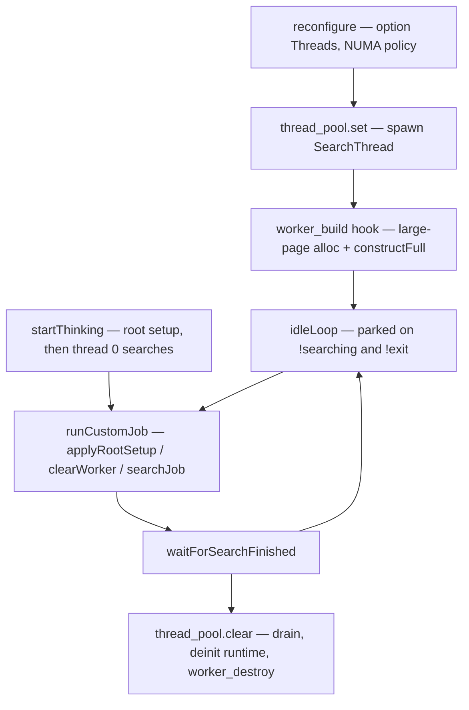

# Platform

`src/platform/` is the OS/HW runtime that **hosts** the engine library: threads,
huge-page memory, NUMA topology, Syzygy tablebases, and the monotonic clock. It is
not a layer beneath the engine — it depends **on** engine, because it builds,
drives, clears, and tears down the `Worker` objects the search runs in. The engine
reaches back the other way only through function-pointer seams it declares itself.
For the zones and the module graph, see [1-architecture.md](1-architecture.md).

## Modules

| File | Owns |
| --- | --- |
| `thread.zig` | the pool face: `reconfigure`, `startThinking`, `clear`, pool-wide counters |
| `thread_pool.zig` | the `ThreadPool` footprint: build/teardown of the thread vector, the bound-nodes slice |
| `thread_runtime.zig` | the OS primitives: the futex seam, `Mutex`, `Condition`, `ThreadRuntime` idle loop |
| `search_thread.zig` | the `SearchThread` vehicle: worker handle, job submission, the search job |
| `thread_vote.zig` | the Lazy-SMP vote picking the best thread's move |
| `memory.zig` | the aligned / huge-page allocator and its zero-fill |
| `numa.zig` | the NUMA topology surface (config, binding, execute-on-node) |
| `numa/config.zig` | `NumaConfig`: nodes, CPU sets, `NumaPolicy` parsing, thread distribution |
| `numa/replication.zig` | `NumaReplicationContext` / `NumaReplicatedBase`: the replica registry |
| `tablebase.zig` | the Syzygy facade the engine's `tb_source` seam binds to |
| `syzygy/tables.zig` | file discovery: scan `SyzygyPath`, count `.rtbw`/`.rtbz`, report cardinality |
| `syzygy/registry.zig` | material key → `TBTable`, lazy file load, `set` / `set_dtz_map` parsing |
| `syzygy/probe.zig` | the probe data model (`PairsData`, `LR` btree) + `setGroups` / `setSymLen` |
| `syzygy/encode.zig` | position → index geometry (binomials, lead-pawn tables) |
| `syzygy/decode.zig` | file header parsing + the RE-PAIR / canonical-Huffman decoder |
| `syzygy/wdl.zig` | the probe algorithm: `do_probe_table`, `probe_wdl`, `probe_dtz`, `map_score` |
| `clock.zig` | the monotonic millisecond clock |
| `libc.zig` | the thin libc binding (`malloc`, `free`, `exit`) |
| `runtime_hooks.zig` | the lifecycle hook registry (worker build/destroy/clear, setup-state handoff) |

## Threads

### The runtime

`thread_runtime.zig` is self-contained (std only) and holds the only OS-specific
code in the thread stack: a wait/wake-on-address seam —
`futexWait` / `futexWakeOne` / `futexWakeAll` — implemented per owned OS as Linux
`futex(2)`, Windows `RtlWaitOnAddress` / `RtlWakeAddress`, macOS `__ulock_wait` /
`__ulock_wake`. On top of that seam sit a three-state (Drepper) `Mutex` and a
sequence-counter `Condition`; both are platform-independent, and every caller
re-checks a predicate, so spurious wakeups are harmless.

A `ThreadRuntime` owns one `std.Thread` running `idleLoop`. The loop sets
`searching = false`, broadcasts, and parks on `!searching and !exit`. `runCustomJob`
stores a callback plus context, sets `searching = true`, and broadcasts;
`waitForSearchFinished` blocks until the job returns; `deinit` sets `exit`,
broadcasts, and joins. `exit` is part of the park predicate precisely so a
`deinit` racing the loop between iterations can never be missed.

### The thread

`search_thread.zig` is the vehicle, not the search body. `SearchThread` holds a tag
at offset 0, the `worker` handle at **offset 8**, the heap `ThreadRuntime` pointer,
and the thread index. `worker@8` is the one field other code reads off a live
thread by offset (`worker_layout.Thread`), and an `@offsetOf` test guards it.

`startSearching` submits `searchJob` with the `Worker` pointer as context.
`searchJob` calls through `searchEntry`, a function pointer `thread.zig` installs at
search start — `search_thread` must not import `position`, since `position` imports
the thread stack for its pool ops. `clearWorker` submits the `worker_clear` hook as
a job. `deinit` joins the runtime **first**, then frees the attached Worker through
`worker_destroy`.

### The pool

`thread_pool.zig` owns the `worker_layout.ThreadPool` footprint: the `stop` and
`increase_depth` flags, the `threads` slice of `Thread*` addresses, and the
`bound` slice of per-thread NUMA-node indices. `set` allocates the vector, creates
and spawns each `SearchThread`, and calls a `ThreadBuilder` callback per index to
attach the Worker — injected, so the footprint bookkeeping is testable without the
engine graph. `clear` waits for every in-flight search **before** tearing threads
down: the teardown path runs with `stop` already set, so an in-flight search bails
and emits its bestmove rather than racing the exit flag. `boundNodesAssign` lays,
reassigns, and frees the bound slice.

### Building a Worker

The builder the pool calls is the `worker_build` lifecycle hook. Its implementation
lives in the composition root, which large-page-allocates `worker_layout.worker_size`
bytes, mints the `SearchManager`, calls `worker_construct.constructFull`, and writes
the result to `worker@8`. `constructFull` zeroes the block, writes the constructor
field set (the shared-history / threads / TT reference slots, the manager pointer,
the NUMA identity scalars, one live `AccumulatorStack` slot), then runs the reset
pieces: worker histories, shared history, reductions, and the NNUE refresh cache.

### Reconfigure

`thread.reconfigure` is the whole sizing path: wait for the main thread, clear the
pool, read the requested thread count and NUMA policy from the option model, decide
binding, distribute threads among nodes and assign the bound slice, clear the shared
histories and insert one per populated node, build the threads, clear the fresh
pool, and finally call `verify_thread_graph` — a read-only check that panics if the
built pool drifts from the model.

### Starting a search

`thread.startThinking` waits for the main thread, resets ponder / `stop` /
`increase_depth`, takes the setup states (handoff or adopt-from-slot), generates the
legal moves and filters `searchmoves` against them, builds the root FEN, root moves,
and TB config, then dispatches `applyRootSetup` as a job on **every** thread —
copying limits, root moves, root position, root state, and TB config into each
Worker — waits for all of them, and starts thread 0. Thread 0's driver starts the
siblings (`search_thread.startPoolSiblings`).

`thread_vote.zig` closes the loop: it summarises each thread's first root move
(PV move, score, bound flags, root depth), runs the integer vote, and returns the
winning thread's index or Worker. It stays a leaf on `worker_layout` because both
`thread.zig` and the search driver need it, and the driver cannot import `thread`.

## Memory

`memory.zig` is the aligned / huge-page allocator, written with no `@cImport` — the
C entry points are declared directly, since `sys/mman.h` does not exist on Windows
and the macOS SDK headers do not cross-compile. `stdAlignedAlloc` is
`posix_memalign` on Linux/macOS and `_aligned_malloc` on Windows (whose blocks must
be released with `_aligned_free`, never plain `free`).

`alignedLargePagesAlloc` rounds the request up to a 2 MiB multiple, allocates it
2 MiB-aligned, **zeroes it**, and on Linux hints transparent huge pages via
`madvise(MADV_HUGEPAGE)`. macOS and Windows have no equivalent advisory call; the
alignment alone lets the OS back the block with large pages.

The engine never calls this directly — that would stop it being a standalone
library. It declares the `page_alloc` seam (`src/engine/state/page_alloc.zig`) for
its big long-lived arenas (transposition table, shared-history stats, NNUE storage),
and the composition root registers the platform allocator over it at startup. The
seam's default is a real page-backed allocator honouring the same contract, so a
headless engine build allocates correctly and loses only the huge pages.

## NUMA

`numa.zig` is the topology surface. zfish runs single-node: `suggestsBindingThreads`
returns false, `distributeThreadsAmongNodes` maps every thread to node 0,
`configNodeCount` is 1, and `executeOnNode` runs the callback inline. `configString`
is real work — on Linux it renders the process's `sched_getaffinity` mask as
comma-joined CPU ranges; elsewhere it reports the full range. Keeping this a real
module means the engine and thread paths call it as ordinary Zig.

`numa/config.zig` holds the model those stubs would drive: `NumaConfig` is a list of
nodes, each an ascending unique CPU set, plus a CPU→node index and the
`custom_affinity` flag. `fromString` parses the user `NumaPolicy` syntax
(`"0-3,8:4-7"`) and forces binding; `fromSystem` builds one node holding every
online CPU. `distributeThreads` balances threads across nodes by fill ratio, and
`suggestsBindingThreads` binds on user-set affinity, never for a single thread, and
otherwise only when the threads cannot fit the largest node.

`numa/replication.zig` is the replica registry. `NumaReplicationContext` owns a
`NumaConfig` and tracks `NumaReplicatedBase` hooks — a plain function pointer
embedded in each replicated wrapper, no vtable. `setNumaConfig` swaps the config and
notifies every tracked object to re-replicate. The shell's engine graph owns the
context. The NNUE weights are always resident rather than replicated per node, so
`thread.ensureNetworkReplicated` is a no-op.

## Tablebases

`tablebase.zig` is the facade: discovery and cardinality from `syzygy/tables.zig`,
the probes from `syzygy/wdl.zig`. `ProbeResult` is re-exported from the engine's
`tb_source`, because the result is a search-facing value the seam owns.

`syzygy/tables.zig` scans `SyzygyPath`, enumerates every King-vs-King material
configuration up to 7 men, builds the canonical stem (`KQK` → `KQvK`), and counts a
table by file existence — the magic header is validated at probe time, not here.
With no path set, `maxCardinality` is 0 and the search never probes.

`syzygy/registry.zig` owns the material key → `TBTable` map, the lazy `.rtbw` /
`.rtbz` load into a 64-byte-aligned buffer, and the `set` / `set_dtz_map` parsing of
each `(side, file)` `PairsData` record. Keys are computed from per-color piece
counts through the engine's material-key routine, so a registry key is bit-identical
to a probed position's `st.material_key`. The load is POSIX-only; on Windows it
yields null and the probe reports unavailable.

The probe path splits by role: `probe.zig` holds the data model and the pure
`setGroups` / `setSymLen` helpers, `encode.zig` the position→index geometry,
`decode.zig` the header parse plus `decompress_pairs`, and `wdl.zig` the algorithm —
`do_probe_table` (position → unique index → value), the `probe_wdl` capture
recursion, `probe_dtz`, and `map_score`. `wdl.zig` imports `registry.zig` downward
and never the reverse, so neither is a god-file. `wdl.zig` also crosses the
platform→engine down-edge for a scratch `Position`, its bitboards, and legal-capture
movegen.

The engine reaches all of it through `src/engine/search/tb_source.zig`:
`maxCardinality`, `probeFen`, and `probeWdlPos` are function pointers the
composition root binds to the facade. Unregistered they report "no tablebases",
which is exactly true when no prober is attached.

## The clock

`clock.zig` returns monotonic time in milliseconds: `QueryPerformanceCounter` /
`QueryPerformanceFrequency` on Windows, `clock_gettime(MONOTONIC)` elsewhere. It
feeds time management and the skill-level RNG seed.

Reading an OS clock is a syscall, so the engine cannot do it and stay portable. It
declares `src/engine/search/time_source.zig` — `pub var now: *const fn () i64` —
and the composition root points it at `clock.now`. The default is a per-call
monotonic counter: a valid clock in the wrong unit, which keeps a headless build
deterministic and is read by no time-limited root.

`libc.zig` is the companion: the handful of genuinely-libc entry points the port
still calls (`malloc`, `free`, `exit`), declared directly as `extern "c"`. Stdio is
deliberately excluded — file reads, stdout/stderr writes, the stdin loop, the cwd
lookup, and every numeric format go through `std.Io` / `std.fmt`.

## runtime_hooks.zig

`runtime_hooks.zig` is the **lifecycle** hook registry: worker build, destroy, and
clear; the setup-state handoff; the shared-history clear/insert; and the thread-graph
verifier. The implementations live in the composition root because they need
`position` / `engine` / `network` / `search` — modules that already import their
callers (`thread`, `search_thread`, `thread_pool`), so the callers cannot import
back to reach them. The root installs the pointers at startup and the callers invoke
through here. See
[the composition root and the cycle-break hooks](1-architecture.md#the-composition-root-and-the-cycle-break-hooks).

The fields are non-optional, each defaulting to a named panic stub, so callers
invoke them directly with no null-unwrap and a hook that was never registered fails
fast **by name**. `zig build hook-lint` bounds the mechanism: it ratchets the hook
count and requires each hook to declare its failure mode when unregistered. Lifecycle
hooks are structurally safe — they cannot become per-query without the design
changing shape — unlike the service seams (`page_alloc`, `time_source`, `tb_source`),
whose `//! hook-class:` headers state the same contract from the engine side. See
[8-tooling-ci.md](8-tooling-ci.md) for the gate itself.

## Invariants

**`FUTEX_WAIT` takes the 4-argument form.** In `thread_runtime.zig` the Linux wait
must pass the timeout argument explicitly as null. `FUTEX_WAIT` reads that argument;
the 3-arg form leaves the register undefined, the kernel dereferences garbage and
returns `EFAULT`, the wait returns immediately, and the predicate loop busy-spins.
The engine still produces correct results, so no unit test catches it — only the
CPU burn shows.

**Large-page blocks are zero-filled.** `alignedLargePagesAlloc` `@memset`s the block
to 0. `posix_memalign` / `_aligned_malloc` return uninitialized memory; fresh OS
pages happen to be zero, but reused blocks (thread resize, search clear) carry stale
data, and a Worker field read during multipv search is initialized by neither the
constructor nor `clear()`. The zero-fill makes it deterministically 0. Worker
construction depends on this — do not remove it, and any allocator registered over
the `page_alloc` seam must honour it.

**`thread.zig` importing `option` is the one platform→shell edge.** `reconfigure`
reads the requested thread count and the NUMA policy mode straight from the shell's
option model. That single edge is the only thing keeping the zone graph from a
strict DAG; every other cross-zone need is met by a hook seam. See
[1-architecture.md](1-architecture.md).
